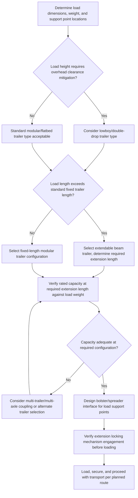

## Hydraulic Modular Trailers and Extendable Trailers

### Overview

Hydraulic modular trailers and extendable trailers are towed (non-self-propelled) heavy haul trailers designed to carry oversized and overweight loads behind a conventional or ballast tractor. Unlike SPMTs, these trailers rely on an external tractor for propulsion but incorporate hydraulic suspension systems for load equalization and, in extendable configurations, telescoping frame sections that allow a single trailer to be adjusted in length to match different load lengths — providing flexibility without requiring a dedicated fixed-length trailer for every load geometry.

### Trailer Categories

**Hydraulic Modular Trailers (Non-Powered)**

Structurally similar to SPMT axle lines in that they feature independent hydraulic suspension at each axle for load equalization and steering capability, but without onboard propulsion — they are towed by a separate tractor unit via a drawbar or gooseneck/fifth-wheel connection. Modules can often be coupled together (similar in principle to SPMT combinations) to increase capacity, but the combination remains dependent on the tractor for motive power.

**Extendable (Telescoping) Beam Trailers**

Trailers with a main frame consisting of two or more telescoping beam sections that can be extended and locked at a required length, accommodating long, slender loads (wind turbine blades, bridge girders, structural steel members, long pipe sections) without requiring a separate fixed-length trailer for each load length.

**Lowboy / Double-Drop Trailers**

Trailers with a significantly lowered deck section (achieved through a "double drop" frame geometry, dropping below the main frame rails and again below the axle centerline) to reduce overall load height for tall loads, critical for maintaining legal or route-specific overhead clearance under bridges and power lines.

**Perimeter/Flatbed Modular Trailers**

Platform-style modular trailers with a continuous flat deck surface across coupled modules, similar in concept to an SPMT flat-top combination but towed rather than self-propelled, suited to loads that sit directly on a level deck without requiring specialized beam support.

### Key Points

- **Hydraulic suspension provides load equalization without propulsion**: The core technical similarity to SPMTs is the independent hydraulic suspension cylinder at each axle, allowing active load equalization across all axles regardless of ground unevenness — the key distinction from SPMTs is simply the absence of onboard drive motors, meaning propulsion is entirely dependent on the towing tractor.
- **Extendable trailers trade structural continuity for length flexibility**: A telescoping beam section, by necessity, includes an overlapping sliding joint rather than a continuous, uniform cross-section; this joint must be engineered to safely transmit bending moment and shear across the full range of extension positions, and the trailer's rated capacity often varies (typically decreasing) as extension length increases due to reduced moment of inertia and joint capacity at longer extensions.
- **Deck height governs route clearance feasibility**: For tall loads, the trailer's deck height (governed by axle/suspension design and frame geometry) directly determines whether a route's overhead clearances (bridges, power lines, tunnels) can be safely navigated; lowboy/double-drop designs exist specifically to minimize this constraint.
- **Coupling multiple modular trailers increases capacity similarly to SPMT combinations**: Modular (non-powered) hydraulic trailers can often be coupled transversely and/or longitudinally in a manner analogous to SPMT axle line combinations, allowing capacity to scale with coupled module count, though the combination remains reliant on external tractor(s) for propulsion.
- **Steering assistance on modular trailers**: Many hydraulic modular trailers include steerable axles (self-tracking or remotely/hydraulically steered) that follow the tractor's path more closely through turns, reducing tire scrub and improving maneuverability compared to simple fixed-axle trailers, though generally with less steering flexibility than a full SPMT combination's independent multi-mode steering.
- **Extension locking and verification**: Extendable trailers require positive mechanical locking of the telescoping section at the selected extension length before loading, with verification (often via a pin/pinhole system or hydraulic lock with position indicator) that the structure is fully engaged and rated for the load at that specific extension.
- **Load spreader/bolster requirements**: Both modular and extendable trailers commonly use bolsters or spreader beams atop the trailer deck to distribute concentrated load points (from the cargo's own structural supports) across a wider area of the trailer frame, similar in principle to grillage systems used with SPMTs.

### Extendable Trailer Capacity-vs-Length Relationship (Conceptual)

For a telescoping beam trailer, rated capacity typically decreases as the beam is extended to greater lengths, reflecting reduced section properties and joint capacity at the overlap zone. A simplified conceptual relationship:

$$C_{rated}(L) = C_{max} \times f(L)$$

where $C_{max}$ is the trailer's maximum rated capacity at minimum (fully retracted) length, and $f(L)$ is a manufacturer-specific derating function that decreases as extension length $L$ increases — reflecting the reduced structural continuity and increased bending moment (for a given load) at longer spans. [Inference] The exact derating relationship is manufacturer- and model-specific, published in the trailer's technical/load rating documentation, and should always be consulted directly rather than assumed from this simplified conceptual description — extension length and corresponding rated capacity must be verified against the actual trailer's certified load chart before use.

### Comparative Trailer Type Table

| Trailer Type | Key Feature | Typical Application |
| --- | --- | --- |
| Hydraulic modular (non-powered) | Hydraulic suspension load equalization, towed | Heavy loads on reasonably direct routes, cost-effective vs SPMT |
| Extendable beam | Telescoping frame for variable length | Long, slender loads (blades, girders, pipe) |
| Lowboy / double-drop | Reduced deck height | Tall loads with overhead clearance constraints |
| Perimeter/flatbed modular | Flat continuous deck, coupled modules | Loads suited to direct deck placement, moderate weight |

### Hydraulic Suspension and Extension Mechanism Diagram (svg_diagram)

<svg xmlns="http://www.w3.org/2000/svg" viewBox="0 0 900 400" font-family="Arial, sans-serif">
<text x="450" y="28" font-size="18" font-weight="bold" text-anchor="middle">Extendable Beam Trailer — Telescoping Joint (svg_diagram)</text>

<text x="220" y="60" font-size="12" font-weight="bold" text-anchor="middle">Retracted (max capacity)</text>

<rect x="100" y="90" width="120" height="30" fill="`#c9d6ea`" stroke="#333" stroke-width="2" />

<rect x="200" y="90" width="120" height="30" fill="`#a8c8e8`" stroke="#333" stroke-width="2" />

<text x="260" y="140" font-size="9" text-anchor="middle">Full overlap - max stiffness</text>

<circle cx="100" cy="140" r="10" fill="#333" />

<circle cx="320" cy="140" r="10" fill="#333" />

<line x1="100" y1="120" x2="100" y2="130" stroke="#333" stroke-width="2" />

<line x1="320" y1="120" x2="320" y2="130" stroke="#333" stroke-width="2" />

<text x="680" y="60" font-size="12" font-weight="bold" text-anchor="middle">Extended (reduced capacity)</text>

<rect x="540" y="90" width="120" height="30" fill="`#c9d6ea`" stroke="#333" stroke-width="2" />

<rect x="620" y="90" width="200" height="30" fill="`#a8c8e8`" stroke="#333" stroke-width="2" />

<text x="680" y="140" font-size="9" text-anchor="middle">Reduced overlap - lower stiffness</text>

<circle cx="540" cy="140" r="10" fill="#333" />

<circle cx="820" cy="140" r="10" fill="#333" />

<text x="450" y="200" font-size="10" text-anchor="middle">Rated capacity C(L) decreases as extension length L increases</text>

<line x1="150" y1="240" x2="750" y2="240" stroke="#333" stroke-width="1.5" />
<line x1="150" y1="230" x2="150" y2="250" stroke="#333" stroke-width="1.5" />
<line x1="750" y1="230" x2="750" y2="250" stroke="#333" stroke-width="1.5" />
<path d="M150,300 Q450,260 750,300" fill="none" stroke="#dc3545" stroke-width="2" />
<text x="450" y="330" font-size="9" text-anchor="middle" fill="#dc3545">Capacity vs. extension length (illustrative trend)</text>
<text x="150" y="360" font-size="9" text-anchor="middle">Min length</text>
<text x="750" y="360" font-size="9" text-anchor="middle">Max length</text>
</svg>

### Trailer Selection and Configuration Process

### Example: Long Steel Girder Transport Using an Extendable Beam Trailer

**Scenario**: A 35-meter steel bridge girder weighing 55 tons must be transported 120 kilometers along a highway route, requiring a trailer capable of accommodating the girder's length while remaining within legal overall combination length limits where possible.

**Approach**:

1. Select an extendable beam trailer with a rated capacity at the required extension length (35 meters, accounting for overhang beyond the trailer's coupling points) that meets or exceeds the girder's 55-ton weight with appropriate safety margin, verified against the trailer's specific capacity-vs-extension load chart.
2. Confirm the extension locking mechanism can achieve and positively lock the required length, with position verification per the manufacturer's procedure.
3. Design bolster supports at the trailer's designated support points to interface with the girder's actual bearing locations, avoiding point loading at unintended locations along the girder's length.
4. Verify the resulting combination's overall length against route permitting requirements and turning radius constraints for the planned route.
5. Confirm deck height (if a standard, non-lowboy extendable trailer is used) provides adequate overhead clearance for the route, or select a lowboy-configuration extendable trailer if clearance is constrained.
6. Execute transport per the permitted route, with escort vehicles as required for the combination's overall length and any overhang beyond standard trailer dimensions.

**Outcome**: The extendable beam trailer provides the required length flexibility for the girder's specific dimensions without requiring a custom or dedicated fixed-length trailer, while the capacity-vs-extension verification ensures the trailer remains within its safe rated capacity at the actual extension length used.

### Loading, Securing, and Operational Considerations

- **Load securement**: Chains, straps, or specialized clamping/bolster systems must be engineered to prevent load shifting during transport, accounting for dynamic forces from acceleration, braking, and route-specific conditions (turns, uneven surfaces).
- **Weight distribution verification**: Even with hydraulic load equalization, the load's placement on the trailer (fore-aft position relative to axle groups, and lateral centering) must be verified to keep both individual axle loads and the tractor's fifth-wheel/gooseneck loading within rated limits.
- **Route permitting for extended/oversized combinations**: As with ballast tractor combinations, extendable and modular trailer moves on public roads typically require oversize/overweight permits specifying route, timing, and escort requirements.
- **Periodic extension mechanism inspection**: The telescoping joint and locking mechanism on extendable trailers are subject to wear and require periodic inspection to confirm continued safe locking engagement and structural integrity at the joint.

[Behavior may vary based on specific trailer manufacturer, model, extension mechanism design, and load-specific configuration — always verify against the specific equipment manufacturer's certified load chart and technical documentation before use.]

### Common Pitfalls

- Using an extendable trailer at an extension length exceeding its rated capacity for the actual load weight, without consulting the specific capacity-vs-extension load chart
- Inadequate bolster/spreader design causing point loading at unintended locations along a long or irregular load
- Overlooking deck height and route overhead clearance verification when a standard (non-lowboy) trailer is used for a tall load
- Insufficient extension locking verification before loading, risking joint failure or unintended retraction under load
- Neglecting weight distribution verification across axle groups and tractor coupling point, even with hydraulic equalization active
- Underestimating overall combination length effects on route permitting, turning radius, and escort vehicle requirements

### Related Topics

- Ballast Tractors and Conventional Heavy Haulers (towing prime mover selection and traction)
- SPMT Design and Axle Line Configuration (comparative self-propelled alternative)
- Grillage and spreader structure design for load transfer onto transport platforms
- Swept path analysis and route survey methodology for oversized transport
- Oversize/overweight permitting processes and escort vehicle requirements
- Load securement engineering for heavy haul transport
- Selecting Strand Jacking versus Conventional Cranes (broader heavy-lift method selection framework)