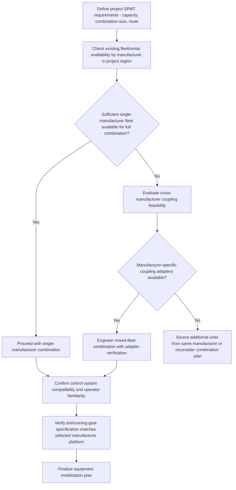

## Goldhofer, Scheuerle, and Cometto Equipment Families

### Overview

Goldhofer, Scheuerle, and Cometto are the three principal European manufacturers of Self-Propelled Modular Transporters (SPMTs) and heavy haulage trailers, whose equipment forms the backbone of the global heavy-lift and specialized transport industry. There are only a handful of SPMT manufacturers that produce these machines for North American customers, including Goldhofer, TII and Cometto (a Faymonville Company), with Enerpac (via its DTA acquisition) also competing, generally at smaller scale. Understanding the distinguishing characteristics of each manufacturer's product family helps in equipment selection, fleet planning, and cross-manufacturer compatibility considerations for heavy-lift projects. [Cranebriefing](https://www.cranebriefing.com/news/spmt-market-is-propelled-by-infrastructure-projects/8039684.article?zephr_sso_ott=orWXIx)

### Corporate Context and Group Structures

**Goldhofer**

Goldhofer specializes in transportation solutions within the heavy-duty and airport equipment sectors, offering a range of products including heavy-duty modular trailers, specialized application trailers, and aircraft recovery systems, as well as conventional and towbarless tractors for airport ground handling. Goldhofer primarily serves sectors such as construction, machine and plant engineering, energy, mining, port and shipyard logistics, and petrochemicals, and is headquartered in Memmingen, Germany. Goldhofer produces between 500-800 SPMT units per year, with sales leadership describing their strategic approach as focused on differentiated improvement rather than simply matching market offerings. [cbinsights](https://www.cbinsights.com/compare/goldhofer-vs-pongratz)[Cranes Today](https://www.cranestodaymagazine.com/news/goldhofer-leads-with-trailer/)

**Scheuerle (TII Group)**

Scheuerle operates as part of the TII Group, which also includes Kamag. Bernd Schwengsbier, president of the Tii Group, estimated their annual production capacity alone at 1,500 units. Scheuerle's presence in North America is significant, with almost 28,000 axle lines in service, reflecting a long-established installed base across the industry. [Cranes Today](https://www.cranestodaymagazine.com/news/goldhofer-leads-with-trailer/)[Cranebriefing](https://www.cranebriefing.com/news/whats-going-on-in-the-north-american-spmt-market/8034960.article)

**Cometto (Faymonville Group)**

Cometto is produced under the principles of its parent company Faymonville, bringing consistent and reliable SPMTs to the market. Notably, the first space shuttle transporter for NASA was a Cometto SPMT, reflecting the company's long historical role in extreme heavy-transport applications. [Cranebriefing](https://www.cranebriefing.com/news/whats-going-on-in-the-north-american-spmt-market/8034960.article)[Cranebriefing](https://www.cranebriefing.com/news/whats-going-on-in-the-north-american-spmt-market/8034960.article)

### Key Points

- **Total market scale**: Although there are only four manufacturers in this space — Scheuerle, Kamag, and Goldhofer of Germany, and Cometto of Italy — total annual worldwide SPMT production is roughly between 1,000 and 2,500 units per year, reflecting a specialized, relatively concentrated global supply base. [Cranes Today](https://www.cranestodaymagazine.com/news/goldhofer-leads-with-trailer/)
- **Shared fundamental architecture**: All three manufacturers produce SPMTs built around the same core modular concept — independent axle lines with hydraulic suspension, steering, and (for powered lines) drive motors, coupled together into project-specific combinations — meaning the fundamental design and operational principles covered under SPMT design and axle line configuration apply across all three product families, even though specific model naming, capacity ratings, and control system details differ by manufacturer.
- **Model line naming conventions**: Goldhofer's product range includes lines such as the PST (Power Steering Trailer) series (e.g., PST-SL, PST-SL-E, PST ADDrive, THP-ES-E), reflecting different generations and capability tiers within their modular transporter family. Cometto's heavy SPMT line is designated the MSPE, offered in 48 metric ton or 70 metric ton capacity per axle line configurations, intended for everyday payloads up to and beyond 20,000 metric tons for the largest combinations. [Cranebriefing](https://www.cranebriefing.com/news/whats-going-on-in-the-north-american-spmt-market/8034960.article)
- **Cross-manufacturer coupling limitations**: Because coupling mechanisms, hydraulic systems, and control/communication protocols are generally manufacturer-proprietary, axle lines from different manufacturers typically cannot be directly coupled into a single combination without specialized adapter engineering — a practical consideration when assembling large project fleets that may draw on multiple rental sources.
- **Industry demand trends**: Industries that have traditionally utilized SPMTs, such as oil and gas and shipbuilding, continue driving strong demand for larger fleets, while newer market segments including space, solar, and heavy industrial manufacturing are creating demand for new SPMT solutions, reflecting broadening application of this equipment class beyond its traditional heavy-industrial base. [Cranebriefing](https://www.cranebriefing.com/news/whats-going-on-in-the-north-american-spmt-market/8034960.article)
- **Automation trends**: Manufacturers are increasingly integrating automation and self-driving capability into their SPMT product lines as customer demand shifts toward reducing the personnel required to operate large combinations. [Cranebriefing](https://www.cranebriefing.com/news/whats-going-on-in-the-north-american-spmt-market/8034960.article)
- **Tire and running-gear specialization**: SPMT tire technology is specifically engineered for extreme validated loads, with some tire models rated to withstand loads as high as 23 tons per tire, tailored to specific manufacturer platforms — for example, certain tire models being specifically suited to Goldhofer modular trailers and Scheuerle heavy-duty combination transport vehicles, while other tire series are matched to Goldhofer's THP/SL-S series specifically, illustrating how running gear selection is often manufacturer- and even model-specific. [Otrtiremanufacturer](https://otrtiremanufacturer.com/blog/info-center/self-propelled-modular-transporter-tire-manufacturer/)

### Comparative Manufacturer Overview

| Manufacturer | Group/Parent | Origin | Notable Product Designation(s) | Approximate Annual Production |
| --- | --- | --- | --- | --- |
| Goldhofer | Independent (Goldhofer AG) | Memmingen, Germany | PST-SL, PST-SL-E, PST ADDrive, THP-ES-E | [Cite: ~500–800 units/yr] |
| Scheuerle | TII Group (with Kamag) | Germany | PEKZ series | [Cite: TII Group capacity ~1,500 units/yr] |
| Cometto | Faymonville Group | Italy | MSPE (48t / 70t per axle line) | [Unverified — not specified in sources reviewed] |

[Unverified] Exact current model lineups, capacity ratings, and technology features change over time as manufacturers release new generations; the model names above reflect information found in available sources and used equipment listings rather than a complete or currently definitive product catalog for each manufacturer, and should be verified directly against each manufacturer's current published specifications for any procurement or engineering decision.

### Equipment Family Relationship Diagram (svg_diagram)

<svg xmlns="http://www.w3.org/2000/svg" viewBox="0 0 900 380" font-family="Arial, sans-serif">
<text x="450" y="28" font-size="18" font-weight="bold" text-anchor="middle">SPMT Manufacturer / Group Structure (svg_diagram)</text>
<rect x="60" y="80" width="220" height="60" rx="8" fill="#c9d6ea" stroke="#333" stroke-width="2" />
<text x="170" y="105" font-size="13" font-weight="bold" text-anchor="middle">Goldhofer AG</text>
<text x="170" y="122" font-size="9" text-anchor="middle">Memmingen, Germany</text>
<rect x="340" y="80" width="220" height="60" rx="8" fill="#c9d6ea" stroke="#333" stroke-width="2" />
<text x="450" y="105" font-size="13" font-weight="bold" text-anchor="middle">TII Group</text>
<text x="450" y="122" font-size="9" text-anchor="middle">(Scheuerle + Kamag)</text>
<rect x="620" y="80" width="220" height="60" rx="8" fill="#c9d6ea" stroke="#333" stroke-width="2" />
<text x="730" y="105" font-size="13" font-weight="bold" text-anchor="middle">Faymonville Group</text>
<text x="730" y="122" font-size="9" text-anchor="middle">(includes Cometto)</text>
<line x1="170" y1="140" x2="170" y2="180" stroke="#333" stroke-width="2" />
<rect x="80" y="180" width="180" height="90" rx="6" fill="#e8f0fe" stroke="#333" stroke-width="1.5" />
<text x="170" y="200" font-size="10" text-anchor="middle">PST-SL / PST-SL-E</text>
<text x="170" y="216" font-size="10" text-anchor="middle">PST ADDrive</text>
<text x="170" y="232" font-size="10" text-anchor="middle">THP-ES-E</text>
<text x="170" y="255" font-size="8" text-anchor="middle">Modular / axle-line SPMTs</text>
<line x1="450" y1="140" x2="450" y2="180" stroke="#333" stroke-width="2" />
<rect x="360" y="180" width="180" height="90" rx="6" fill="#e8f0fe" stroke="#333" stroke-width="1.5" />
<text x="450" y="205" font-size="10" text-anchor="middle">Scheuerle PEKZ</text>
<text x="450" y="225" font-size="10" text-anchor="middle">series</text>
<text x="450" y="255" font-size="8" text-anchor="middle">~28,000 axle lines in NA service</text>
<line x1="730" y1="140" x2="730" y2="180" stroke="#333" stroke-width="2" />
<rect x="640" y="180" width="180" height="90" rx="6" fill="#e8f0fe" stroke="#333" stroke-width="1.5" />
<text x="730" y="205" font-size="10" text-anchor="middle">Cometto MSPE</text>
<text x="730" y="222" font-size="9" text-anchor="middle">48t / 70t per axle line</text>
<text x="730" y="255" font-size="8" text-anchor="middle">First NASA shuttle transporter</text>

<text x="450" y="320" font-size="9" text-anchor="middle">All families share the same fundamental modular axle-line architecture</text>

<text x="450" y="336" font-size="9" text-anchor="middle">(independent hydraulic suspension, steering, coupled combinations)</text>

</svg>

### Manufacturer Selection Considerations

### Example: Fleet Selection for a Large Petrochemical Module Campaign

**Scenario**: A project requires transporting a series of large petrochemical modules over several months, with a peak single-lift requirement of a 1,200-ton module needing a large multi-file SPMT combination, in a region where a single rental provider's fleet may not have sufficient axle lines of one manufacturer readily available.

**Approach**:

1. Assess the regional rental/heavy-transport contractor market to determine which manufacturer(s)' fleets (Goldhofer, Scheuerle/TII, or Cometto/Faymonville) have sufficient axle line inventory available for the project's peak combination size and schedule.
2. Where a single manufacturer's fleet is insufficient, evaluate whether the selected heavy-transport contractor has experience and adapter equipment for cross-manufacturer combination coupling, recognizing this as a specialized engineering exercise rather than a routine substitution.
3. Confirm operator training and control system familiarity align with the selected manufacturer's equipment, since control system interfaces differ between manufacturers.
4. Verify running gear (tires, suspension components) specified for the project matches the selected manufacturer's platform requirements, since replacement parts and consumables are often manufacturer- and model-specific.
5. Finalize the mobilization plan with the selected contractor, confirming combination configuration, PPU allocation, and coupling method for the specific fleet composition used.

**Outcome**: Understanding each manufacturer's fleet scale, model families, and coupling compatibility allows the project team to make an informed contractor and equipment selection decision, balancing availability against the added complexity (and potential engineering review requirements) of any cross-manufacturer combination.

[Behavior may vary based on current manufacturer product lineups, regional fleet availability, and specific rental/purchase contract terms — always verify against the specific manufacturer's current published specifications and the selected heavy-transport contractor's actual available fleet before finalizing equipment selection for a project.]

### Common Pitfalls

- Assuming direct interchangeability between different manufacturers' axle lines without verifying coupling and control system compatibility
- Overlooking that model designations and capacity ratings can change between generations within the same manufacturer's product line, requiring verification against current published data rather than assumed historical specifications
- Underestimating the specialized engineering effort required for cross-manufacturer combination coupling when relying on the assumption that "SPMT is SPMT" regardless of source
- Selecting running gear (tires, suspension components) not specifically rated for the actual manufacturer/model platform in use
- Failing to verify regional fleet availability early in project planning, leading to late-stage sourcing constraints for large combination requirements

### Related Topics

- SPMT Design and Axle Line Configuration (shared fundamental architecture across manufacturers)
- SPMT Coupling Configurations and Combination Planning (manufacturer-specific combination engineering)
- Power Pack Units and Hydraulic Drive Systems (manufacturer-specific control system considerations)
- Ballast Tractors and Conventional Heavy Haulers (comparative non-SPMT transport equipment)
- Heavy-transport contractor and rental fleet selection criteria
- SPMT automation and self-driving technology trends