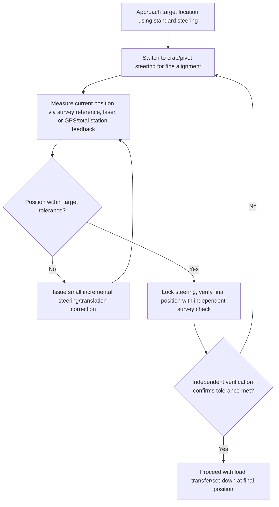

## SPMT Steering Modes and Positioning Accuracy

### Overview

SPMT steering modes and positioning accuracy address how Self-Propelled Modular Transporter combinations achieve their signature maneuverability advantage over conventional trailers, and the practical control-system and operational techniques used to position extremely heavy loads within tight, often millimeter-scale tolerances at final set locations. Because each axle line's wheels can be independently and continuously steered through a wide angular range, SPMT combinations can execute movement patterns impossible for a fixed-axle vehicle — a capability that is only realized through precise, synchronized control across every coupled unit in the combination.

### Steering Mode Categories

**Standard (Coordinated) Steering**

All axle lines steer in a coordinated pattern analogous to a conventional vehicle's front/rear steering geometry, causing the combination to travel in an arc around a defined turning center, with the combination's overall footprint sweeping through the turn similarly (though with a much tighter achievable radius) to a conventional long vehicle.

**Crab Steering**

All wheels across the combination are turned to the same angle relative to the direction of travel, causing the entire combination to translate diagonally or directly sideways without any rotation of the combination's own orientation — useful for aligning a load with a specific target position without changing its heading.

**Pivot (Rotation) Steering**

Wheels on opposite sides (or opposite ends) of the combination are steered to opposing angles, causing the combination to rotate about a fixed point — typically its own geometric center or another defined pivot point — enabling in-place reorientation within a footprint only marginally larger than the combination itself, without requiring the sweep path a standard turn would need.

**Independent/Custom Steering**

Advanced control systems allow operators to define custom steering behaviors combining elements of translation and rotation simultaneously, or to steer about an arbitrary point (not necessarily the combination's own center), providing flexibility for complex, non-standard maneuvering sequences required by specific site geometry.

### Key Points

- **Steering mode selection depends on maneuver geometry, not load characteristics**: Unlike load distribution or capacity decisions, which depend heavily on the specific load's weight and CG, steering mode selection is primarily a function of the required movement pattern relative to site constraints — a straight approach uses standard steering, a lateral alignment uses crab steering, and a direction change in confined space uses pivot steering.
- **Combined mode sequences for complex maneuvers**: Real-world positioning sequences frequently combine multiple steering modes in succession — for example, standard steering for the majority of a route approach, transitioning to crab steering for fine lateral alignment, then pivot steering for final heading correction — all coordinated through the same central control system without requiring the load to be set down and re-rigged between mode transitions.
- **Positioning accuracy is a function of control system feedback, not just steering capability**: Achieving fine positioning tolerance (commonly millimeter-scale for critical foundation setting) depends not only on the steering modes available but on the control system's position feedback (via GPS/total station survey integration, laser positioning systems, or encoder-based dead-reckoning) and the operator's ability to make small, incremental adjustments guided by that feedback.
- **Surveyed reference points guide final positioning**: Critical final-set operations typically use surveyed target points or reference markers (physical targets, laser alignment systems, or integrated total station tracking) that the operator or automated control system references to guide the combination's final approach and micro-positioning moves.
- **Load stability during rotation/crab movement**: While steering modes provide movement flexibility, the load's own stability (particularly for tall, high-CG loads) must be considered during crab and pivot maneuvers, which can introduce different dynamic force patterns on the load's tie-downs/restraint system compared to straight-line travel.
- **Turning radius scales with combination dimensions**: Even with advanced steering, a longer or wider combination has a larger minimum practical turning envelope; pivot steering mitigates this for in-place rotation, but standard-mode turns still require swept-path clearance proportional to the combination's footprint.
- **Wireless control latency and reliability**: Fine positioning maneuvers, particularly pivot steering of large combinations, are especially sensitive to control system responsiveness; latency or intermittent signal issues during fine positioning can cause overshoot or uneven response across a large combination's many axle lines.

### Steering Geometry Comparison Diagram (svg_diagram)

<svg xmlns="http://www.w3.org/2000/svg" viewBox="0 0 900 420" font-family="Arial, sans-serif">
<text x="450" y="26" font-size="18" font-weight="bold" text-anchor="middle">SPMT Steering Mode Geometries (svg_diagram)</text>

<text x="150" y="60" font-size="12" font-weight="bold" text-anchor="middle">Standard steering</text>

<rect x="110" y="90" width="80" height="140" fill="`#e0e0e0`" stroke="#333" stroke-width="2" />

<path d="M110,230 A250,250 0 0,0 340,60" fill="none" stroke="#666" stroke-width="1.5" stroke-dasharray="4,3" />

<path d="M300,90 A250,250 0 0,0 190,230" fill="none" stroke="#666" stroke-width="1.5" stroke-dasharray="4,3" />

<circle cx="150" cy="330" r="4" fill="`#dc3545`" />

<text x="150" y="350" font-size="8" text-anchor="middle">Turn center (offset)</text>

<text x="150" y="270" font-size="9" text-anchor="middle">Arc travel</text>

<text x="450" y="60" font-size="12" font-weight="bold" text-anchor="middle">Crab steering</text>

<rect x="410" y="90" width="80" height="140" fill="`#e0e0e0`" stroke="#333" stroke-width="2" />

<line x1="500" y1="160" x2="560" y2="160" stroke="#666" stroke-width="2" marker-end="url(#arrowSt)" />

<text x="450" y="270" font-size="9" text-anchor="middle">Pure lateral translation</text>

<text x="450" y="290" font-size="8" text-anchor="middle">no heading change</text>

<text x="750" y="60" font-size="12" font-weight="bold" text-anchor="middle">Pivot steering</text>

<rect x="710" y="90" width="80" height="140" fill="`#e0e0e0`" stroke="#333" stroke-width="2" />

<circle cx="750" cy="160" r="4" fill="`#dc3545`" />

<path d="M750,90 A70,70 0 1,1 749,90" fill="none" stroke="#666" stroke-width="1.5" stroke-dasharray="4,3" />

<text x="750" y="270" font-size="9" text-anchor="middle">Rotation about center point</text>

<text x="750" y="290" font-size="8" text-anchor="middle">minimal footprint sweep</text>

</svg>

### Positioning Feedback and Control Loop Concept

Fine positioning of an SPMT combination during final set operates as a closed-loop control process: the operator or automated system continuously compares the combination's (or load's) actual position against the target position, issuing small corrective steering/translation commands until the deviation falls within acceptable tolerance.

### Positioning Accuracy Considerations

- **Reference system selection**: Survey total stations, GPS-RTK (Real-Time Kinematic) positioning, and laser alignment systems each offer different accuracy characteristics and practical considerations (indoor vs. outdoor use, line-of-sight requirements, equipment cost) — selection depends on the required tolerance and the specific site's physical environment.
- **Incremental movement capability**: The control system's ability to command very small, precise movements (rather than only larger discrete steps) directly affects achievable final positioning tolerance; most modern SPMT control systems support fine incremental control specifically for this purpose.
- **Multiple independent verification checks**: Critical final-set operations typically involve independent position verification (a second survey check, or a different measurement method) before final load transfer, reducing the risk of a single-method measurement error resulting in a misaligned final position.
- **Environmental factors affecting accuracy**: Wind loading on tall loads, ground surface irregularities affecting individual axle line height (even with hydraulic equalization), and thermal expansion effects on very long combinations can all introduce small positioning deviations that must be accounted for during fine positioning.
- **Load flexibility/settling effects**: For loads with some structural flexibility, or where final set involves transferring load from the SPMT deck to a foundation (potentially with different support point stiffness), position may shift slightly during the load transfer itself — final verification should account for or occur after this transfer where practical.

### Example: Final Positioning of a Reactor Module onto Foundation Bolts

**Scenario**: A 700-ton reactor module must be positioned onto a foundation with pre-installed anchor bolts requiring alignment within a few millimeters, following SPMT transport to the general vicinity of the final location.

**Approach**:

1. Use standard steering mode to bring the SPMT combination to the general approach position near the foundation, with wider tolerance acceptable at this stage.
2. Transition to crab steering for lateral fine alignment, bringing the module's anchor bolt hole pattern into approximate alignment with the foundation's installed bolts, guided by visual reference and rough survey feedback.
3. Use pivot steering (if needed) for final heading correction, ensuring the module's orientation matches the foundation's bolt pattern rotation.
4. Engage a closed-loop positioning process using surveyed reference targets or a laser alignment system, making small incremental crab/pivot corrections while continuously checking position against the target tolerance.
5. Once within tolerance, perform an independent verification survey check before committing to load transfer.
6. Execute the final load transfer (lowering the module onto the foundation via the SPMT's hydraulic suspension, or using auxiliary jacks) while monitoring for any position shift during the transfer itself.
7. Perform a final post-transfer survey to confirm the module's final as-set position meets the required alignment tolerance.

**Outcome**: The combination of steering mode flexibility and closed-loop position feedback allows the module to be precisely aligned with pre-installed foundation bolts, a task that would be extremely difficult to achieve with a conventional fixed-steering trailer's more limited maneuvering capability.

[Behavior may vary based on specific SPMT manufacturer control system capabilities, positioning reference technology used, and site-specific environmental conditions — always verify against the specific equipment manufacturer's technical documentation and a project-specific positioning procedure before execution.]

### Common Pitfalls

- Attempting fine positioning using only standard steering mode when crab or pivot steering would provide more direct, lower-risk alignment capability
- Relying on a single position measurement method without independent verification before committing to final load transfer
- Underestimating combination swept-path requirements during standard-mode approach turns, even though fine positioning modes are available for the final stage
- Overlooking load stability considerations during crab/pivot maneuvers for tall or high-CG loads
- Inadequate wireless control system planning in areas with potential radio interference, risking latency or command loss during critical fine-positioning moves
- Failing to account for position shift during load transfer itself, treating pre-transfer position verification as the final confirmation without a post-transfer check

### Related Topics

- SPMT Design and Axle Line Configuration (fundamental steering mechanism architecture)
- SPMT Coupling Configurations and Combination Planning (combination footprint effects on turning envelope)
- Power Pack Units and Hydraulic Drive Systems (control system and synchronization infrastructure)
- Survey and positioning reference systems for heavy-lift final set operations
- Swept path analysis and route survey methodology for oversized transport
- Load transfer and foundation-setting procedures for heavy modules