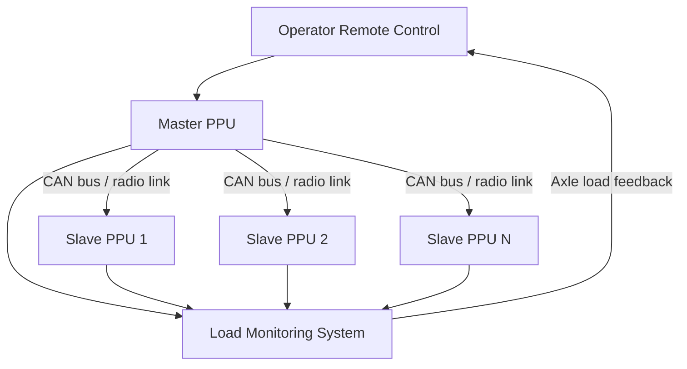
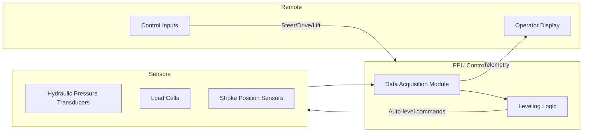

## Remote Control Operation and Load Monitoring Systems

### Overview

Self-Propelled Modular Transporters (SPMTs) are operated primarily through wireless remote control systems rather than an onboard driver station, enabling a single operator (or a coordinated multi-operator team) to control long, multi-axle-line platform trailers from a position with optimal sightlines to the load, obstacles, and personnel. Integrated load monitoring systems provide real-time feedback on axle loads, hydraulic pressures, and platform geometry, allowing the operator to maintain load distribution within engineering limits throughout the move.

### Remote Control Architecture

**Key Points**

- SPMT remote controls are typically proprietary systems tied to the manufacturer's PPU (Power Pack Unit) and electronic steering/suspension control architecture (e.g., Scheuerle, Goldhofer, COMETTO, Faymonville).
- Communication is via encoded RF (radio frequency) link, with modern systems increasingly offering redundant radio channels or hybrid RF/cable tether options for high-EMI environments (e.g., near refineries, power plants).
- The remote unit (pendant or beltpack) duplicates critical onboard controls: steering mode selection, drive/brake, raise/lower (lift cylinders), and emergency stop.

**Core control functions transmitted:**

- Propulsion: forward/reverse, speed proportional throttle
- Steering modes: standard (Ackermann), crab steering, circular/pivot steering, electronic coordinate steering
- Suspension: independent or grouped axle raise/lower for load leveling and obstacle clearance
- Braking: service brake and emergency/park brake
- PPU synchronization: linking of multiple PPUs for a single train of SPMTs (master-slave configuration)

### Steering Modes

`### Steering Modes (svg_diagram)`

<svg xmlns="http://www.w3.org/2000/svg" viewBox="0 0 760 300">

<rect width="760" height="300" fill="`#ffffff`" />

<text x="20" y="20" font-family="sans-serif" font-size="14" font-weight="bold" fill="#111">Steering Modes (svg_diagram)</text>

<g transform="translate(20,50)">
<text x="0" y="0" font-family="sans-serif" font-size="12" fill="#333">Standard</text>
<rect x="0" y="10" width="140" height="40" fill="none" stroke="#333" stroke-width="2" />
<line x1="10" y1="10" x2="10" y2="50" stroke="#0066cc" stroke-width="3" />
<line x1="130" y1="10" x2="130" y2="50" stroke="#0066cc" stroke-width="3" />
<path d="M10,10 L20,0" stroke="#0066cc" stroke-width="2" fill="none" />
<path d="M130,10 L140,0" stroke="#0066cc" stroke-width="2" fill="none" />
<text x="0" y="70" font-family="sans-serif" font-size="10" fill="#555">Front axles turn,</text>
<text x="0" y="82" font-family="sans-serif" font-size="10" fill="#555">rear tracks straight</text>
</g>
<g transform="translate(210,50)">
<text x="0" y="0" font-family="sans-serif" font-size="12" fill="#333">Crab</text>
<rect x="0" y="10" width="140" height="40" fill="none" stroke="#333" stroke-width="2" />
<line x1="10" y1="10" x2="20" y2="0" stroke="#cc3300" stroke-width="3" />
<line x1="10" y1="50" x2="20" y2="60" stroke="#cc3300" stroke-width="3" />
<line x1="130" y1="10" x2="140" y2="0" stroke="#cc3300" stroke-width="3" />
<line x1="130" y1="50" x2="140" y2="60" stroke="#cc3300" stroke-width="3" />
<text x="0" y="80" font-family="sans-serif" font-size="10" fill="#555">All wheels same angle,</text>
<text x="0" y="92" font-family="sans-serif" font-size="10" fill="#555">lateral/diagonal travel</text>
</g>
<g transform="translate(400,50)">
<text x="0" y="0" font-family="sans-serif" font-size="12" fill="#333">Circular / Pivot</text>
<rect x="30" y="10" width="80" height="40" fill="none" stroke="#333" stroke-width="2" transform="rotate(20 70 30)" />
<circle cx="70" cy="30" r="60" fill="none" stroke="#009933" stroke-width="1.5" stroke-dasharray="4,3" />
<text x="0" y="105" font-family="sans-serif" font-size="10" fill="#555">Each wheel steers toward</text>
<text x="0" y="117" font-family="sans-serif" font-size="10" fill="#555">common center point</text>
</g>
<g transform="translate(590,50)">
<text x="0" y="0" font-family="sans-serif" font-size="12" fill="#333">Coordinate</text>
<rect x="0" y="10" width="30" height="40" fill="none" stroke="#333" stroke-width="2" />
<rect x="60" y="30" width="30" height="40" fill="none" stroke="#333" stroke-width="2" />
<rect x="120" y="10" width="30" height="40" fill="none" stroke="#333" stroke-width="2" />
<path d="M15,50 Q45,70 75,60" stroke="#9900cc" stroke-width="1.5" fill="none" stroke-dasharray="3,2" />
<path d="M75,60 Q100,50 135,50" stroke="#9900cc" stroke-width="1.5" fill="none" stroke-dasharray="3,2" />
<text x="0" y="105" font-family="sans-serif" font-size="10" fill="#555">Path-following via</text>
<text x="0" y="117" font-family="sans-serif" font-size="10" fill="#555">stored X/Y coordinates</text>
</g>
<line x1="0" y1="200" x2="760" y2="200" stroke="#ccc" stroke-width="1" />
<text x="20" y="225" font-family="sans-serif" font-size="12" font-weight="bold" fill="#111">Operator selects mode via remote control panel; selection is mirrored on PPU display</text>
<text x="20" y="245" font-family="sans-serif" font-size="11" fill="#555">Mode mismatch between remotes on multi-PPU trains is a common cause of tracking errors [Inference]</text>
</svg>

### Multi-PPU Synchronization

For heavy or long loads, multiple SPMT lines are coupled mechanically and electronically. One PPU is designated **master**, and all other PPUs operate in **slave** mode, receiving synchronized steering, speed, and lift commands from the single remote control held by the operator.

**Key Points**

- Master-slave linking may be via cable (CAN bus / SPMT-specific data bus) or wireless, depending on manufacturer and site EMI conditions.
- Cable linking is generally preferred for critical lifts due to lower latency and higher reliability versus wireless [Inference].
- Loss of link between master and slave PPUs triggers an automatic stop/brake condition on all units as a safety interlock.

### Load Monitoring Systems

Load monitoring on SPMTs measures the actual load transmitted through each axle line (or hydraulic suspension leg) in real time, comparing it against the engineered load distribution plan.

**Measurement methods:**

- Hydraulic pressure transducers on each suspension cylinder, converting cylinder pressure to equivalent axle load
- Load cells integrated into king-pin or bolster connection points for platform-to-load interface monitoring
- Strain gauge instrumentation on critical structural members (less common, used for high-precision or research-grade monitoring)

**Load calculation (hydraulic pressure method):**

$$F = P \times A$$

Where $F$ is axle line force, $P$ is measured hydraulic pressure, and $A$ is the effective piston area of the suspension cylinder.

**Example**

A suspension cylinder with effective piston area $A = 500\text{cm}^2$ reads a pressure $P = 180\text{bar}$ ($18\text{MPa}$):

$$F = 18\text{MPa} \times 0.05\text{m}^2 = 900\text{kN} \approx 91.7\text{t}$$

This value is displayed per axle line on the operator's monitoring screen and logged for post-move QA documentation.

### Load Distribution and Leveling

**Key Points**

- Load monitoring feeds directly into automatic hydraulic leveling, which redistributes load across axle lines to keep all suspension points within their rated capacity.
- Leveling compensates for uneven ground, ramps, and transitions (e.g., ro-ro ramps, ground-to-barge transitions) by independently raising/lowering suspension groups.
- Maximum allowable load imbalance between axle lines is defined by the engineering lift plan and is typically expressed as a percentage deviation from mean axle load (commonly 10-15%, but always project-specific) [Unverified — project-specific engineering value].

**Alarm thresholds** are typically configured in tiers:

| Tier | Typical Trigger | System Response |
| --- | --- | --- |
| Advisory | Approaching 90% of rated axle load | Visual indicator on display |
| Warning | 90-100% of rated axle load | Audible alarm, operator acknowledgment required |
| Critical | Load imbalance exceeds plan tolerance | Auto-stop of forward motion, lock steering |

Exact thresholds vary by manufacturer's control software configuration and project-specific engineering limits [Inference].

### Operator Display and HMI

The remote control unit and/or a supplementary tablet/console displays:

- Real-time axle-line loads (numeric and graphical bar/heat-map representation)
- Total combined weight across all coupled PPUs
- Steering mode and wheel angle indicators
- Ground clearance / stroke position of each suspension cylinder
- Battery/fuel status of PPU(s)
- Fault codes and diagnostic alerts

### Safety Interlocks

**Key Points**

- Dead-man switch on the remote: continuous operator input required; release triggers automatic braking.
- Emergency stop (E-stop) on both the remote and PPU physically cuts propulsion and applies brakes, independent of software state.
- Geofencing/boundary limits may be configured on advanced systems to restrict travel path (coordinate steering mode).
- Signal loss timeout: if the PPU does not receive a valid signal within a defined interval (commonly under 1 second, manufacturer-dependent), the system defaults to a safe stop state [Unverified — manufacturer-specific timing].
- Redundant operator confirmation is typically required before executing multi-axle-line lift/lower commands during load transfer operations (e.g., ro-ro, load-out onto barge).

### Pre-Operation and Operational Checklist

**Example**

1. Verify remote-to-PPU pairing/handshake (link quality indicator green)
2. Confirm load monitoring system zeroed/calibrated against known reference weight
3. Cross-check displayed total load against engineered lift plan weight
4. Test E-stop function on remote and PPU
5. Verify steering mode matches planned route geometry (straight run vs. turn vs. crab)
6. Confirm all coupled PPUs report "slave synchronized" status
7. Begin move at crawl speed, monitor load distribution for first several meters before proceeding at operational speed

### Common Failure Modes

**Key Points**

- RF interference from site equipment (cranes, welding, radio towers) causing signal degradation — mitigated by frequency-hopping spread spectrum (FHSS) radio protocols in most modern remotes.
- Load cell/pressure transducer drift over time, requiring periodic recalibration against certified reference loads.
- Master-slave desynchronization on multi-PPU trains, typically surfaced as a fault code halting operation until resynchronized.
- Battery depletion on wireless remote/beltpack mid-operation — most systems carry a backup remote or hardwired tether contingency.

### Regulatory and Industry Standards Context

Load monitoring and remote control system design for SPMTs is generally guided by a combination of:

- Manufacturer type-approval and CE/ISO machinery directives (for European-built platforms such as Scheuerle, Goldhofer, COMETTO)
- Site-specific lift plans engineered per project (often referencing SC&RA — Specialized Carriers & Rigging Association — guidance in North America)
- OSHA and local jurisdiction requirements for rigging/heavy transport operator certification

[Inference] Exact certification and standard applicability vary significantly by country and project client requirements; always confirm against the specific project's engineering and regulatory compliance documents.

**Related Topics**

- SPMT Axle Load Calculation and Weight Distribution Engineering
- Multi-PPU Train Configuration and Synchronization Protocols
- Ro-Ro (Roll-on/Roll-off) Load Transfer Procedures
- Hydraulic Suspension Systems in Modular Transporters
- SPMT Route Survey and Ground Bearing Pressure Analysis
- Operator Certification and Training Requirements for SPMT Systems
- Telemetry Data Logging and Post-Move QA Documentation