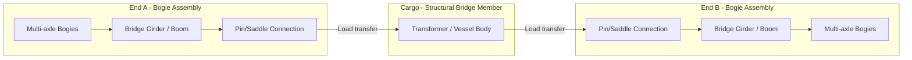

## Schnabel Car Design and Bridge Configurations

### Overview

A Schnabel car is a specialized heavy-haul railcar designed to carry extremely large, heavy, and indivisible loads (transformers, reactor vessels, generator stators, industrial pressure vessels) by having the cargo itself form part of the structural load path between two multi-axle bogie sections. Unlike conventional flatcars, the load is not simply set atop a deck — it is cradled and mechanically integrated into the car's structure, allowing the car to distribute enormous concentrated weights across many axles while maintaining rail clearance and curve negotiability.

### Core Structural Principle

**Key Points**

- The Schnabel car consists of two semi-independent "ends" (also called stub units or bridge sections), each mounted on multiple bogies (truck assemblies).
- The two ends connect to the cargo itself via massive pin connections, saddles, or trunnions, effectively making the cargo the center structural "bridge" member of the car.
- This design lowers the load's center of gravity relative to the rail and distributes weight across a much greater number of axles than a rigid flatcar could achieve.
- Load capacity for large Schnabel cars can range from several hundred tons up to 1,000+ tons on the largest purpose-built units [Unverified — capacity varies by specific car and operator fleet].

### Load Path Architecture

**Key Points**

- Each end's "boom" or girder cantilevers from the bogie assembly toward the cargo, terminating in a connection point (pin, trunnion, or saddle).
- The cargo bridges the gap between the two connection points, meaning the car's overall rigidity and load capacity are partially dependent on the cargo's own structural strength — this is the defining characteristic distinguishing Schnabel cars from conventional depressed-center or well cars.
- Some Schnabel designs use hydraulic articulation at the connection points to allow load leveling and to accommodate track superelevation and curve transitions without overstressing the cargo.

### Schnabel Car Types by Configuration

**Fixed-Bolster (Rigid) Type**

- Connection points are fixed pin joints with limited or no hydraulic compensation
- Simpler design, used for loads with sufficient inherent structural rigidity
- Less common in modern heavy-haul fleets due to limited flexibility for varying cargo geometries

**Hydraulic/Articulated Type**

- Connection points incorporate hydraulic cylinders allowing independent height adjustment at each end
- Enables load leveling across track irregularities, superelevation on curves, and grade transitions
- Allows the car to "self-adjust" and maintain even weight distribution across all bogie axles during transit
- Standard for modern high-capacity Schnabel cars (e.g., large power-transformer transport units)

**Sliding/Telescoping Type**

- Bridge/boom sections can extend or retract to accommodate cargo of varying lengths
- Allows a single car (or car pair) to be reconfigured for different cargo dimensions, improving fleet utilization

### Bogie and Axle Configuration

**Key Points**

- Each end typically rides on multiple bogies, and each bogie carries multiple axles (commonly 4, 6, or 8 axles per bogie group depending on car capacity class).
- Total axle count on large Schnabel cars can reach 24-36+ axles combined across both ends for the heaviest capacity classes [Inference — varies by specific fleet unit].
- Axle load is governed by track class and bridge/culvert rating along the intended route; this is a primary constraint driving route engineering (see Related Topics).
- Some configurations use idler/buffer cars coupled between the Schnabel car's ends and the rest of the train consist to manage overall train length and coupling geometry, since the Schnabel unit itself may not have conventional couplers at its load-bearing ends.

`### Bogie/Axle Layout — Fixed vs Hydraulic Type (svg_diagram)`

<svg xmlns="http://www.w3.org/2000/svg" viewBox="0 0 760 260">

<rect width="760" height="260" fill="`#ffffff`" />

<text x="20" y="20" font-family="sans-serif" font-size="14" font-weight="bold" fill="#111">Bogie/Axle Layout — Fixed vs Hydraulic Type (svg_diagram)</text>

<text x="20" y="50" font-family="sans-serif" font-size="12" font-weight="bold" fill="#333">Fixed-Bolster Type</text>

<g transform="translate(20,60)">

<rect x="0" y="20" width="80" height="20" fill="#ddd" stroke="#333" />

<circle cx="10" cy="45" r="6" fill="#333" /><circle cx="30" cy="45" r="6" fill="#333" />

<circle cx="50" cy="45" r="6" fill="#333" /><circle cx="70" cy="45" r="6" fill="#333" />

<line x1="80" y1="30" x2="160" y2="10" stroke="#555" stroke-width="4" />

<circle cx="160" cy="10" r="4" fill="`#cc3300`" />

<rect x="160" y="0" width="220" height="20" fill="`#f0c040`" stroke="#333" />

<text x="200" y="-5" font-family="sans-serif" font-size="10" fill="#555">Cargo (structural bridge member)</text>

<circle cx="380" cy="10" r="4" fill="`#cc3300`" />

<line x1="380" y1="10" x2="460" y2="30" stroke="#555" stroke-width="4" />

<rect x="460" y="20" width="80" height="20" fill="#ddd" stroke="#333" />

<circle cx="470" cy="45" r="6" fill="#333" /><circle cx="490" cy="45" r="6" fill="#333" />

<circle cx="510" cy="45" r="6" fill="#333" /><circle cx="530" cy="45" r="6" fill="#333" />

<text x="150" y="65" font-family="sans-serif" font-size="9" fill="#555">Fixed pin — no independent height adjustment</text>

</g>

<text x="20" y="160" font-family="sans-serif" font-size="12" font-weight="bold" fill="#333">Hydraulic/Articulated Type</text>

<g transform="translate(20,170)">

<rect x="0" y="20" width="80" height="20" fill="#ddd" stroke="#333" />

<circle cx="10" cy="45" r="6" fill="#333" /><circle cx="30" cy="45" r="6" fill="#333" />

<circle cx="50" cy="45" r="6" fill="#333" /><circle cx="70" cy="45" r="6" fill="#333" />

<rect x="35" y="0" width="10" height="20" fill="`#0066cc`" />

<line x1="80" y1="10" x2="160" y2="10" stroke="#555" stroke-width="4" />

<circle cx="160" cy="10" r="4" fill="`#009933`" />

<rect x="160" y="0" width="220" height="20" fill="`#f0c040`" stroke="#333" />

<circle cx="380" cy="10" r="4" fill="`#009933`" />

<line x1="380" y1="10" x2="460" y2="10" stroke="#555" stroke-width="4" />

<rect x="480" y="0" width="10" height="20" fill="`#0066cc`" />

<rect x="460" y="20" width="80" height="20" fill="#ddd" stroke="#333" />

<circle cx="470" cy="45" r="6" fill="#333" /><circle cx="490" cy="45" r="6" fill="#333" />

<circle cx="510" cy="45" r="6" fill="#333" /><circle cx="530" cy="45" r="6" fill="#333" />

<text x="150" y="65" font-family="sans-serif" font-size="9" fill="#555">Blue = hydraulic cylinder, independent leveling each end</text>

</g>

</svg>

### Weight Distribution Calculation

The static load per axle in a symmetric loading condition can be approximated as:

$$W_{axle} = \frac{W_{total}}{n_{axles}}$$

Where $W_{total}$ is combined car + cargo weight and $n_{axles}$ is total axle count across both ends. In practice, distribution is not perfectly even due to cargo center-of-gravity offset, requiring the more general moment-balance calculation:

$$W_A = W_{total} \times \frac{L_B}{L_A + L_B}, \quad W_B = W_{total} \times \frac{L_A}{L_A + L_B}$$

Where $W_A$, $W_B$ are the loads carried at End A and End B respectively, and $L_A$, $L_B$ are the horizontal distances from the cargo's center of gravity to each end's connection point.

**Example**

A transformer + car assembly totals $W_{total} = 450\text{t}$. The cargo center of gravity sits $L_A = 6\text{m}$ from End A's connection point and $L_B = 9\text{m}$ from End B's connection point:

$$W_A = 450 \times \frac{9}{6+9} = 450 \times 0.6 = 270\text{t}$$

$$W_B = 450 \times \frac{6}{15} = 180\text{t}$$

This asymmetric distribution directly affects which end requires more bogies/axles or a higher-capacity bogie group in car design.

### Route Engineering Considerations

**Key Points**

- Schnabel car movements require detailed route surveys covering bridge/culvert load ratings, curve radii, clearance envelopes (tunnels, platforms, signal structures), and grade profiles.
- Superelevation on curves must be accounted for in the hydraulic leveling system's range of travel to avoid overstressing the cargo at one connection point.
- Total consist length (including idler cars, buffer cars, and locomotives) affects siding capacity and crossing/junction negotiability along the route.
- Speed restrictions are typically imposed for Schnabel car movements, often well below standard freight speeds, particularly across bridges and through curves [Inference — restriction values are route- and operator-specific].

### Loading and Unloading Procedures

**Example**

1. Position car ends apart (telescoped/extended configuration if applicable) to create clearance for cargo insertion
2. Lower/position cargo using heavy-lift cranes, gantries, or SPMT transfer onto the car's saddle/trunnion fixtures
3. Engage pin connections or saddle clamps at both ends
4. Verify hydraulic leveling system engages and balances load across all bogies
5. Conduct static load test / weight verification before departure
6. Confirm clearance envelope and route profile match the as-loaded car dimensions (height, width, overhang)

### Comparison: Schnabel Car vs. Conventional Heavy-Haul Flatcar

| Attribute | Schnabel Car | Conventional Flatcar/Well Car |
| --- | --- | --- |
| Load role | Cargo is structural bridge member | Cargo sits passively on deck |
| Typical capacity | Very high (100s of tons) | Lower, deck-load-limited |
| Center of gravity | Lower (cargo cradled between ends) | Higher (cargo on top of deck) |
| Flexibility | Often custom-fit or adjustable to specific cargo | General-purpose |
| Complexity | High — hydraulic leveling, custom fixtures | Lower |
| Use case | Transformers, reactor vessels, unique oversized cargo | General oversized/heavy freight |

### Common Failure Modes and Risk Factors

**Key Points**

- Cargo structural inadequacy: because the cargo itself bears bridging loads, the cargo's own structural capacity must be verified as sufficient — a mismatch between assumed and actual cargo stiffness is a critical engineering risk.
- Hydraulic system failure at one end can cause sudden load imbalance; redundant hydraulic circuits and mechanical fail-safes are standard mitigations on modern cars.
- Connection point (pin/trunnion) fatigue from repeated loading cycles requires periodic inspection per railcar maintenance standards (e.g., AAR interchange rules in North America).
- Route mismatches (unanticipated curve/clearance conditions) are mitigated through detailed pre-move survey rather than car design alone.

**Related Topics**

- Rail Route Survey and Clearance Diagram Analysis for Oversized Cargo
- Idler and Buffer Car Configuration in Heavy-Haul Consists
- Hydraulic Leveling Systems in Heavy-Haul Rail Equipment
- AAR Interchange Rules and Heavy-Haul Railcar Maintenance Standards
- Transformer and Reactor Vessel Rigging for Rail Transport
- Depressed-Center and Well Car Design Comparison
- Superelevation and Curve Negotiation for Extra-Wide Rail Loads