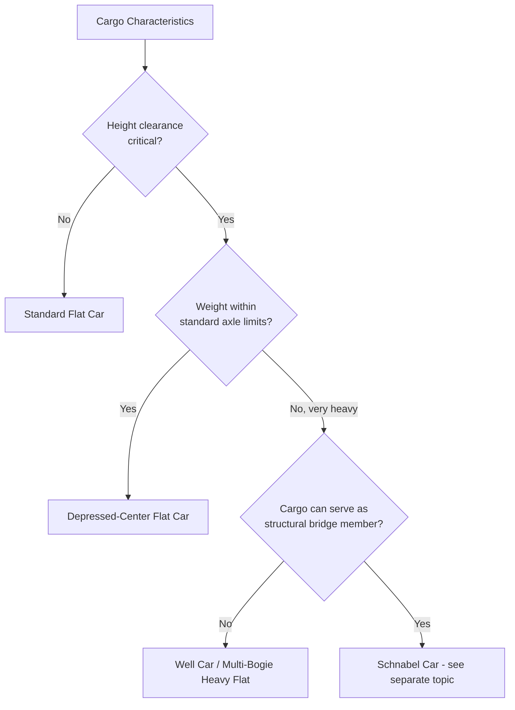

## Flat Car and Well Car Options for Heavy Cargo

### Overview

Flat cars and well cars represent the general-purpose end of the heavy-haul rail equipment spectrum, used when cargo dimensions and weight fall within ranges that do not require the specialized cradling structure of a Schnabel car. Flat cars provide a simple, level deck for top-loading cargo, while well cars (depressed-center or "well" designs) lower the load-bearing deck between the bogies to increase vertical clearance and stability for taller loads. Selection between car types is driven primarily by cargo weight, height, width, and whether the load can be secured/blocked on a flat deck or requires a lower center of gravity.

### Car Type Classification

### Standard Flat Car

**Key Points**

- Flat, level deck spanning the full car length, typically riding on two standard trucks (bogies) with 4 axles total.
- Load capacity typically ranges up to roughly 100 tons on standard interchange flat cars, though this varies by car class and jurisdiction [Unverified — capacity is fleet- and regulation-specific].
- Cargo is secured via blocking, bracing, chains, and strapping per standard rail loading rules (e.g., AAR Loading Rules in North America).
- Deck height is fixed at standard rail car floor height, offering no additional vertical clearance advantage.
- Best suited for cargo that is heavy but not exceptionally tall — machinery, structural steel, containers, vehicles, pipe.

### Depressed-Center Flat Car

**Key Points**

- The center section of the deck is lowered ("depressed") between the two truck assemblies, dropping well below the level of the deck at each end.
- Provides significantly increased vertical clearance for tall cargo (transformers, large tanks, industrial equipment) while remaining within tunnel/overhead clearance envelopes.
- Center depression also lowers the cargo's center of gravity, improving stability, particularly important on curves and during acceleration/braking.
- Typically rated for higher capacities than standard flat cars due to reinforced center-sill structure, commonly in the 100-200+ ton range depending on specific car design [Unverified — varies by manufacturer/fleet].
- May use either a rigid center sill or, in higher-capacity variants, additional intermediate bogies to spread load across more axles.

`### Depressed-Center vs Standard Flat Car Profile (svg_diagram)`

<svg xmlns="http://www.w3.org/2000/svg" viewBox="0 0 760 240">

<rect width="760" height="240" fill="`#ffffff`" />

<text x="20" y="20" font-family="sans-serif" font-size="14" font-weight="bold" fill="#111">Depressed-Center vs Standard Flat Car Profile (svg_diagram)</text>

<text x="20" y="50" font-family="sans-serif" font-size="12" font-weight="bold" fill="#333">Standard Flat Car</text>

<g transform="translate(20,60)">

<line x1="0" y1="90" x2="600" y2="90" stroke="#999" stroke-width="2" />

<rect x="0" y="40" width="600" height="15" fill="#ccc" stroke="#333" />

<circle cx="60" cy="90" r="10" fill="#333" /><circle cx="100" cy="90" r="10" fill="#333" />

<circle cx="500" cy="90" r="10" fill="#333" /><circle cx="540" cy="90" r="10" fill="#333" />

<rect x="200" y="10" width="200" height="30" fill="`#f0c040`" stroke="#333" />

<text x="250" y="0" font-family="sans-serif" font-size="10" fill="#555">Cargo</text>

</g>

<text x="20" y="180" font-family="sans-serif" font-size="12" font-weight="bold" fill="#333">Depressed-Center Flat Car</text>

<g transform="translate(20,190)">

<line x1="0" y1="40" x2="600" y2="40" stroke="#999" stroke-width="2" />

<path d="M0,10 L150,10 L220,35 L380,35 L450,10 L600,10 L600,25 L450,25 L400,40 L200,40 L150,25 L0,25 Z" fill="#ccc" stroke="#333" />

<circle cx="60" cy="40" r="10" fill="#333" /><circle cx="100" cy="40" r="10" fill="#333" />

<circle cx="500" cy="40" r="10" fill="#333" /><circle cx="540" cy="40" r="10" fill="#333" />

<rect x="220" y="10" width="160" height="25" fill="`#f0c040`" stroke="#333" />

</g>

</svg>

### Well Car (Container/Heavy-Well Variants)

**Key Points**

- Originally developed for double-stack intermodal container service, the well car design (a deep, low-slung "well" section between bogies) has been adapted in heavy-haul contexts for cargo requiring both low center of gravity and protected/recessed placement.
- In heavy-cargo (non-intermodal) applications, well-type cars are used for tall, narrow, or fragile heavy equipment that benefits from being nested below the level of the truck bolsters.
- Some multi-unit articulated well car designs (common in intermodal service) are adapted for heavy-project cargo by removing container-specific fittings and reinforcing the well floor for point loads.
- Well depth directly trades off against minimum cargo width/shape compatibility — very wide loads may not fit within the well's side structure.

### Multi-Axle Heavy-Capacity Flat Cars

For cargo heavier than standard flat car ratings but not requiring Schnabel-style cradling, heavy-capacity flat cars use additional bogies and axles to spread load:

$$W_{axle} = \frac{W_{total}}{n_{trucks} \times n_{axles/truck}}$$

**Example**

A heavy flat car with 4 trucks of 3 axles each (12 axles total) carries a combined car + cargo weight of $W_{total} = 300\text{t}$:

$$W_{axle} = \frac{300}{4 \times 3} = 25\text{t per axle}$$

This is compared against the maximum permissible axle load for the intended route's track class before the move is approved.

### Selection Criteria Summary

| Factor | Standard Flat Car | Depressed-Center Flat Car | Heavy Well Car |
| --- | --- | --- | --- |
| Typical capacity | Up to ~100t | ~100-200t+ | Varies, often 100t+ |
| Height clearance benefit | None | Significant | Significant |
| Center of gravity | Standard | Lowered | Lowered |
| Cargo shape flexibility | High | Moderate (must fit depression) | Lower (well width constrains shape) |
| Complexity/cost | Low | Moderate | Moderate-High |
| Typical cargo | General freight, machinery | Transformers, tanks, tall equipment | Tall/narrow fragile heavy equipment |

### Loading and Securement Considerations

**Key Points**

- Load blocking and bracing must account for car type: flat cars require full top-deck bracing systems, while depressed-center and well cars require fixtures compatible with the lowered section's geometry.
- Center-of-gravity height relative to rail directly affects curve speed limits and risk of load shift; lower CG designs generally permit less restrictive speed profiles, though actual limits are set by the specific route's engineering approval [Inference].
- Weight distribution across the car's length must be verified against the car's individual truck/axle ratings, not just total car capacity, since concentrated point loads can exceed local structural limits even within overall weight allowance.
- Tie-down and chain/strap securement follows applicable regulatory loading standards (e.g., AAR Loading Rules, or equivalent national standards outside North America); exact requirements vary by jurisdiction and car owner/operator rules.

### Route and Clearance Interaction

**Key Points**

- Depressed-center and well cars are frequently selected specifically to solve a clearance constraint (tunnels, overhead structures, platform canopies) rather than purely for weight capacity reasons.
- Route clearance diagrams must be checked against the *loaded* car profile (car deck height + cargo height), not the empty car's dimensions.
- Bridge and culvert load ratings along the route must accommodate the car's axle spacing and per-axle load, which varies significantly between 2-truck standard flat cars and multi-truck heavy variants.

**Related Topics**

- Schnabel Car Design and Bridge Configurations
- Rail Route Clearance Diagrams and Tunnel/Overhead Constraints
- AAR Loading Rules and Cargo Securement Standards
- Center of Gravity Management for Rail-Transported Heavy Cargo
- Intermodal Well Car Design Fundamentals
- Bridge and Culvert Load Rating Analysis for Heavy-Haul Rail Routes
- Curve Speed Restrictions and Superelevation for Oversized Rail Cargo