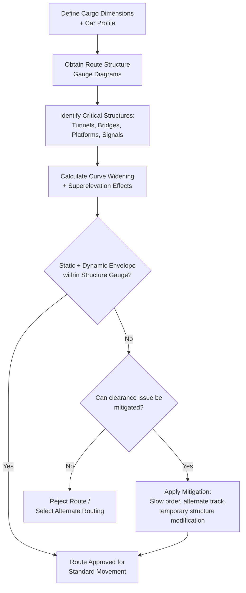

## Rail Clearance Diagrams and Loading Gauge Limits

### Overview

Rail clearance diagrams (also called clearance envelopes or berne/kinematic gauges depending on region) define the maximum permissible cross-sectional profile that rolling stock and cargo may occupy without contacting fixed infrastructure — tunnels, bridges, platforms, signal gantries, overhead catenary, and adjacent track structures. Loading gauge limits translate these envelopes into practical height, width, and offset constraints that heavy-haul rail moves must satisfy along an entire route, making clearance analysis one of the first and most route-critical engineering steps in any oversized rail shipment.

### Core Concepts

**Key Points**

- **Structure gauge**: the maximum envelope defined by fixed lineside infrastructure (tunnels, bridges, platforms) — the "outer boundary" cargo must stay within.
- **Loading gauge (vehicle/kinematic gauge)**: the maximum profile a railcar and its load may physically occupy, including allowances for dynamic movement (sway, roll, suspension travel).
- **Clearance margin**: the mandatory buffer maintained between the loading gauge and structure gauge to account for measurement tolerance, dynamic effects, and safety factor.
- Different countries and rail networks use different reference gauge standards (e.g., UIC gauges in Europe, Plate sizes in North America, Berne gauge historically), meaning a load cleared for one network may not automatically clear another.

### Loading Gauge Reference Systems by Region

| Region/System | Typical Reference | Notes |
| --- | --- | --- |
| North America (AAR) | Plate B, C, E, F, H (Association of American Railroads) | Plate letter denotes max height/width envelope class |
| United Kingdom | W6, W8, W9, W10, W12 gauges | Higher numbers generally indicate larger envelope, esp. for container traffic |
| Continental Europe | UIC GA, GB, GB1, GB2, GC gauges | Berne gauge historically; harmonized under UIC/TSI standards |
| International (UIC) | UIC 505-1 kinematic gauge | Reference framework used for cross-border interoperability |

[Inference] Exact plate/gauge letter-to-dimension mappings vary by publication version and should always be verified against the current controlling standard for the specific route and operating railroad, since these are periodically revised.

### Clearance Diagram Structure

`### Clearance Envelope Cross-Section (svg_diagram)`

<svg xmlns="http://www.w3.org/2000/svg" viewBox="0 0 700 400">

<rect width="700" height="400" fill="`#ffffff`" />

<text x="20" y="20" font-family="sans-serif" font-size="14" font-weight="bold" fill="#111">Clearance Envelope Cross-Section (svg_diagram)</text>

<line x1="350" y1="350" x2="350" y2="40" stroke="#999" stroke-width="1" stroke-dasharray="3,3" />
<text x="355" y="45" font-family="sans-serif" font-size="9" fill="#999">Track centerline</text>
<path d="M100,350 L100,150 Q100,60 350,60 Q600,60 600,150 L600,350" fill="none" stroke="#cc0000" stroke-width="3" />
<text x="440" y="55" font-family="sans-serif" font-size="10" fill="#cc0000">Structure Gauge (tunnel/bridge limit)</text>
<path d="M180,350 L180,180 Q180,110 350,110 Q520,110 520,180 L520,350" fill="none" stroke="#0066cc" stroke-width="3" stroke-dasharray="6,3" />
<text x="440" y="130" font-family="sans-serif" font-size="10" fill="#0066cc">Loading Gauge (max car+cargo profile)</text>
<rect x="300" y="230" width="100" height="80" fill="#f0c040" stroke="#333" stroke-width="2" />
<text x="315" y="270" font-family="sans-serif" font-size="10" fill="#333">Cargo</text>
<line x1="230" y1="350" x2="270" y2="350" stroke="#000" stroke-width="10" />
<line x1="430" y1="350" x2="470" y2="350" stroke="#000" stroke-width="10" />
<text x="330" y="370" font-family="sans-serif" font-size="9" fill="#333">Rail</text>
<line x1="600" y1="150" x2="520" y2="180" stroke="#009933" stroke-width="1" stroke-dasharray="2,2" />
<text x="610" y="160" font-family="sans-serif" font-size="9" fill="#009933">Clearance margin</text>
</svg>

### Key Measurement Dimensions

**Key Points**

- **Height above rail (top of rail, ToR)**: vertical clearance measured from the running rail surface to the highest point of the structure or cargo profile.
- **Width from centerline**: lateral clearance measured symmetrically (and asymmetrically, when applicable) from the track centerline.
- **Kinematic envelope**: an expanded version of the static loading gauge that accounts for dynamic vehicle movement — suspension compression, roll, lateral sway on curves — critical because a load that is statically within gauge may exceed it dynamically at speed or on curves.
- **Curve widening effects**: on curves, both the vehicle's overhang (ends swinging outward) and mid-car offset (center swinging inward, on very long cars) must be checked against the structure gauge, since standard tangent-track clearance figures do not directly apply on curves.

### Curve and Superelevation Effects on Clearance

On curved track, cargo clearance is affected by two competing geometric effects:

$$\Delta_{overhang} = \frac{L_{overhang}^2}{2R}$$

Where $\Delta_{overhang}$ is the lateral offset at the car end due to overhang, $L_{overhang}$ is the distance from the truck center to the car end, and $R$ is the curve radius.

**Example**

A railcar with $L_{overhang} = 8\text{m}$ negotiating a curve of radius $R = 300\text{m}$:

$$\Delta_{overhang} = \frac{8^2}{2 \times 300} = \frac{64}{600} \approx 0.107\text{m} \, (107\text{mm})$$

This additional lateral offset must be added to the load's static width profile when checking clearance against lineside structures on that curve section.

Superelevation (track banking on curves) additionally causes the car body to roll relative to vertical, shifting the effective top-of-load lateral position — tall, narrow loads are particularly sensitive to this effect since roll displacement increases with height above the rail.

### Route Clearance Survey Process

### Common Clearance Constraints in Practice

**Key Points**

- Tunnels are typically the tightest constraint on height and width simultaneously, since the full bore cross-section is fixed infrastructure.
- Platforms and station canopies constrain width more than height, particularly at curved platforms where the car body overhangs further into the platform edge.
- Overhead catenary/electrification structures impose strict height limits on electrified routes; non-electrified diversionary routes may be used specifically to avoid this constraint for very tall loads.
- Adjacent track centerline spacing matters for wide loads, since a load exceeding standard width may foul an adjacent track's own loading gauge — this can require single-tracking or coordinated blocking of adjacent track during the move.
- Signal masts, mileposts, and other lineside furniture, while individually minor, are cataloged in clearance surveys since cumulative violations across a route are what typically drive routing decisions.

### Mitigation Strategies for Clearance Violations

**Example**

Common mitigations when a load exceeds standard gauge at a specific location:

1. **Slow orders**: reducing speed through the constrained section to minimize dynamic sway/roll effects, effectively shrinking the kinematic envelope back toward the static envelope
2. **Track selection**: routing via a track with more generous clearance (e.g., outer track on a multi-track curve) or via an alternate diversionary route entirely
3. **Temporary infrastructure modification**: platform edge trimming, signal relocation, or catenary de-energization/removal for the duration of the move (used for the most constrained moves)
4. **Cargo reorientation**: rotating or repositioning asymmetric cargo on the car to present a narrower profile through the constrained zone, where feasible
5. **Off-peak/possession-window scheduling**: moving through highly constrained urban or station areas during scheduled track possessions when adjacent traffic can be suspended

### Documentation and Approval Workflow

**Key Points**

- Clearance calculations are typically compiled into a formal route survey/clearance report submitted to each railroad's engineering department for approval before movement.
- Multi-railroad interchange moves require clearance approval from each individual carrier whose track the load will traverse, since gauge standards and internal structure databases differ between operators.
- Approval is move-specific: a clearance approval for one load's exact dimensions and car type does not automatically extend to a different load, even on the identical route, since profile, weight distribution, and dynamic behavior differ.
- Digital clearance modeling tools (railroad-proprietary GIS/CAD systems) are commonly used by Class I and major international railroads to automate structure-gauge-vs-load-profile checking, though the underlying engineering principles remain as described above [Inference — specific tool names and capabilities vary by railroad and were not verified here].

**Related Topics**

- Schnabel Car Design and Bridge Configurations
- Flat Car and Well Car Options for Heavy Cargo
- Bridge and Culvert Load Rating Analysis for Heavy-Haul Rail Routes
- Curve Speed Restrictions and Superelevation for Oversized Rail Cargo
- Multi-Railroad Interchange Coordination for Heavy-Haul Moves
- Rail Route Survey Documentation and Approval Processes
- Center of Gravity Management for Rail-Transported Heavy Cargo