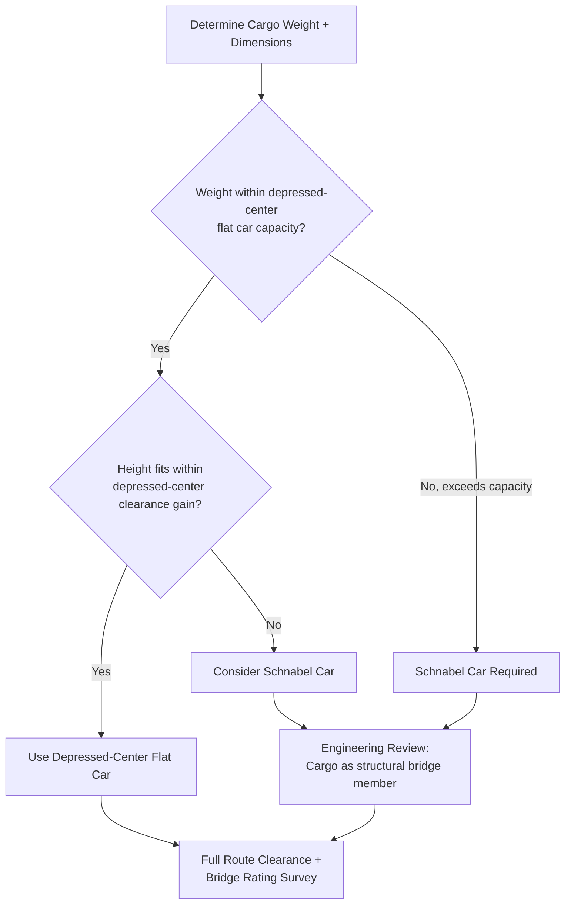

## Transformer and Generator Rail Movements

### Overview

Power transformers and generators (including generator stators, rotors, and large turbine components) represent some of the heaviest and most valuable indivisible cargo moved by rail, with unit weights commonly ranging from 100 to 500+ tons for large power transformers and utility-scale generator stators. These moves combine the structural, clearance, and route engineering challenges covered in Schnabel car design, flat/well car selection, and clearance gauge analysis into a single highly coordinated project, typically executed as a bespoke engineered move rather than a standard freight shipment.

### Cargo Characteristics Driving Move Design

**Key Points**

- **Power transformers**: tall, dense, rigid steel-tank structures with internal windings and bushings; center of gravity is typically high relative to the unit's footprint, and bushings/radiators are often removed and shipped separately to reduce height and protect fragile components.
- **Generator stators**: large cylindrical or oval structures, often longer and more uniformly weighted than transformers, but similarly dense and rigid; typically transported without disassembly due to the precision of internal windings.
- **Generator rotors**: highly sensitive to bending stress and typically require specialized cradles or shipping saddles that distribute support along the rotor's length to avoid shaft distortion.
- Both transformer and generator cargo are generally non-collapsible/non-reducible in cross-section (unlike, e.g., piping or structural steel), meaning height and width are fixed by the equipment itself and cannot be adjusted for clearance purposes — this is what drives car type selection (depressed-center, Schnabel) and gauge analysis intensity.

### Car Selection Logic for Transformer/Generator Moves



### Weight and Dimension Planning

**Key Points**

- Total transportable weight includes the transformer/generator unit itself plus any shipping accessories (cooling oil if shipped filled vs. drained, shipping brackets, impact recorders, temporary bracing).
- Many large transformers are shipped with oil drained and nitrogen-blanketed (or with reduced oil level) specifically to reduce shipping weight and lower risk of internal component movement during transit — this is an engineering/logistics decision made jointly by the manufacturer and transport engineer [Inference — practice varies by transformer size, manufacturer, and destination requirements].
- Center of gravity height and offset (front-to-back and side-to-side) must be documented precisely by the manufacturer, since this data directly feeds the axle load distribution and hydraulic leveling calculations on Schnabel or depressed-center cars.

**Example — approximate weight budgeting:**

$$W_{transport} = W_{unit} + W_{oil,shipped} + W_{fixtures}$$

A 250t transformer shipped with oil drained to a minimal shipping level ($W_{oil,shipped} \approx 15\text{t}$ vs. $\approx 60\text{t}$ full) and $8\text{t}$ of shipping fixtures:

$$W_{transport} = 250 + 15 + 8 = 273\text{t}$$

Compared to a fully-oil-filled shipment: $250 + 60 + 8 = 318\text{t}$ — a difference that can determine whether a depressed-center car suffices or a Schnabel car becomes necessary.

### Route Engineering for Transformer/Generator Moves

**Key Points**

- Full clearance diagram analysis (structure gauge vs. loaded kinematic envelope) is mandatory given the near-universal need for depressed-center or Schnabel cars on large units — see clearance gauge methodology in the related topic.
- Bridge and culvert load ratings must be checked against the specific axle spacing and per-axle load of the selected car, not generic route capacity figures.
- Curve radius and superelevation profiles along the entire route are surveyed for both static and dynamic clearance, and for structural stress on Schnabel car connection points where cargo bridges between bogie ends.
- Multi-railroad interchange is common for these moves (manufacturing plant to substation/power plant often spans several carriers' track), requiring coordinated clearance approval and scheduling across each railroad.
- Speed restrictions specific to the move (often well below standard freight speed limits) are typically imposed for the full route or for constrained segments, set by the responsible railroad's engineering department based on car type, load, and track conditions [Unverified — restriction values are move-specific].

### Coordination and Stakeholders

```mermaid
flowchart LR
    MFG[Manufacturer
CG data, unit specs] --> ENG[Transport Engineer
Car selection, load calc]
    ENG --> RR1[Origin Railroad
Clearance + routing]
    ENG --> RR2[Interchange Railroad(s)
Clearance + routing]
    ENG --> RR3[Destination Railroad
Clearance + routing]
    RR1 --> SCHED[Coordinated
Move Scheduling]
    RR2 --> SCHED
    RR3 --> SCHED
    SCHED --> RIG[Rigging/Crane Contractor
Load-in / Load-out]
    RIG --> SITE[Final Site Delivery
(often via SPMT/heavy-haul truck
for last-mile leg)]
```

**Key Points**

- Final delivery from the nearest rail siding to the substation or power plant is frequently completed via heavy-haul truck or SPMT for the last-mile leg, since generation and substation sites are rarely directly rail-served to the exact point of installation — this creates a rail-to-road (or rail-to-barge) transfer point requiring its own crane/rigging plan.
- Instrumentation such as impact recorders (accelerometers/shock recorders) is standard practice on high-value transformer and generator shipments to document in-transit forces for warranty and claims purposes.
- Escort and pilot vehicle requirements, while more commonly associated with the road leg, may also apply to rail movements in the form of accompanying technical personnel monitoring load security and instrumentation during transit.

### Loading and Securement

**Key Points**

- Transformers are typically secured via a combination of base-mounted tie-down fixtures (often using the unit's own lifting/jacking pads or a purpose-built shipping skid) plus chain/cable bracing to the car deck.
- Generator stators and rotors often require custom-engineered cradles or saddles matched to the specific unit's geometry, particularly for rotors where uneven support can induce bending stress.
- Load testing and verification (static weight check, load distribution confirmation via the car's monitoring/leveling system on Schnabel cars) is performed before departure, mirroring the pre-move checklist described under Schnabel car operations.
- Environmental protection (weatherproof covers, desiccant/nitrogen blanketing for drained transformers) is coordinated with the securement plan to avoid interference with tie-down points.

### Risk Factors Specific to Transformer/Generator Cargo

**Key Points**

- High unit value relative to most heavy-haul cargo means insurance, damage-prevention, and instrumentation requirements are typically more stringent than for general oversized freight.
- Internal component sensitivity (winding insulation, bushana points, precision-machined generator components) means shock and vibration limits are often specified by the manufacturer and monitored in-transit, rather than relying solely on visual/structural securement adequacy.
- Long lead times for route clearance approval across multiple railroads are a common scheduling risk, particularly when the move requires temporary infrastructure modification (platform trimming, catenary work) identified during clearance survey.
- Single-point-of-failure risk on Schnabel car connections (cargo serving as structural bridge member) makes structural adequacy verification of the cargo itself — not just the car — a critical pre-move engineering step, as covered under Schnabel car design.

**Related Topics**

- Schnabel Car Design and Bridge Configurations
- Flat Car and Well Car Options for Heavy Cargo
- Rail Clearance Diagrams and Loading Gauge Limits
- Multi-Railroad Interchange Coordination for Heavy-Haul Moves
- Rail-to-Road Transfer Points and Last-Mile SPMT Delivery
- Impact Recorder and In-Transit Shock Monitoring Practices
- Rigging and Crane Planning for Transformer Load-In/Load-Out