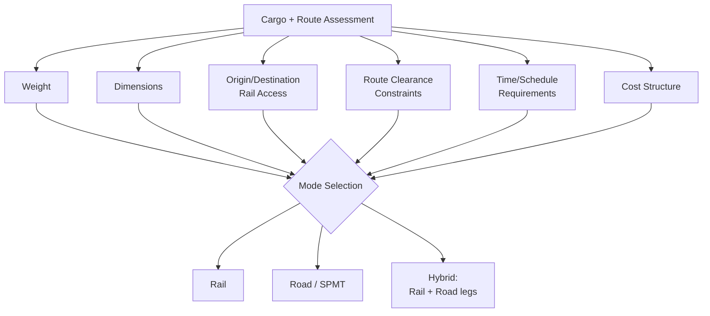

## Rail versus Road Transport Decision Factors

### Overview

Selecting between rail and road (heavy-haul trucking, including SPMT) for oversized and heavy cargo is a multi-variable engineering and commercial decision, not a default choice. The two modes have fundamentally different constraint structures — rail is bound by fixed infrastructure (gauge, bridge ratings, siding access) but offers very high capacity per unit, while road offers routing flexibility and true door-to-door delivery but faces tighter practical weight/dimension ceilings per axle group and more variable permitting/escort requirements. Most large heavy-lift projects use a combination of both modes rather than a single mode end-to-end.

### Primary Decision Factors

### Weight and Capacity Comparison

**Key Points**

- Rail, via Schnabel and multi-axle heavy-capacity cars, can move single indivisible loads well beyond what is practical on public roads — units of several hundred tons are routine in rail heavy-haul, whereas road moves of similar weight require extensive SPMT trains and are far more route-constrained.
- Road capacity scales by adding more axle lines/SPMT modules, but total combination length, bridge postings along the public route, and turning geometry at intersections impose practical ceilings that differ fundamentally from rail's constraint set.
- For truly extreme single-piece weights (largest transformers, reactor vessels), rail via Schnabel car is often the only practical inland option, with road/SPMT used for the final short-distance leg to/from a rail siding [Inference — general industry pattern, not a universal rule].

### Dimensional and Clearance Constraints

| Factor | Rail | Road / SPMT |
| --- | --- | --- |
| Height constraint driver | Tunnels, bridges, catenary, platforms | Overhead utility lines, overpasses, bridges |
| Width constraint driver | Structure gauge, adjacent track spacing | Lane width, oncoming traffic, roadside obstacles |
| Governing standard | Loading gauge / clearance diagrams (fixed, surveyed) | Local permit limits (variable by jurisdiction) |
| Route flexibility | Low — fixed track network | High — multiple road route options often exist |
| Predictability | High once cleared (survey is definitive) | Moderate — route may need real-time adjustment for unforeseen obstacles |

**Key Points**

- Rail clearance, once surveyed and approved, is highly predictable for the specific move; road clearance can involve last-minute obstacle discovery (temporary construction, overhead lines not in original survey) despite pre-move route surveys.
- Road offers the ability to route around a single blocking obstacle via an alternate street or highway; rail has effectively no alternate "next track over" option at a fixed clearance pinch point without a genuinely separate rail line.

### Origin and Destination Access

**Key Points**

- Rail requires both origin (typically a manufacturing plant or port) and destination (or a nearby siding) to have rail access; lack of direct rail service at either end forces a hybrid rail+road/SPMT solution regardless of other factors.
- Road/SPMT offers true point-to-point capability when the origin and destination both have suitable road access and load-in/load-out space, which is common for substations, power plants, and industrial sites even when not rail-served.
- Port-to-site moves for imported heavy equipment frequently use a hybrid model: ocean vessel to port, SPMT or heavy-haul truck for a short land leg to a rail siding, rail for the long inland haul, then SPMT/truck again for final site delivery.

### Route and Infrastructure Risk

**Key Points**

- Rail route risk is concentrated in the clearance/bridge-rating survey phase — once approved, execution risk is comparatively low and highly scheduled (train paths, crew, track possessions).
- Road route risk includes variable permit approval timelines across multiple state/provincial/municipal jurisdictions, utility relocation coordination (overhead line lifting, traffic signal removal), and police/escort scheduling — often a longer and more variable planning cycle than rail clearance for equivalent complexity [Inference — comparative planning-cycle claim, varies significantly by jurisdiction].
- Multi-railroad interchange (for rail) and multi-jurisdiction permitting (for road) both introduce coordination overhead, but the nature of the coordination differs: rail interchange is primarily a clearance/scheduling handoff between a small number of railroads, while road permitting can involve dozens of individual permit authorities along a long route.

### Time and Schedule Considerations

**Key Points**

- Rail transit, once moving, is generally faster over long distances than road heavy-haul, which is typically restricted to specific hours (daylight-only, off-peak, or night moves depending on jurisdiction) and lower travel speeds.
- Road moves are more susceptible to weather-driven schedule disruption over a multi-day route (high wind affecting tall loads, ice/snow affecting SPMT or trailer operations) since they are less protected than a rail corridor.
- Rail scheduling depends on securing an approved train path/slot from the railroad(s) involved, which can itself introduce lead time, particularly for interchange moves spanning multiple carriers.

### Cost Structure Comparison

**Key Points**

- Rail generally offers a lower marginal cost per ton-mile for very heavy, long-distance moves, but carries higher fixed costs for specialized car mobilization (Schnabel car positioning, which may itself require a repositioning move from a distant depot).
- Road/SPMT costs scale more directly with crew-days, equipment mobilization, and permit/escort fees, and can become cost-competitive or cheaper than rail for shorter distances or when a suitable rail car is not readily available near the origin.
- Hybrid moves incur transfer costs at each mode change (crane lift-off/lift-on, or SPMT ramp transfer at a rail siding), which must be weighed against the transport savings of using each mode for its most efficient segment.

### Decision Framework Summary

**Example**

A practical decision sequence for a large transformer move:

1. Confirm whether origin and destination both have usable rail access — if not, at least one hybrid transfer point is required regardless of other factors
2. Compare total cargo weight/dimensions against road permit limits in the relevant jurisdictions vs. rail car capacity and clearance gauge
3. Survey both rail clearance (structure gauge) and road route (overhead/width obstacles) in parallel where a real choice exists
4. Compare total project schedule (mobilization + transit + permitting/clearance approval lead time) for each option
5. Compare total landed cost including mode-transfer costs for any hybrid legs
6. Select the mode (or hybrid combination) that satisfies technical constraints within acceptable schedule and cost

### When Rail Is Typically Preferred

- Extremely heavy single-piece cargo exceeding practical road/SPMT combination limits
- Long-distance inland moves (hundreds to thousands of km) where rail's per-mile cost advantage compounds
- Origin and destination both have direct or near-direct rail access
- Route has been previously cleared for similar cargo, reducing survey lead time

### When Road/SPMT Is Typically Preferred

- Origin or destination lacks rail access (common for substations, refineries, and many industrial sites)
- Shorter-distance moves where rail car mobilization overhead outweighs transit savings
- Cargo dimensions or weight fit comfortably within standard heavy-haul trucking/SPMT capability
- Schedule requires flexible, on-demand routing not tied to train path availability

**Related Topics**

- Schnabel Car Design and Bridge Configurations
- Rail Clearance Diagrams and Loading Gauge Limits
- Transformer and Generator Rail Movements
- SPMT Route Survey and Ground Bearing Pressure Analysis
- Permitting and Escort Requirements for Oversized Road Loads
- Multi-Railroad Interchange Coordination for Heavy-Haul Moves
- Multimodal Transfer Point Planning (Rail-to-Road, Port-to-Rail)