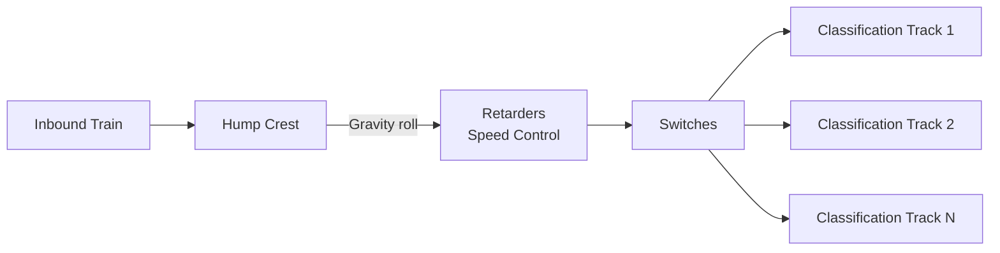
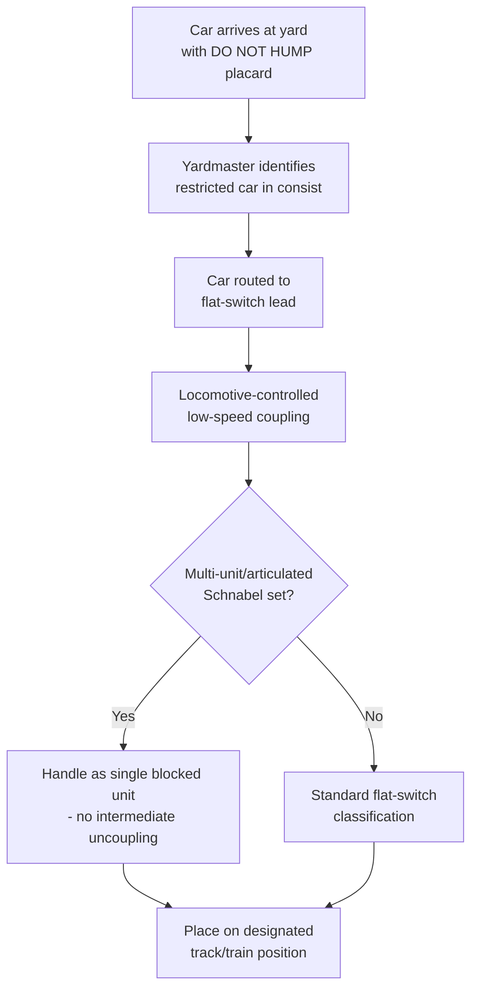

## Rail Yard Handling and Hump Yard Restrictions

### Overview

Rail yards perform the classification, coupling, and staging functions that assemble individual railcars into trains, and the handling method used within a yard has direct consequences for heavy and oversized cargo cars. Hump yards — which classify cars by rolling them over a graded hill and allowing gravity to sort them into classification tracks — are efficient for high-volume general freight but pose specific risks to heavy-haul equipment, making flat-switching (or "flat yard") handling the standard requirement for Schnabel cars, depressed-center flat cars, and other specialized heavy-cargo equipment.

### Hump Yard Operation Basics

**Key Points**

- In hump yard operation, cars are uncoupled at the crest of a small hill and allowed to roll by gravity down into classification tracks, with retarders (mechanical or hydraulic brakes built into the track) controlling speed and preventing excessive coupling impact.
- Cars typically couple with adjacent cars at the bottom of the hump at a controlled but still non-trivial impact speed, commonly in the range of a few km/h, calibrated to achieve reliable automatic coupling without excessive shock — exact target speeds are yard- and railroad-specific [Unverified — specific coupling speed standards vary by railroad].
- Hump yards are highly efficient for classifying large volumes of standard freight cars but apply impact forces and require individual car separation (uncoupling) that is incompatible with several characteristics of heavy-haul equipment.

### Why Heavy-Haul Cars Are Excluded from Humping

**Key Points**

- **Impact sensitivity**: high-value, precision cargo (transformers, generator components, sensitive machinery) can be damaged by the coupling impact forces considered normal and acceptable for standard freight, even when within a hump yard's calibrated retarder settings.
- **Structural/connection sensitivity**: on Schnabel cars, the cargo itself forms part of the structural load path between the two car ends; humping impact could impose transient loads on the cargo-to-car connection points that the design does not account for, since the car was engineered for controlled, monitored movement — not gravity-classification impacts.
- **Multi-unit coupling constraints**: Schnabel cars and other articulated/multi-bogie heavy cars are frequently marked as "do not hump" and handled as blocked units precisely because their physical configuration (extended wheelbase, non-standard coupling arrangement, or permanently coupled multi-car sets) is often incompatible with standard hump classification switches and retarder geometry.
- **Weight/axle load on hump infrastructure**: the hump crest, retarders, and classification bowl track are engineered for standard freight car axle loads; extremely heavy cars may exceed design parameters for hump-specific track sections even if mainline track along the route is rated for the load [Inference].
- **Escort/monitoring requirements**: many heavy-haul cars carry in-transit monitoring (load cells, impact recorders per the transformer/generator movement practices) that is incompatible with unsupervised, automated hump classification.

### Flat Switching as the Required Alternative

**Key Points**

- Flat switching (or "flat yard" switching) moves cars using a locomotive to directly push or pull them to their destination track at controlled, low speed, without the free-rolling gravity phase of a hump.
- This method allows precise speed control throughout the entire coupling maneuver, keeping impact forces well below hump-yard levels and allowing an operator/ground crew to visually monitor the coupling in real time.
- Special/restricted cars (identified in the railroad's car movement instructions, waybill notations, or placarding) are typically flagged with explicit "DO NOT HUMP" or "FLAT SWITCH ONLY" markings that yard crews are required to observe.
- Flat switching is inherently slower and more labor-intensive per car than humping, which is one reason heavy-haul car movements through yards require advance coordination and scheduling rather than being processed through routine yard flow.

### Yard Handling Workflow for Restricted Cars

### Placarding and Documentation

**Key Points**

- Restricted-handling cars carry standardized placards/stencils (e.g., "DO NOT HUMP," "FLAT SWITCH ONLY," "HANDLE WITH CARE") visible to yard personnel, in addition to being flagged in the railroad's electronic waybill/car movement system.
- Waybill instructions for heavy-haul cargo typically include explicit handling restrictions beyond hump avoidance — maximum coupling speed, prohibition on certain switching maneuvers, and sometimes a requirement for the car to remain in a fixed position within the train consist.
- Coordination between the shipper/transport engineer and each railroad's operating department (not just the sales/pricing side) is necessary to ensure yard crews at every intermediate yard along a multi-railroad route are aware of and equipped to handle the restrictions.

### Consequences of Yard Handling on Route and Schedule Planning

**Key Points**

- Because restricted cars cannot flow through standard hump classification, transit through yards with humping as their primary or only classification method can introduce delay while cars are manually flat-switched around the yard's normal flow.
- Some routes may specifically be selected, in part, to minimize the number of hump yards traversed, favoring routings through yards with flat-switching capability or direct run-through handling where the heavy-haul car bypasses yard classification entirely (e.g., handled as a dedicated unit train or block).
- This yard-handling constraint is a scheduling and routing input that compounds with the clearance and bridge-rating constraints covered separately — a technically clear route may still face yard-handling delays that must be factored into overall project timeline.

### Best Practices for Heavy-Haul Rail Yard Coordination

**Example**

1. Confirm "DO NOT HUMP" / flat-switch-only status is documented in the waybill and physically placarded on the car before movement begins
2. Identify all yards along the planned route and confirm each has flat-switching capability or an alternate handling procedure for restricted cars
3. Coordinate directly with yardmasters/operating departments at key yards in advance, particularly for multi-railroad interchange points
4. Where possible, request handling as a dedicated block or unit movement to minimize the number of individual switching maneuvers
5. Verify any in-transit monitoring equipment (impact recorders, load cells) is confirmed operational before yard transit, since this is where uncontrolled impact risk is highest if handling instructions are not followed

**Related Topics**

- Schnabel Car Design and Bridge Configurations
- Transformer and Generator Rail Movements
- Multi-Railroad Interchange Coordination for Heavy-Haul Moves
- Impact Recorder and In-Transit Shock Monitoring Practices
- Rail Route Survey Documentation and Approval Processes
- Flat Car and Well Car Options for Heavy Cargo
- Waybill and Car Movement Instruction Documentation Standards