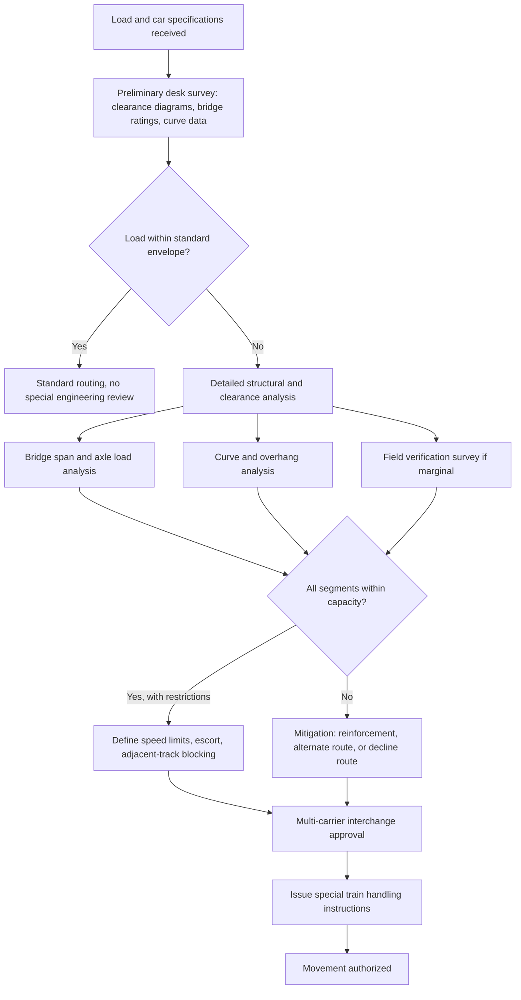

## Rail Route Engineering and Track Structure Assessment

### Overview and Purpose

Rail route engineering and track structure assessment is the process of verifying that a specific route — its track, bridges, tunnels, and associated infrastructure — can physically and structurally accommodate a given heavy or oversized rail movement before it is authorized to run. Unlike standard freight, which is designed to fit within a railroad's published clearance and weight envelopes by default, heavy-lift and out-of-gauge cargo routinely exceeds one or more of those envelopes, so each movement requires an engineering review specific to that load and that route. This discipline sits at the intersection of civil/structural engineering (bridges, track substructure), mechanical engineering (car and truck design), and operations planning (train handling, scheduling, interchange coordination).

### Core Assessment Domains

**Key Points**

- **Clearance (dimensional) assessment**: verifying the load's width, height, and any overhang will pass every fixed structure and adjacent track along the route without contact.
- **Weight and structural capacity assessment**: verifying that axle loads, truck loads, and total car weight fall within what the track, bridges, and culverts along the route can safely carry.
- **Curvature and geometry assessment**: verifying the car (especially long, articulated, or schnabel-type equipment) can physically negotiate the minimum curve radii, turnouts, and grade transitions on the route without excessive overhang, coupler angle, or binding.
- **Track condition assessment**: verifying the physical condition of rail, ties, ballast, and fastenings is adequate for the dynamic loads the movement will impose, independent of the route's nominal design rating.

Each domain can independently disqualify a route or require mitigation (speed restriction, escort, temporary reinforcement, or rerouting), so a full assessment addresses all four rather than treating any single check as sufficient.

### Clearance (Dimensional) Engineering

**Key Points**

- **Loading gauge**: the maximum cross-sectional envelope (width and height, as a function of height above rail) that a railroad guarantees is clear of fixed structures under normal conditions. Common reference standards include AAR Plate diagrams (Plate B through Plate H/I and beyond) in North America, and UIC/Berne gauge or national gauges (e.g., GB gauges in the UK) elsewhere.
- **Kinematic vs. static envelope**: the loading gauge is a static reference; the actual clearance available to a specific car depends on its kinematic envelope — how far the car body swings, leans, or overhangs during curve negotiation, superelevation, and suspension travel. A load that is statically within gauge can still foul a structure dynamically on a curve.
- **Structure gauge / clearance diagram**: the as-built minimum clearance at every tunnel, bridge, platform, signal gantry, and overhead catenary structure on the route, typically documented by the infrastructure owner and updated by periodic clearance surveys (historically manual, increasingly via LiDAR-equipped clearance cars).
- **Superelevation interaction**: on curves, the outer rail is raised (superelevated) to counteract lateral acceleration. A tall load leans toward the inside of the curve relative to the track plane, which can reduce effective clearance on the high (outer) side structure and must be modeled explicitly for out-of-gauge loads.
- **Out-of-gauge (OOG) classification**: railroads typically classify moves into tiers (e.g., "wide load," "high load," "high-wide," "excess dimension") that determine what level of route-specific engineering review, escort, and speed restriction is triggered.

**Example**

A load 4.3 m wide (versus a nominal 3.4 m gauge) triggers a full route survey checking every adjacent track centerline spacing, platform edge, and structure along the route, because the load will overhang into the adjacent track's space — potentially requiring the adjacent track to be blocked (no meets/passes) for the duration of the movement.

### Weight and Structural Capacity Engineering

**Key Points**

- **Axle load limits**: the maximum load permitted on a single axle, set by rail section (weight per yard/meter), tie spacing and condition, ballast depth, and subgrade. Mainline heavy-haul track in North America is commonly rated to roughly 35.7 tonnes/axle (315,000 lb gross rail load) under AAR M-1001 standards for qualifying car types, though many secondary lines and older bridges are rated lower.
- **Bridge formula / span analysis**: bridges are rated not just for total weight but for the distribution of that weight over the span, since a concentrated load produces a higher bending moment than the same weight spread over a longer wheelbase. Bridge engineers calculate the moment and shear a specific car's axle spacing and weight will produce on each span and compare it to the bridge's rated capacity, often expressed as a **Cooper E-rating** (or equivalent) that quantifies live-load capacity in the classical steam-locomotive-derived unit still used for freight bridge rating in North America.
- **Culvert and embankment capacity**: for very heavy point loads, culverts and fill embankments under track can also be limiting factors, particularly where a heavy multi-axle truck's footprint is short relative to the structure beneath it.
- **Dynamic (impact) load allowance**: static axle weight understates the actual force delivered to track and bridges, because wheel/rail irregularities, speed, and car suspension characteristics add a dynamic increment. Engineering assessments typically apply an impact factor (which generally decreases as speed is reduced) — this is a primary reason heavy-lift movements are speed-restricted over bridges and through weak track sections.
- **Cumulative fatigue considerations**: for bridges near the end of their design life or with known deficiencies, engineers may also assess cumulative fatigue effects of repeated heavy movements, not just the single-pass capacity.

$$M_{applied} = \sum_{i} P_i \cdot a_i$$

where $M_{applied}$ is bending moment at the critical section, $P_i$ is the load at axle $i$, and $a_i$ is that axle's influence-line ordinate (a function of its position on the span) — compared against the bridge's rated moment capacity to determine whether the movement can proceed as-is, requires speed restriction, or requires temporary reinforcement (e.g., timber cribbing, temporary shoring, or a load-spreading mat).

### Curvature and Geometry Engineering

**Key Points**

- **Minimum curve radius**: every car has a minimum negotiable curve radius determined by truck center spacing, coupler swing, and car body length; schnabel and other extreme-length heavy-lift cars often have significantly larger minimum radii than standard equipment, which can eliminate certain routes or yard tracks entirely.
- **Overhang analysis**: on curves, the center of a long car body swings outward (mid-car overhang) while the ends swing inward relative to the track centerline (end overhang), both of which must be checked against adjacent structures and adjacent-track clearance — this compounds with the dimensional clearance analysis above.
- **Vertical curves and grade transitions**: depressed-center and articulated cars have limited ability to flex vertically; sharp changes in grade (crest and sag vertical curves) can cause the underframe to bind, or in the case of schnabel cars where the load itself is the structural member, can impose unacceptable stress on the load's lifting lugs/trunnions if not modeled in advance.
- **Turnout (switch) negotiation**: turnout geometry (frog angle, guard rail clearance) must accommodate wide-gauge or multi-axle trucks; some heavy-lift cars require specific turnout numbers (shallower angles) to pass safely.
- **Yard and terminal geometry**: beyond the mainline, receiving yards, interchange tracks, and the origin/destination sidings must also be checked, since these are often older, tighter-radius trackage not designed to modern heavy-haul standards.

### Track Condition Assessment

**Key Points**

- **Rail section and condition**: heavier, newer rail sections (higher weight per yard/meter) generally tolerate higher axle loads; worn, older, or lighter rail sections may derate a route below its nominal design capacity.
- **Tie and fastening condition**: deteriorated ties, missing spikes/clips, or degraded ballast reduce the effective load-carrying capacity of track independent of the rail itself, and are typically checked via track inspection records and, for critical movements, a dedicated pre-move inspection walk or geometry car run.
- **Track geometry car data**: many railroads run instrumented geometry cars that measure gauge, cross-level, alignment, and surface (vertical profile) — this data is used to identify segments needing maintenance before a heavy-lift movement, since geometry defects amplify dynamic loading.
- **Special trackwork condition**: turnouts, diamond crossings, and bridge approach track often show accelerated wear and are common focus points for pre-move inspection and, if needed, tamping/surfacing or component renewal.
- **Weather and seasonal effects**: track structure capacity can vary seasonally — thawing subgrade in spring ("frost boil" conditions) or extreme heat (risk of sun kink/buckling) can further restrict what a route can safely carry at a given time, independent of its nominal rating.

### Route Survey and Approval Workflow

**Key Points**

- **Preliminary desk survey**: engineering staff review existing clearance diagrams, bridge ratings, and curve data against the proposed car and load dimensions/weight to identify an initial candidate route and flag likely problem points.
- **Field verification**: for movements near the edge of tolerance, a physical survey (historically manual measurement, increasingly via LiDAR/laser scanning mounted on a survey car) confirms as-built clearances match records, since infrastructure can change (new signal equipment, adjacent construction, vegetation encroachment) without being reflected in older diagrams.
- **Multi-carrier coordination**: when a route crosses more than one railroad's track (interchange), each carrier independently reviews and approves the segment on its own property, since liability and engineering standards are carrier-specific; this is a common source of scheduling delay for long-haul heavy-lift moves.
- **Mitigation planning**: where a specific structure or segment is marginal, engineers develop mitigations — permanent or temporary bridge reinforcement, speed restriction zones, single-direction operation (blocking the adjacent track), escort/pilot requirements, or in some cases rerouting around the deficient segment entirely.
- **Movement authorization and special instructions**: once approved, the movement is typically governed by a special train handling bulletin specifying maximum speed by segment, required inspection stops, and any operating restrictions (e.g., no meets on adjacent track through a given clearance-critical section).

**Diagram: Route Assessment Workflow**

### Comparison: Assessment Focus by Load Characteristic

| Load Characteristic | Primary Assessment Domain | Typical Limiting Structure |
| --- | --- | --- |
| Excess width | Clearance | Adjacent track, platforms, signal gantries |
| Excess height | Clearance | Tunnels, overhead bridges, catenary |
| Excess weight (total) | Structural capacity | Bridges, culverts |
| High axle/truck concentration | Structural capacity | Short-span bridges, turnouts |
| Excess length / rigid wheelbase | Curvature/geometry | Sharp curves, yard trackage |
| Load requiring in-transit leveling | Geometry (vertical) | Grade transitions, sag/crest curves |

### Practical Considerations and Limitations

- **Data currency**: clearance diagrams and bridge ratings are only as reliable as their last update; changes to adjacent infrastructure (new signals, replaced bridges, vegetation) can silently invalidate older records, which is why marginal moves warrant field re-verification rather than reliance on historical documents alone. [Inference: the specific re-verification interval or trigger threshold is set by each railroad's internal engineering standards and is not uniform across the industry.]
- **Behavior may vary by railroad and jurisdiction**: axle load limits, bridge rating methodologies (e.g., Cooper E-rating conventions), and clearance diagram standards differ between North America, Europe, and other regions, and even between individual railroads within the same country; figures cited here are representative, not universal.
- **Interchange complexity**: the more carriers a route crosses, the more independent approvals are required, and the more likely a single marginal segment on any one carrier's track becomes the binding constraint on the entire movement.

### Related Topics

- Loading gauge standards and structure gauge diagrams (AAR Plates, UIC/Berne gauge)
- Cooper E-rating and bridge live-load capacity analysis
- Track geometry cars and LiDAR-based clearance survey technology
- Superelevation design and its interaction with tall/out-of-gauge loads
- Multi-carrier interchange coordination for superload rail movements
- Temporary bridge reinforcement and load-spreading techniques for heavy-lift moves
- Dynamic/impact load factors in rail structural assessment
- Multi-Axle Flatcars and Depressed-Center Cars (equipment side of the same movement)