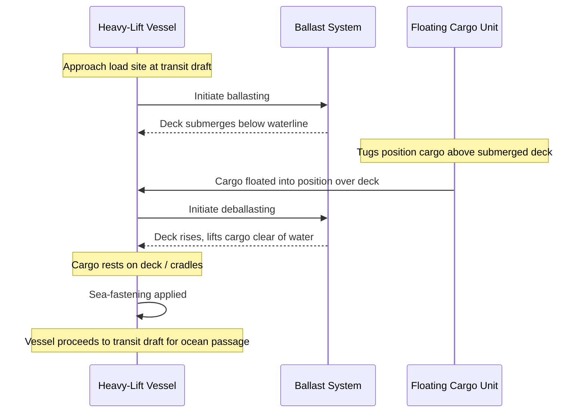

## Semi-Submersible and Float-On/Float-Off Vessels

### Overview and Functional Purpose

Semi-submersible and float-on/float-off (FLO/FLO) vessels are heavy-lift ships designed to transport cargo that cannot be lifted by crane or driven aboard by ramp — either because it is too heavy for any crane system, or because it floats and must be loaded and unloaded on the water itself. Both vessel types achieve this through the same fundamental mechanism: controlled ballasting submerges the vessel's cargo deck below the waterline, allowing cargo to be floated into position over the deck, after which deballasting raises the deck (and the cargo resting on it) back above the waterline for transport. The distinction between "semi-submersible" and "FLO/FLO" is one of degree and terminology convention rather than a hard category boundary, and the terms are frequently used interchangeably in industry practice, though some operators reserve "semi-submersible" for vessels that submerge only partially (deck remains near or just below the surface) and "FLO/FLO" for the operational method regardless of how deep the vessel submerges.

### Core Operating Principle

**Key Points**

- **Ballasting to submerge**: the vessel takes on seawater ballast into tanks distributed through the hull, increasing displacement and drawing the main deck down below the waterline to a depth sufficient to float the cargo (a barge, another vessel, an offshore platform jacket/topside, or a floating dry dock) over the deck.
- **Positioning cargo**: the floating cargo unit is maneuvered (by tugs, its own propulsion, or winches on the heavy-lift vessel) into position directly above the submerged deck, aligned with pre-marked positioning cues or guided by divers/ROV survey and GPS-referenced positioning systems for precision placement.
- **Deballasting to lift**: the vessel pumps ballast water out, reducing displacement and causing the vessel (and everything resting on its deck) to rise. As the deck breaks the surface and continues rising, the cargo is lifted clear of the water and comes to rest fully supported on the deck structure, cradles, or sea-fastening points.
- **Sea-fastening**: once the cargo is resting on deck and the vessel is at transit draft, the cargo is welded, chained, or otherwise mechanically secured (sea-fastened) to the deck to withstand the motions and accelerations of open-ocean transit.
- **Reverse process for discharge**: at the destination, the sequence is reversed — the vessel re-ballasts to submerge the deck, the cargo floats free, and is towed or maneuvered off before the vessel deballasts again for its next voyage.

**Diagram: FLO/FLO Loading Sequence**

### Vessel Types and Cargo Categories

**Key Points**

- **Semi-submersible heavy-lift ships**: the most common commercial type, used for oversized project cargo, offshore platform jackets and topsides, drilling rigs (jack-ups and semi-submersible rigs), damaged or non-propelled vessels, and large modular industrial units. These typically have a wide, flat, open cargo deck and moderate submersion capability.
- **Open-deck heavy-lift/dock ships**: a subcategory optimized for very wide beam cargo (e.g., jack-up rigs with long legs, or wide barges) where deck width and load-spreading capacity matter more than maximum submersion depth.
- **Floating dry dock transport**: FLO/FLO vessels are a standard method for relocating floating dry docks themselves, since a dry dock is itself a floating structure too large and specialized to move under its own power over long distances.
- **Submersible barge transport**: transporting large barges (including construction barges, accommodation barges, or damaged vessels) that cannot self-propel or that owners prefer not to expose to open-ocean towing risk.
- **Non-FLO/FLO comparison point**: distinct from these are "dockwise-type" heavy-lift vessels used more generally for any dry cargo that can be floated or craned aboard — the FLO/FLO capability is one loading method among several a modern heavy-lift vessel may offer (the others being lift-on/lift-off via ship's cranes, and roll-on/roll-off via ramp).

### Structural and Design Features

**Key Points**

- **Ballast tank arrangement**: distributed across double-bottom and wing tanks along the hull length and breadth, engineered to allow controlled, differential ballasting so the vessel can be trimmed and heeled precisely (not just sunk uniformly) to align the deck plane with the cargo or to compensate for asymmetric cargo weight distribution.
- **Deck strength and load-spreading**: the cargo deck must be structurally reinforced to accept concentrated point loads or line loads from cargo resting on cradles, skid beams, or its own keel/hull structure — a fundamentally different loading pattern than a normal cargo ship's evenly distributed containerized or bulk load.
- **Freeboard and stability during submersion**: submerging the main deck reduces the vessel's freeboard and metacentric height (GM) at intermediate stages of the ballasting sequence, which is the most stability-critical phase of the entire operation — naval architects must verify stability throughout the full ballasting curve, not just at fully-loaded and fully-submerged endpoints.
- **Propulsion and station-keeping**: many semi-submersible heavy-lift vessels use azimuth thrusters or dynamic positioning (DP) systems to hold position precisely during the loading/discharge sequence, particularly important in open roadstead locations without sheltered harbor loading facilities.
- **Skid beams and cradles**: fixed or adjustable structural cradles on deck are used to receive specific cargo shapes (e.g., a vessel's hull form, a rig's hull pontoons) and to spread the load evenly rather than concentrating it on isolated deck points.

### Stability and Ballast Engineering During Submersion

**Key Points**

- **Intact stability requirements**: classification societies (e.g., DNV, ABS, Lloyd's Register) impose stability criteria the vessel must satisfy throughout the ballasting sequence, not only at the start and end states, since GM and freeboard vary continuously and non-linearly as tanks fill.
- **Free surface effect**: as ballast tanks are partially filled during the transition, free surface effect (the tendency of liquid in a partially full tank to shift and reduce effective stability) must be accounted for in real-time ballast control calculations.
- **Trim and heel control**: precise differential ballasting between port/starboard and fore/aft tank groups allows operators to correct for uneven cargo weight distribution or to intentionally trim the vessel to match a non-level cargo item (e.g., an already-listing damaged vessel being rescued).
- **Environmental limits**: FLO/FLO loading and discharge operations are generally restricted to defined limits of significant wave height, wind speed, and current, since the operation requires the cargo and vessel to be relatively positioned with tight tolerances while the vessel's own stability margin is temporarily reduced. [Inference: specific environmental operating limits are vessel- and operation-specific, set by the vessel operator's operations manual and the specific cargo's marine warranty surveyor, not a single industry-wide figure.]
- **Marine warranty survey**: for high-value or high-risk cargo (offshore platforms, expensive vessels), an independent marine warranty surveyor typically reviews and approves the loading plan, ballast sequence, and sea-fastening design before the operation is insured.

### Sea-Fastening and Voyage Preparation

**Key Points**

- **Sea-fastening design**: engineered to resist the combined static and dynamic forces of ocean transit — pitch, roll, heave accelerations, and green water/wave slam loads — calculated for the specific voyage's expected sea states (often governed by a route-specific or seasonal design wave height/motion criteria).
- **Securing methods**: typically a combination of welded steel stoppers/chocks preventing sliding, wire rope or chain lashings preventing lifting/shifting, and timber or elastomeric packing distributing contact loads between cargo and deck/cradle.
- **Cargo-specific engineering**: because FLO/FLO cargo is often a unique, one-off item (a specific rig, a specific damaged vessel), sea-fastening is typically custom-engineered per voyage rather than using generic fittings, based on the cargo's actual weight distribution, center of gravity, and structural hard points.
- **Motion monitoring**: some voyages carry motion-monitoring instrumentation (accelerometers, inclinometers) to verify actual voyage motions remain within the design envelope assumed for the sea-fastening calculations, particularly on long ocean crossings.

### Comparison: FLO/FLO vs. Other Heavy-Lift Vessel Loading Methods

| Loading Method | Cargo Must Float? | Typical Cargo | Loading Mechanism |
| --- | --- | --- | --- |
| FLO/FLO (semi-submersible) | Yes | Rigs, platforms, barges, damaged vessels, dry docks | Ballast/deballast to submerge and re-float deck |
| Lift-on/Lift-off (LO/LO) | No | Modules, generators, transformers, project cargo | Ship's own heavy-lift cranes or shore cranes |
| Roll-on/Roll-off (RO/RO) | No | Wheeled or skidded cargo, self-propelled units | Ramp, SPMTs, or rail-mounted trailers |
| Dockwise-type combination vessels | Optional | Broad project cargo mix | Vessel may offer FLO/FLO, LO/LO, and RO/RO capability |

### Operational Considerations and Limitations

- **Port and site requirements**: FLO/FLO operations require sufficient water depth for the vessel to submerge (deck depth plus cargo draft plus under-keel clearance), which can restrict operations to specific deepwater anchorages or purpose-built loading facilities rather than standard container/bulk berths.
- **Weather windows**: because the operation is stability-sensitive and requires precise relative positioning, loading/discharge is typically scheduled around favorable weather windows, and delays due to sea state are a common schedule risk factor in project planning.
- **Behavior may vary by vessel class and operator**: specific submersion depths, deck dimensions, and ballast system capabilities vary substantially between vessel classes and operators; figures and procedures described here represent general industry practice rather than any single vessel's specification. [Unverified: exact current fleet capabilities should be confirmed against the specific vessel's class certificate and operator documentation, as these details change as vessels are built, modified, or retired.]

### Related Topics

- Ballast system design and free-surface effect calculations for stability-critical operations
- Marine warranty surveying for high-value heavy-lift and project cargo voyages
- Sea-fastening engineering and voyage motion criteria (design wave/motion envelopes)
- Offshore platform jacket and topside transport logistics
- Comparison of heavy-lift vessel loading methods (LO/LO, RO/RO, FLO/FLO combination vessels)
- Dynamic positioning (DP) systems in heavy-lift marine operations
- Floating dry dock relocation logistics
- Route Rail Route Engineering and Track Structure Assessment (land-transport counterpart in the broader heavy-lift chain)