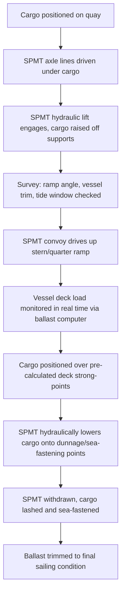

## Open Deck and Roll-On/Roll-Off Vessels

### Overview

Open deck vessels and Roll-on/Roll-off (RoRo) vessels represent two distinct but often complementary ship classes used in heavy-lift and specialized cargo logistics. Open deck vessels (also called open-hatch or flush-deck vessels) carry cargo on an unobstructed, weatherable deck surface without traditional hatch covers segmenting the cargo space, allowing oversized and irregularly shaped cargo to overhang deck edges or extend above conventional hatch coamings. RoRo vessels are designed around wheeled or self-propelled cargo that is driven or towed on and off the vessel via ramps, rather than lifted by crane. Many modern heavy-lift carriers combine both capabilities in a single hull, marketed as Open Hatch/RoRo (OHRO) or heavy-lift RoRo tonnage.

### Open Deck Vessels

#### Defining Characteristics

Open deck vessels are engineered so that the cargo hold is accessible through a single, full-beam opening rather than multiple discrete hatches separated by deck structure (coamings, hatch beams, cross-deck strips). This design eliminates "shadow zones" that would otherwise prevent a crane hook from reaching cargo positioned under deck structure between hatches.

**Key Points**

- Full-beam, full-length hatch openings (in true open-hatch designs) allow box-shaped cargo (e.g., paper reels, steel coils, project cargo modules) to be loaded with minimal void space
- Vertical, self-supporting cell guides or corner-post guidance systems (borrowed from container-ship technology) are frequently integrated to allow stackable cargo without lashing between tiers
- Deck cargo is common: pipes, modules, yachts, and breakbulk units are frequently carried on the weather deck in addition to under-deck stowage
- Cargo can overhang the vessel's beam (over-width) or exceed hatch coaming height (over-height), constrained by class society and port stability/air-draft approvals rather than ship structure

#### Structural and Stability Considerations

Removing conventional hatch coamings and cross-deck structure reduces the hull's inherent torsional and racking stiffness. Naval architects compensate through:

- Increased plating thickness in way of the ship's sides and double bottom
- Higher tensile steel in strength decks
- Reinforced hatch coamings acting as longitudinal strength members despite the absence of intermediate cross-deck beams

[Inference] The specific torsional stiffness penalty and compensating scantling increase vary by class society (DNV, ABS, Lloyd's Register, ClassNK) and are vessel-specific, so exact structural margins should be confirmed against a given vessel's classification documentation rather than assumed generically.

Stability calculations for open deck cargo differ from container or bulk stowage because:

$$GM_{corrected} = KM - KG_{cargo-adjusted} - FSC$$

Where $KG_{cargo-adjusted}$ accounts for high, concentrated deck loads (e.g., a single 800-tonne module stowed on deck) rather than a distributed cargo plan, and $FSC$ (free surface correction) remains relevant for ballast used to counteract asymmetric or high-KG loading.

#### Crane and Lifting Configuration

Most open deck heavy-lift vessels are gearless-hatch designs served by:

- **Twin jib cranes** with combined lifting capacity (tandem lift), commonly 2 x 350t to 2 x 500t on modern tonnage, enabling single loads up to 700-1,000t via synchronized tandem lifting
- **Mast cranes** (single-point, higher-capacity) on specialized project carriers, occasionally exceeding 2,000t

**Example**

A vessel fitted with two 400t cranes performing a tandem lift can theoretically handle a 700-750t module (derated below the 800t nominal sum due to load-sharing inefficiency, rigging geometry, and dynamic amplification factors during lift). [Inference] The derating percentage is operator- and rigging-specific and is typically established through a lift-specific engineering study rather than a fixed industry constant.

### Roll-on/Roll-off (RoRo) Vessels

#### Defining Characteristics

RoRo vessels load and discharge cargo using its own wheels (trucks, trailers, mafi-trailers, self-propelled construction equipment) or Self-Propelled Modular Transporters (SPMTs), moving cargo across ramps rather than lifting it vertically.

**Key Points**

- Stern ramps (and often bow or side ramps/doors) connect the vessel deck to the quay or a floating ramp structure
- Internal ramps connect multiple deck levels, with some designed as hoistable/liftable decks to vary deck height for different cargo profiles
- Cargo is secured with lashing chains, twist-locks (for wheeled units with container-compatible corner castings), or wheel chocks rather than crane-rigged slings
- Vessels are classified by cargo type served: PCTC (Pure Car and Truck Carrier), ConRo (Container + RoRo hybrid), and Heavy-Lift RoRo (reinforced decks for project cargo and military/oversized wheeled loads)

#### Deck and Ramp Engineering

Heavy-lift RoRo vessels differentiate themselves from standard PCTCs primarily through **deck strength (point loads and uniform loads)** and **ramp capacity**.

| Parameter | Standard PCTC | Heavy-Lift RoRo |
| --- | --- | --- |
| Deck load capacity | ~2-3 t/m² | 15-40+ t/m² (reinforced decks) |
| Stern ramp capacity | ~50-150t | 500t+ (some vessels exceed 750t) |
| Deck clear height | ~1.8-4.5m (multi-level) | Often adjustable via hoistable decks, up to 6-8m clear on main deck |
| Typical cargo | Cars, light trucks | SPMT-carried modules, tracked/wheeled military vehicles, mining equipment, wind components |

[Unverified] Exact ramp and deck load figures are vessel-specific and change across newbuild generations; figures above represent commonly cited industry ranges and should be verified against a specific vessel's loading manual before engineering a lift.

#### Loading Sequence with SPMTs

A typical heavy-lift RoRo loading operation using SPMTs follows this sequence:

**Key Points**

- Ramp angle is a hard operational constraint: excessive angle risks SPMT grounding-out (chassis contact) or exceeding cargo tilt limits for sensitive equipment
- Real-time trim and heel monitoring during loading prevents progressive listing as sequential heavy units cross the ramp off-centerline
- Tidal window calculations are critical where ramp angle is tide-dependent (particularly at quays without adjustable link-span ramps)

### Open Hatch / RoRo (OHRO) Hybrid Vessels

Many modern heavy-lift carriers combine open deck crane-lift capability with stern/side RoRo ramps in a single hull, maximizing cargo flexibility. This hybrid is common among specialized project cargo operators.

**Key Points**

- Allows a single vessel to serve breakbulk, project cargo (via crane), and wheeled/tracked cargo (via ramp) on the same voyage
- Cargo holds often feature removable tween decks (pontoon-type) that can be positioned at variable heights or removed entirely to create a single tall cargo space
- Tween deck pontoons themselves may need craning into a temporary stowage position, consuming deck cargo space and lift capacity during the voyage

### Cargo Securing Comparison

| Aspect | Open Deck (Lift-on/Lift-off) | RoRo (Roll-on/Roll-off) |
| --- | --- | --- |
| Loading method | Crane/jib lift | Self-propelled or SPMT-driven |
| Typical securing | Steel wire/chain lashings to deck padeyes, welded sea-fastening for very heavy units | Chain lashings to deck lashing points/tracks, wheel chocks, twist-locks on ISO-compatible frames |
| Cargo motion risk | Primarily vertical/lateral shift under sway/heave | Rolling/shifting on wheels/suspension under roll |
| Damage/CTL risk profile | Point-load structural damage to deck if sea-fastening fails | Suspension/tire damage, cargo tip-over on unrestrained wheeled units |
| Port infrastructure need | Quay crane or vessel's own gear; adequate quay bearing capacity | Ramp-compatible berth, sufficient quay/ramp bearing capacity, tidal ramp clearance |

### Route and Trade Applications

**Key Points**

- Open deck vessels dominate forestry products (paper reels, wood pulp), steel (coils, plate, structural sections), and project cargo trades (refinery modules, wind turbine components) where cargo is not self-propelled
- RoRo and OHRO tonnage dominates: military mobilization/pre-positioning, mining and construction equipment relocation, offshore wind component transport (nacelles/blade sets on SPMT-loaded trailers), and used vehicle/high-and-heavy trade
- [Inference] The choice between chartering open deck versus RoRo tonnage for a given project cargo movement is typically driven by whether the cargo can be safely driven/towed under its own or SPMT power onto a ramp, versus requiring vertical lift — this is a project-engineering decision rather than a fixed rule

### Illustration: Cross-Section Comparison

<svg xmlns="http://www.w3.org/2000/svg" viewBox="0 0 900 420">
<text x="450" y="25" font-size="18" font-weight="bold" text-anchor="middle" fill="#1a1a2e">Open Deck vs RoRo Vessel Cross-Section (svg_diagram)</text>

<text x="220" y="55" font-size="14" font-weight="bold" text-anchor="middle" fill="`#16213e`">Open Deck Vessel</text>

<path d="M 60 300 L 60 200 L 100 130 L 340 130 L 380 200 L 380 300 Z" fill="`#e8eef7`" stroke="`#16213e`" stroke-width="2" />

<rect x="110" y="150" width="220" height="150" fill="#f4f7fb" stroke="#16213e" stroke-width="1.5" stroke-dasharray="4,3" />
<text x="220" y="230" font-size="12" text-anchor="middle" fill="#333">Single open hold</text>
<text x="220" y="248" font-size="12" text-anchor="middle" fill="#333">(no cross-deck structure)</text>

<rect x="130" y="100" width="60" height="35" fill="#c9a26d" stroke="#16213e" stroke-width="1.5" />
<rect x="200" y="90" width="70" height="45" fill="#c9a26d" stroke="#16213e" stroke-width="1.5" />
<text x="220" y="80" font-size="11" text-anchor="middle" fill="#333">Deck cargo (overhang allowed)</text>

<line x1="90" y1="130" x2="90" y2="60" stroke="#8a3324" stroke-width="4" />
<line x1="90" y1="60" x2="200" y2="60" stroke="#8a3324" stroke-width="4" />
<line x1="200" y1="60" x2="200" y2="95" stroke="#8a3324" stroke-width="2" />
<text x="90" y="55" font-size="11" text-anchor="middle" fill="#8a3324">Jib crane</text>

<line x1="40" y1="300" x2="400" y2="300" stroke="#2b6cb0" stroke-width="3" />
<text x="220" y="318" font-size="11" text-anchor="middle" fill="#2b6cb0">Waterline</text>

<line x1="450" y1="60" x2="450" y2="360" stroke="#ccc" stroke-width="1" />

<text x="680" y="55" font-size="14" font-weight="bold" text-anchor="middle" fill="`#16213e`">RoRo Vessel</text>

<path d="M 520 300 L 520 200 L 560 130 L 800 130 L 840 200 L 840 300 Z" fill="`#e8eef7`" stroke="`#16213e`" stroke-width="2" />

<line x1="530" y1="230" x2="830" y2="230" stroke="#16213e" stroke-width="2" />
<text x="680" y="185" font-size="12" text-anchor="middle" fill="#333">Upper deck (wheeled cargo)</text>
<text x="680" y="265" font-size="12" text-anchor="middle" fill="#333">Main deck (wheeled cargo)</text>

<path d="M 840 300 L 900 340" stroke="#8a3324" stroke-width="5" />
<text x="880" y="360" font-size="11" text-anchor="middle" fill="#8a3324">Stern ramp</text>

<rect x="560" y="205" width="30" height="18" fill="#c9a26d" stroke="#16213e" />
<rect x="610" y="205" width="30" height="18" fill="#c9a26d" stroke="#16213e" />
<rect x="560" y="270" width="30" height="18" fill="#c9a26d" stroke="#16213e" />
<rect x="700" y="270" width="40" height="20" fill="#c9a26d" stroke="#16213e" />

<line x1="500" y1="300" x2="860" y2="300" stroke="#2b6cb0" stroke-width="3" />
<text x="680" y="318" font-size="11" text-anchor="middle" fill="#2b6cb0">Waterline</text>
</svg>

### Common Pitfalls and Operational Risks

**Key Points**

- Underestimating deck point-load capacity when spotting a heavy unit off pre-surveyed strong-points on a RoRo deck can cause local deck buckling
- Failing to verify ramp angle against SPMT/trailer ground clearance and tire/suspension limits at low tide
- Assuming tandem-lift crane capacity is a simple sum of individual crane SWLs without applying load-sharing derates and rigging geometry factors
- Neglecting free-surface and high-KG stability effects when a single very heavy unit is stowed on deck rather than distributed cargo
- [Inference] These are commonly reported failure modes in project cargo case studies rather than universal statistics, and actual risk profiles depend on the specific vessel, cargo, and port combination

### Related Topics

- Semi-Submersible and Float-On/Float-Off (FloFlo) Vessels
- Self-Propelled Modular Transporters (SPMT) Engineering
- Cargo Securing Manuals and Lashing Calculations for Project Cargo
- Tandem Lift Planning and Rigging Engineering
- Port Infrastructure Requirements for Heavy-Lift Berths (quay bearing capacity, ramp link-spans)
- Stability and Trim Calculations for Concentrated Deck Loads
- Class Society Rules for Open Hatch Hull Structural Design (DNV, ABS, Lloyd's Register)