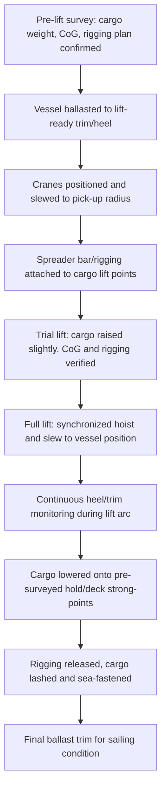

## Conventional Heavy-Lift and Gear-Equipped Vessels

### Overview

Conventional heavy-lift and gear-equipped vessels are self-sustaining cargo ships fitted with their own onboard cranes or derricks, enabling them to load and discharge cargo independently of shore-based lifting infrastructure. This self-sufficiency distinguishes them from geared bulk carriers or container ships (which carry light-duty cranes primarily for convenience) and from crane-dependent breakbulk vessels that rely entirely on port equipment. Conventional heavy-lift tonnage is the workhorse of the project cargo and breakbulk trades, serving ports lacking heavy shore cranes and enabling single-lift capacities that can exceed what most port infrastructure provides.

### Vessel Classification

**Key Points**

- **Conventional (Tweendecker) Heavy-Lift Vessels**: Multi-deck breakbulk ships with heavy derricks/cranes, general cargo holds, and tweendecks for stowage flexibility
- **Heavy-Lift Project Carriers**: Purpose-built vessels with single or open holds, high-capacity cranes, and reinforced 'tween decks or pontoon systems, optimized for modules, machinery, and oversized units
- **Semi-Submersible/Heavy-Lift Hybrid**: Some heavy-lift carriers incorporate limited ballasting/submersion capability for float-on cargo, blurring the line with dedicated semi-submersibles (a separate vessel class)
- **Multipurpose (MPP) Vessels**: Geared vessels balancing container, bulk, and breakbulk capability with moderate crane capacity (typically under 350t), serving mixed-cargo trades rather than pure heavy-lift work

### Onboard Lifting Gear

#### Crane Types

| Crane Type | Typical SWL Range | Characteristics |
| --- | --- | --- |
| Single jib/pedestal crane | 30-120t | Standard MPP vessel equipment; flexible slewing arc |
| Heavy-lift jib crane (paired) | 2 x 250t to 2 x 800t | Enables tandem lifting for combined capacities |
| Mast crane (single-point revolving) | 500t-2,000t+ | Fixed mast with heavy-duty luffing/hoisting; found on dedicated project carriers |
| Derrick (Stülcken/heavy derrick) | 300t-2,000t | Older/traditional heavy-lift rig using paired king posts and topping systems; largely superseded by cranes on modern newbuilds but still active on some vessels |

[Unverified] Exact SWL figures vary by vessel and shipyard generation; the ranges above reflect commonly cited industry figures and should be confirmed against a specific vessel's crane certificate before lift planning.

#### Tandem Lift Mechanics

When a single cargo item exceeds one crane's individual capacity, two cranes work in tandem, sharing the load through synchronized slewing, luffing, and hoisting.

**Key Points**

- Load distribution between the two cranes is rarely perfectly even; rigging geometry (sling angles, spreader bar positioning, and the cargo's center of gravity relative to the pick points) determines the actual share each crane bears
- A derating factor is applied to the combined nominal SWL to account for dynamic amplification, unequal load sharing, and synchronization tolerances during the lift
- Cranes must be electronically or hydraulically synchronized (load-sharing systems) to avoid one crane taking a disproportionate share as the lift progresses through different angles

**Example**

Two cranes each rated 400t SWL, performing a tandem lift, are commonly planned to a combined practical capacity in the range of 650-700t rather than the nominal 800t sum. [Inference] The specific derating percentage used is determined through a lift-specific rigging study (considering spreader beam design, sling angles, and the cargo's actual CoG) rather than a fixed universal industry ratio.

$$T_{effective} = SWL_1 \cdot k_1 + SWL_2 \cdot k_2$$

Where $k_1$ and $k_2$ are load-sharing coefficients (typically $k_1 + k_2 < 1.0$ after applying dynamic and synchronization derates), determined by the specific rigging arrangement.

### Cargo Hold Configuration

#### Tweendecks

Traditional conventional heavy-lift vessels use removable or foldable tweendecks (intermediate deck panels) that subdivide the cargo hold vertically, allowing:

- Stowage of lighter, less dense cargo above heavier cargo (weight distribution optimization)
- Multiple cargo types in a single hold without one crushing another
- Conversion to a single tall hold (by removing/stowing tweendeck panels) when oversized cargo requires full hold height

**Key Points**

- Removing tweendeck pontoons consumes deck space and crane time, and the pontoons themselves often must be craned into a temporary stowage position for the voyage
- Reinforced tweendecks on heavy-lift-specific tonnage may carry point-load ratings (t/m²) significantly higher than general cargo vessels to support concentrated module or machinery loads

#### Hatch Coamings and Access

Unlike open deck vessels, conventional gear-equipped ships typically retain box-shaped hatch coamings and hatch covers (pontoon, MacGregor-type, or piggyback), which create "shadow zones" beneath the deck structure between hatches that a crane hook cannot reach without cargo repositioning.

**Key Points**

- Cargo planning must sequence loading so that units destined for positions under deck structure are loaded before adjacent hatch-blocking cargo
- This constraint is a key reason many purpose-built heavy-lift project carriers moved toward open-hatch or minimal-coaming designs (see the related Open Deck vessel class) — [Inference] this shift reflects an industry-wide trend toward flexibility for oversized cargo, though many conventional tweendeckers remain in active service for standard breakbulk trades

### Stability and Structural Considerations for Heavy Lifts

Lifting a single heavy unit imposes both static and dynamic loads on the vessel structure and stability:

$$M_{heel} = W \cdot d \cdot \cos(\theta)$$

Where $W$ is the lifted weight, $d$ is the outreach (horizontal distance from the crane's slewing axis to the load), and $\theta$ is the list/heel angle during the lift arc.

**Key Points**

- Maximum outreach at rated SWL is typically lower than the crane's minimum-radius rated capacity; cranes are rated on a load chart correlating SWL to radius
- Heel and trim must be actively monitored and corrected via ballast during the lift, since heavy single-point loads at extended outreach can induce significant heel before the cargo is landed and secured
- Vessel's crane foundation and deck structure beneath the crane pedestal are reinforced locally to handle the concentrated reaction loads transmitted through the crane base

### Loading Sequence for a Heavy-Lift Module (Tandem Crane)

### Comparison: Conventional Heavy-Lift vs Other Vessel Types

| Aspect | Conventional Heavy-Lift (Geared) | Open Deck Vessel | Shore-Crane-Dependent Breakbulk |
| --- | --- | --- | --- |
| Lifting independence | Self-sufficient (own cranes) | Often geared, but relies on open hatch access | Requires port crane infrastructure |
| Port flexibility | High — can serve ports lacking heavy cranes | High for cargo access, but still may need own gear | Low — limited to ports with adequate shore cranes |
| Cargo hold access | Constrained by hatch coamings/shadow zones | Full-beam open hold access | Constrained by hatch and hold design |
| Typical max single lift | Up to ~800-2,000t (tandem/mast crane dependent) | Similar, often with open deck advantage for oversized units | Dependent entirely on shore crane capacity |
| Common trades | General breakbulk, project cargo, machinery | Paper, steel, project modules | Standard breakbulk where port cranes are adequate |

### Common Pitfalls and Operational Risks

**Key Points**

- Planning a tandem lift using the simple sum of both cranes' nominal SWLs without applying a rigging-specific derate factor
- Failing to sequence cargo loading around hatch-coaming shadow zones on tweendeck vessels, leading to re-stows or blocked cargo access
- Underestimating heel/trim excursion during a heavy lift at extended crane outreach, particularly on vessels with a high vertical center of gravity from other already-loaded cargo
- Neglecting to verify a specific crane's load chart (SWL vs. radius) rather than assuming a flat maximum capacity applies at all boom angles
- [Inference] These pitfalls are commonly cited in project cargo engineering literature and case studies; actual risk exposure depends on the specific vessel, crane system, and cargo combination involved

### Related Topics

- Open Deck and Roll-On/Roll-Off Vessels
- Semi-Submersible and Float-On/Float-Off (FloFlo) Vessels
- Tandem Lift Rigging Engineering and Spreader Bar Design
- Crane Load Charts and Radius-Dependent SWL Interpretation
- Vessel Stability Calculations for Single-Point Heavy Lifts
- Cargo Securing Manuals and Sea-Fastening Design for Breakbulk Modules
- Port Selection Criteria for Vessels Lacking Shore Crane Infrastructure