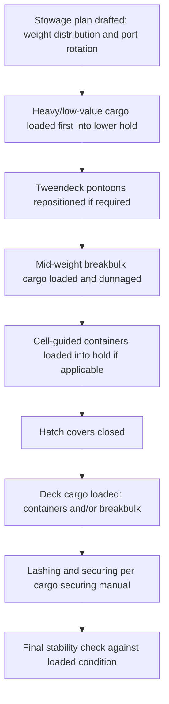

## Multipurpose and Breakbulk Vessels

### Overview

Multipurpose (MPP) vessels and breakbulk carriers form the backbone of general cargo shipping, designed to handle a wide variety of cargo types — containers, bulk commodities, project cargo, and unitized breakbulk — within a single hull. Unlike specialized heavy-lift or open-deck tonnage, MPP vessels prioritize flexibility across cargo categories over maximizing single-lift capacity, making them the most common vessel class serving mixed-cargo trades, secondary ports, and routes with irregular or non-containerizable cargo volumes.

### Vessel Classification

**Key Points**

- **Multipurpose (MPP) Vessels**: Geared ships combining container capability (cell guides, lashing points), bulk cargo capacity, and breakbulk stowage flexibility, typically 10,000-30,000 DWT
- **Breakbulk Carriers**: Vessels optimized for non-unitized or irregularly shaped cargo (bagged goods, steel products, machinery, timber) loaded and stowed individually rather than in containers
- **F-Type/General Cargo Vessels**: Traditional tweendecker designs predating container standardization, still active in niche trades requiring hold flexibility
- **Heavy-Lift MPP Hybrids**: MPP vessels fitted with heavier-than-standard cranes (150-350t range) to capture project cargo business alongside general cargo

[Inference] The DWT and crane capacity ranges cited reflect commonly observed industry segments rather than fixed regulatory categories; individual vessel specifications vary by owner and shipyard generation.

### Cargo Flexibility Design

#### Hold and Hatch Configuration

MPP vessels are typically built with:

- **Box-shaped holds** with minimal framing intrusion, maximizing usable stowage volume for irregular cargo shapes
- **Removable tweendecks** allowing vertical subdivision for mixed cargo (e.g., bagged cement below, palletized goods above)
- **Container cell guides** in the lower hold and/or on deck, permitting containerized cargo alongside breakbulk on the same voyage
- **Large hatch openings** relative to hold size, improving crane access compared to older general cargo designs

**Key Points**

- Cell guide systems can often be partially or fully removed/folded to free up hold space for oversized breakbulk when a voyage carries no containers
- Tweendeck pontoons serve the same dual role as on conventional heavy-lift vessels: enabling weight-segregated stowage, but consuming crane time and deck space when removed

#### Onboard Cranes

MPP vessels are typically geared with one or more cranes in the 30-150t range, occasionally up to 350t on heavy-lift-capable MPP tonnage.

| Feature | Standard MPP Crane | Heavy-Lift MPP Crane |
| --- | --- | --- |
| Typical SWL | 30-80t | 100-350t |
| Tandem lift capability | Sometimes (2 cranes) | Common, combined capacity up to ~500-700t |
| Cargo focus | Containers, palletized goods, light machinery | Project cargo, transformers, modules |

[Unverified] Specific crane SWL figures are vessel- and builder-specific; the table reflects general industry ranges and should be verified against a vessel's crane certificate for actual lift planning.

### Typical Cargo Mix

**Key Points**

- Containers (loaded on deck and/or in cell-guided holds)
- Steel products: coils, plate, billets, structural sections, pipe
- Forest products: sawn timber, plywood, wood pulp bales
- Bagged/palletized cargo: cement, fertilizer, foodstuffs
- Project cargo (moderate scale): generators, transformers, prefabricated structures within crane capacity
- Rolling stock or vehicles (where deck/hold configuration permits, though without dedicated ramps this requires craning rather than true RoRo handling)

### Stowage Planning Considerations

Mixed cargo stowage on MPP vessels requires careful sequencing and compatibility planning:

**Key Points**

- **Weight distribution**: Heavier cargo (steel, machinery) is generally stowed low in the hold to maintain adequate metacentric height ($GM$) and avoid excessive vertical center of gravity
- **Cargo segregation**: Incompatible cargo (e.g., cargo sensitive to moisture stowed near cargo prone to sweating or contamination) must be separated or dunnage-protected
- **Sequencing for multi-port discharge**: Cargo for the first discharge port must be accessible without disturbing cargo for later ports, often dictating a "last loaded, first discharged" stowage plan
- **Dunnage and securing**: Breakbulk cargo lacks standardized securing points (unlike containers' twist-lock corner castings), requiring individually engineered lashing, shoring, and dunnage arrangements per cargo type

$$GM = KM - KG$$

Where $KM$ is the height of the metacenter above keel (a hydrostatic property of the hull form and draft) and $KG$ is the vertical center of gravity of the loaded vessel; adequate positive $GM$ margin must be maintained after accounting for all stowed cargo's contribution to $KG$.

### Cargo Loading Sequence (Mixed Breakbulk and Container)

### Comparison: MPP/Breakbulk vs Specialized Heavy-Lift Vessels

| Aspect | MPP/Breakbulk Vessel | Conventional Heavy-Lift Vessel | Open Deck Vessel |
| --- | --- | --- | --- |
| Cargo flexibility | Highest — containers, bulk, breakbulk | Moderate — breakbulk and project cargo focused | Moderate — project cargo and stackable units |
| Typical crane capacity | 30-150t (up to 350t on hybrids) | 250t-2,000t+ | 250t-800t+ |
| Hold access | Standard hatch coamings, some shadow zones | Standard hatch coamings, shadow zones | Full-beam open access, minimal shadow zones |
| Primary trade focus | General/mixed cargo, secondary ports | Machinery, modules, oversized project cargo | Coils, reels, stackable/oversized cargo |
| Port infrastructure dependency | Low (self-sufficient gear) | Low (self-sufficient gear) | Variable (geared or gearless variants exist) |

### Common Pitfalls and Operational Risks

**Key Points**

- Mis-sequencing multi-port cargo, resulting in costly restows to access cargo buried beneath later-discharge-port cargo
- Inadequate dunnage or securing engineering for irregular breakbulk shapes, leading to cargo shift in heavy weather
- Overloading tweendeck point-load ratings when stowing concentrated-weight cargo (e.g., steel coils) without verifying deck strength certificates
- Underestimating the stability impact of high-KG deck cargo (e.g., stacked containers or bulky breakbulk) when combined with a partially loaded hold
- [Inference] These risks are commonly documented in general cargo stowage and P&I loss-prevention literature; actual exposure varies by vessel, cargo, and route

### Related Topics

- Conventional Heavy-Lift and Gear-Equipped Vessels
- Open Deck and Roll-On/Roll-Off Vessels
- Cargo Stowage and Segregation Planning for Mixed Breakbulk
- Dunnage, Shoring, and Lashing Engineering for Non-Unitized Cargo
- Stability and Metacentric Height Calculations for Loaded Vessels
- Multi-Port Discharge Sequencing and Stowage Plan Optimization
- Cargo Securing Manuals (CSM) and IMO/SOLAS Compliance for Breakbulk