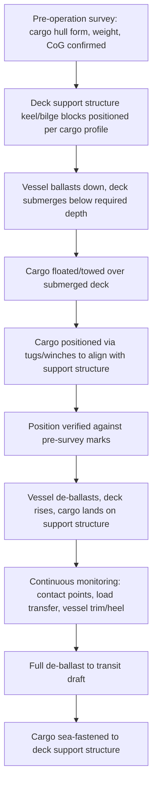

## Dock Ships and Project Cargo Carriers

### Overview

Dock ships (semi-submersible/heavy-lift dock vessels) and project cargo carriers represent the most specialized tier of the heavy-lift fleet, purpose-built to transport cargo that cannot be handled by conventional cranes, ramps, or standard stowage methods. Dock ships achieve this through ballasting to submerge a portion of the hull, allowing cargo to be floated on and off rather than lifted or driven. Project cargo carriers, more broadly, encompass purpose-designed vessels (which may include dock-ship capability, heavy cranes, or both) optimized around the specific engineering demands of oversized, overweight, or high-value indivisible cargo units.

### Dock Ships (Semi-Submersible Vessels)

#### Operating Principle

A dock ship's cargo deck is ballasted down below the waterline, allowing cargo — typically another vessel, an offshore platform, or a very large module — to be floated over the submerged deck and positioned. The vessel then de-ballasts, lifting the cargo clear of the water as the deck rises beneath it. This method is termed Float-on/Float-off (FloFlo).

**Key Points**

- No crane or ramp handling is required; the cargo's own buoyancy (or a temporary flotation arrangement) positions it during the submersion phase
- Cargo capacity is limited primarily by the vessel's deck area and buoyancy/ballast capacity rather than crane SWL, enabling transport of units far exceeding any crane's lifting capability (jack-up rigs, damaged vessels, floating docks, large FPSO modules)
- Precise position control during float-on is critical: cargo must be guided (via tugs, winches, or guide posts on deck) to land accurately on pre-surveyed keel blocks/support structure as the deck rises

#### Ballasting and Submersion Mechanics

$$\Delta d = \frac{V_{ballast}}{A_{waterplane}}$$

Where $\Delta d$ is the change in draft/submersion depth, $V_{ballast}$ is the volume of ballast water taken on or discharged, and $A_{waterplane}$ is the vessel's waterplane area at the relevant draft — a simplified relationship illustrating that submersion depth is governed by ballast volume relative to hull geometry, though actual dock-ship ballasting follows detailed, vessel-specific ballast sequencing plans rather than this idealized formula alone.

**Key Points**

- Ballasting sequence must maintain adequate stability (positive $GM$) throughout the submersion process, since a deeply ballasted, partially submerged deck condition is a non-standard loading condition requiring vessel-specific stability approval
- Deck support structure (keel blocks, bilge blocks, or cargo-specific cradles) must be pre-surveyed and positioned before submersion to match the cargo's hull form or support points precisely
- Weather window and sea-state limits for float-on/float-off operations are typically more restrictive than for conventional lift operations, since precise position control becomes difficult in swell or current

[Inference] Specific stability approval processes and sea-state limits are vessel- and class-society-specific (DNV, ABS, Lloyd's Register); exact operational limits should be confirmed against the vessel's approved stability booklet and operation manual rather than assumed as fixed values.

### Project Cargo Carriers (Broader Category)

Project cargo carriers is a functional category rather than a single design; it includes vessels engineered around the specific demands of indivisible, high-value, or technically complex cargo units, potentially combining:

- **Heavy-lift cranes** (see Conventional Heavy-Lift Vessels)
- **Open, minimal-coaming holds** (see Open Deck Vessels)
- **RoRo ramps** for wheeled/SPMT-carried modules (see Open Deck and RoRo Vessels)
- **Semi-submersible/FloFlo capability** for extreme-scale or non-craneable cargo

**Key Points**

- The defining characteristic of a project cargo carrier is design optimization around a specific cargo profile common to the trades it serves (e.g., offshore module transport, wind turbine component logistics, refinery/petrochemical modules) rather than general-purpose flexibility
- Many project carriers are chartered on a project-specific basis rather than liner service, with vessel selection driven by the specific cargo's dimensions, weight, and handling method rather than route economics alone

### Cargo Types Served

**Key Points**

- Offshore platforms, jack-up rigs, and floating production units (FPSOs, semi-submersible platforms) — typically FloFlo
- Damaged or non-self-propelled vessels requiring relocation (salvage, newbuild delivery, decommissioning) — FloFlo
- Large refinery/petrochemical modules exceeding conventional crane capacity — combination of heavy-lift crane and/or FloFlo depending on module design
- Wind turbine components (monopiles, transition pieces, nacelles) — increasingly transported via combination heavy-lift/RoRo/FloFlo carriers as turbine scale has grown
- Floating docks and dry docks being relocated between shipyards — FloFlo

### Float-On/Float-Off Loading Sequence

### Structural and Class Considerations

**Key Points**

- Dock ships require reinforced deck structure to support concentrated keel/bilge block loads that differ fundamentally from distributed cargo loading assumed in standard hull design
- Ballast system capacity (pump rate, tank arrangement) must be sized to achieve the required submersion depth within an operationally acceptable time window, particularly where tidal or weather windows constrain the operation
- [Unverified] Ballast pump rates and submersion time figures are vessel-specific and vary significantly by dock ship design generation; specific performance figures should be sourced from the vessel's technical specification rather than assumed generically

### Comparison: Dock Ships vs Other Heavy-Lift Methods

| Aspect | Dock Ship (FloFlo) | Conventional Heavy-Lift (Crane) | RoRo (Ramp) |
| --- | --- | --- | --- |
| Loading method | Ballast/submersion, cargo floated | Crane lift | Self-propelled/SPMT drive-on |
| Cargo weight ceiling | Effectively limited by deck area/buoyancy, not lift capacity | Limited by crane SWL (single or tandem) | Limited by deck point-load and ramp capacity |
| Cargo type suitability | Floating structures, non-craneable hulls | Modules, machinery within crane reach/capacity | Wheeled/tracked or SPMT-carried cargo |
| Operational complexity | High — precise position control during submersion | Moderate — rigging and lift engineering | Moderate — ramp angle and SPMT coordination |
| Weather sensitivity | High — sea state critical during float-on | Moderate — wind/list limits during lift | Moderate — ramp angle/tide dependent |

### Common Pitfalls and Operational Risks

**Key Points**

- Inadequate pre-survey of cargo hull form leading to misalignment with deck support structure during the critical de-ballasting/landing phase
- Underestimating stability requirements during the partially submerged ballast condition, which is a non-standard loading state outside typical intact stability criteria
- Attempting float-on/float-off operations outside the vessel's approved sea-state/weather window, risking loss of position control
- Insufficient ballast pump capacity relative to the required operational time window, extending exposure to changing weather during a weather-sensitive operation
- [Inference] These risks are commonly cited in heavy marine transport industry guidance and case studies; actual risk exposure is highly specific to the vessel, cargo, and operating environment involved

### Related Topics

- Conventional Heavy-Lift and Gear-Equipped Vessels
- Open Deck and Roll-On/Roll-Off Vessels
- Ballast System Design and Stability Approval for Semi-Submersible Operations
- Offshore Module and FPSO Transport Engineering
- Sea-Fastening Design for Float-On/Float-Off Cargo
- Weather Routing and Operational Weather Windows for Heavy Marine Transport
- Wind Turbine Component Logistics (Monopile, Nacelle, Blade Transport)