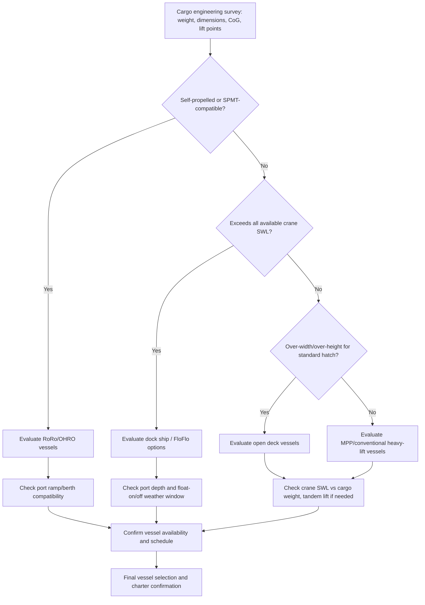

## Vessel Selection Criteria for Project Cargo

### Overview

Vessel selection for project cargo is a structured engineering and commercial decision process that matches specific cargo characteristics (dimensions, weight, handling requirements) against the capabilities of available vessel types (open deck, conventional heavy-lift, RoRo, dock ships/FloFlo, or MPP tonnage). Unlike liner container shipping, where vessel choice is largely a function of route and schedule, project cargo vessel selection is driven primarily by whether a given vessel can physically and safely handle the specific cargo unit — making the selection process itself a core engineering discipline within heavy-lift logistics.

### Primary Selection Parameters

#### Cargo Dimensional and Weight Profile

**Key Points**

- **Weight**: Determines whether cargo falls within a single crane's SWL, requires tandem lift, exceeds all crane capacity (requiring FloFlo), or is compatible with RoRo/SPMT deck point-load limits
- **Length, width, height**: Determines whether cargo fits within a conventional hatch coaming (favoring open deck tonnage for over-width/over-height units) or can be handled on a standard tweendecker
- **Center of gravity (CoG) location**: Affects rigging point selection, crane outreach requirements, and stability calculations during lift or float-on operations
- **Structural lift points**: Whether the cargo has engineered lifting lugs/trunnions or requires improvised rigging affects both vessel crane compatibility and lift risk

#### Cargo Handling Method Compatibility

| Cargo Characteristic | Preferred Vessel Type |
| --- | --- |
| Self-propelled or SPMT-compatible, wheeled/tracked | RoRo or OHRO hybrid |
| Box-shaped, craneable, stackable (coils, reels, modules within crane SWL) | Open deck vessel |
| General breakbulk mixed with containers | MPP/breakbulk vessel |
| Exceeds all crane capacity, or non-craneable hull form | Dock ship (FloFlo) |
| High-value, single indivisible unit requiring bespoke engineering | Purpose-built project carrier |

[Inference] This mapping represents general industry practice; specific cargo may qualify for multiple vessel types depending on available fleet, route, and cost, making the final selection a multi-factor optimization rather than a strict lookup.

### Secondary Selection Parameters

#### Route and Port Compatibility

**Key Points**

- **Port draft restrictions**: Vessel's loaded draft must clear port approach channels and berth depths at the load and discharge ports
- **Air draft (vertical clearance)**: Relevant where bridges, overhead cables, or terminal cranes constrain vessel/cargo height, particularly for over-height deck cargo
- **Berth crane infrastructure**: Determines whether a self-sufficient geared vessel is required (no shore crane available) or whether shore cranes can supplement/replace onboard gear
- **Ramp/ro-ro infrastructure compatibility**: For RoRo cargo, berth must have a ramp or link-span compatible with the vessel's stern/quarter ramp angle and capacity

#### Vessel Availability and Commercial Factors

**Key Points**

- Project cargo often requires vessel chartering on a voyage-charter or project-specific basis rather than booking liner space, extending lead times for vessel sourcing
- Vessel positioning (where the vessel currently is relative to load port) affects both cost and schedule
- Classification society and flag state requirements may constrain vessel choice for certain cargo (e.g., military, government, or insurance-sensitive cargo with specific vessel certification requirements)
- [Unverified] Specific chartering lead times and cost premiums for project cargo vessels are highly market- and route-dependent and fluctuate with broader shipping market conditions; figures should be sourced from current freight market data rather than assumed static

### Selection Decision Workflow

### Engineering Verification Before Final Selection

**Key Points**

- **Lift plan/rigging study**: Confirms actual achievable lift capacity (accounting for tandem derating, outreach, and CoG) matches or exceeds cargo weight with adequate margin
- **Stability calculation**: Confirms vessel's $GM$ remains positive and within acceptable limits throughout loading, transit, and discharge given the cargo's contribution to $KG$
- **Deck/hold strength verification**: Confirms point-load and distributed-load ratings at intended stowage positions meet or exceed cargo's actual loading (particularly critical for RoRo deck stowage and tweendeck stowage)
- **Route and weather routing study**: Confirms transit route avoids conditions exceeding cargo securing design limits or vessel seasonal/route restrictions

$$SF = \frac{Capacity_{rated}}{Load_{actual}}$$

Where $SF$ is the safety factor applied when comparing a vessel's or lifting system's rated capacity against the actual cargo load; [Inference] the specific minimum acceptable safety factor for a given lift or stowage arrangement is determined by classification society rules, cargo insurer requirements, and project-specific engineering standards rather than a single universal value.

### Comparison Matrix: Vessel Type Trade-offs

| Factor | Open Deck | Conventional Heavy-Lift | RoRo/OHRO | Dock Ship (FloFlo) | MPP/Breakbulk |
| --- | --- | --- | --- | --- | --- |
| Max effective cargo weight | High (crane-dependent, often geared) | High (tandem crane/mast crane) | Moderate-High (deck point-load dependent) | Very High (buoyancy-limited, not crane-limited) | Low-Moderate (crane SWL dependent) |
| Over-width/over-height tolerance | High | Moderate (hatch coaming dependent) | Moderate (deck height dependent) | High (no coaming constraint) | Low-Moderate |
| Self-propelled/wheeled cargo handling | Not applicable | Not applicable | Excellent | Not applicable | Limited |
| Port infrastructure independence | Moderate-High | High (self-geared) | Moderate (needs ramp-compatible berth) | Low (needs deep water, specific handling) | High (self-geared) |
| Typical charter lead time | Project-specific | Project-specific | Project-specific | Longer (specialized, limited fleet) | Often shorter (more common tonnage) |

### Common Pitfalls and Operational Risks

**Key Points**

- Selecting a vessel based on nominal crane SWL sum for tandem lifts without applying rigging-specific derate factors, resulting in an infeasible lift plan discovered late in project timeline
- Overlooking port air draft or approach channel depth restrictions until the vessel is already committed, forcing a costly re-selection
- Underestimating lead time required to charter specialized tonnage (particularly dock ships), risking project schedule delays
- Failing to verify deck/hold strength ratings against actual cargo point loads, particularly when repurposing a vessel type for cargo outside its typical trade profile
- [Inference] These pitfalls are commonly documented in project logistics case studies and industry guidance; actual risk exposure depends on the specific project, cargo, and market conditions

### Related Topics

- Open Deck and Roll-On/Roll-Off Vessels
- Conventional Heavy-Lift and Gear-Equipped Vessels
- Dock Ships and Project Cargo Carriers
- Lift Plan and Rigging Engineering for Project Cargo
- Route Surveys and Port Suitability Assessment for Heavy-Lift Cargo
- Cargo Insurance and Marine Warranty Surveyor (MWS) Approval Processes
- Charter Party Negotiation for Project and Heavy-Lift Voyage Charters