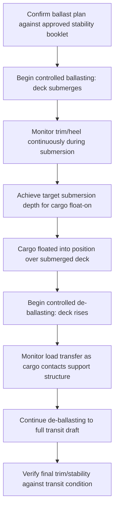

## Ballast Systems and Deck Strength Considerations

### Overview

Ballast systems and deck strength together form the structural and hydrostatic foundation underlying every heavy-lift and project cargo operation. Ballast systems manage a vessel's trim, heel, and draft by transferring water between tanks, enabling controlled responses to asymmetric cargo loading, crane lift dynamics, and semi-submersible float-on/float-off operations. Deck strength — the vessel's capacity to bear distributed and concentrated cargo loads without local or global structural failure — determines where and how heavy cargo units can be safely stowed. Both disciplines are interdependent: ballast decisions are frequently made specifically to manage the stability and trim consequences of deck loading, and deck strength limits constrain where ballast-sensitive heavy cargo can be positioned.

### Ballast System Fundamentals

#### Purpose and Function

**Key Points**

- **Trim control**: Adjusts the vessel's fore-aft draft balance, critical for RoRo ramp angle management and maintaining propeller/rudder immersion
- **Heel/list correction**: Counteracts asymmetric loading (e.g., off-centerline heavy cargo, or load transfer during a crane lift) to keep the vessel upright
- **Stability management**: Ballast water lowers the vessel's center of gravity ($KG$) when added low in the hull, improving metacentric height ($GM$) for a given loading condition
- **Submersion/draft control**: On semi-submersible dock ships, ballast is the primary mechanism enabling deck submersion for float-on/float-off operations

#### System Components

| Component | Function |
| --- | --- |
| Ballast tanks (double bottom, wing, peak) | Store ballast water; distributed throughout the hull for trim/heel flexibility |
| Ballast pumps | Transfer water into/out of tanks and between tanks; sized for required ballasting rate |
| Piping/valve manifold | Routes water between tanks and to/from sea, allowing selective tank filling |
| Ballast control/monitoring system | Displays real-time tank levels, vessel trim/heel/draft; on modern vessels, often integrated with a loading computer |

**Key Points**

- Ballast pump capacity (typically expressed in m³/hour) determines how quickly a vessel can respond to a loading change or complete a required submersion/de-ballasting sequence
- [Unverified] Specific pump capacities vary significantly by vessel size and type; figures should be sourced from the vessel's ballast system specification rather than assumed generically

### Ballast Management During Heavy-Lift Operations

#### Crane Lift Ballasting

During a crane lift, especially at extended outreach, the load's horizontal offset from the vessel's centerline induces a heeling moment:

$$M_{heel} = W \cdot d$$

Where $W$ is the suspended load weight and $d$ is the horizontal distance from the vessel's centerline to the load's position. Ballast is shifted (typically from one side to the counteracting side, or added/removed from trim tanks) to counteract this moment in real time as the crane slews and the load moves.

**Key Points**

- Ballast correction during a lift must be responsive enough to keep heel within an acceptable operational limit (often a few degrees) throughout the lift arc, not just at the final position
- Continuous monitoring (heel/trim/draft) during the lift is standard practice, allowing the ballast team to anticipate and correct rather than react after an excursion develops
- [Inference] The specific acceptable heel limit during a lift is generally set by the crane manufacturer's operating limits and the vessel's stability booklet for the lift condition, rather than a single fixed industry-wide value

#### Float-On/Float-Off Ballasting Sequence

On dock ships, ballasting is the core operational mechanism rather than a corrective measure:

**Key Points**

- The partially submerged condition during float-on/float-off is a non-standard loading state requiring specific stability approval beyond standard intact stability criteria
- Ballasting rate must be controlled precisely enough to allow accurate position monitoring as the deck rises and cargo contact begins, since uneven load transfer across support points can induce unwanted heel

### Deck Strength Fundamentals

#### Load Types

**Key Points**

- **Distributed load (uniformly distributed load, UDL)**: Cargo weight spread evenly across a deck area, expressed in t/m²; relevant for general breakbulk or containerized stowage
- **Point load (concentrated load)**: Cargo weight transmitted through a small contact area (e.g., SPMT axle lines, keel blocks, cargo support feet), expressed in tonnes per point or t/m² over the actual small contact footprint
- **Line load**: Weight distributed along a line rather than a point or full area (e.g., a long cargo skid or beam bearing along its length)

$$q_{UDL} = \frac{W_{total}}{A_{deck}}$$

Where $q_{UDL}$ is the uniformly distributed load, $W_{total}$ is total cargo weight in the area, and $A_{deck}$ is the deck area over which it is spread — this simplified relationship applies to genuinely distributed cargo; concentrated point loads (e.g., SPMT axle lines) require separate point-load verification against the deck's rated point-load capacity rather than an averaged UDL figure.

#### Deck Strength Ratings by Vessel Type

| Vessel Type | Typical Distributed Load Rating | Point Load Handling |
| --- | --- | --- |
| Standard MPP/breakbulk | 2-5 t/m² (hold), lower on tweendecks | Limited; requires spreader/dunnage for concentrated loads |
| Standard PCTC (car carrier) | ~2-3 t/m² | Very limited; not designed for heavy point loads |
| Heavy-lift RoRo | 15-40+ t/m² (reinforced decks) | Engineered for SPMT axle line loads at rated capacity |
| Open deck heavy-lift vessel | Varies by hold/deck position; hatch coamings often rated higher | Engineered strong-points for module/reel stowage |

[Unverified] These figures represent commonly cited industry ranges; actual deck strength ratings are vessel-specific and documented in the vessel's loading manual, which must be consulted before finalizing any stowage plan.

### Point-Load Verification Process for Heavy Cargo

**Key Points**

- Identify the cargo's actual contact footprint (SPMT axle line spacing, keel block layout, or cargo support feet dimensions)
- Calculate the resulting point load or local pressure at each contact point
- Compare against the vessel's deck loading manual for the specific stowage position (ratings often vary by location — e.g., over floors/girders versus between them)
- Apply dunnage, load-spreading beams, or additional support structure where cargo point loads exceed the deck's native rating at the intended position
- Obtain vessel's loading officer/chief officer or naval architect sign-off before proceeding with stowage at the calculated position

**Example**

An SPMT axle line exerting 40 tonnes over a 1m x 1.2m footprint produces a local pressure requiring comparison against the specific deck panel's rated point-load capacity at that stowage position — not simply against the vessel's average distributed load rating, which would understate the actual local stress concentration.

### Interaction Between Ballast and Deck Loading

**Key Points**

- Heavy point-load cargo positioned off-centerline or fore/aft of the vessel's center of flotation directly drives the ballast correction required to maintain trim and heel within limits
- Ballast tank selection for corrective ballasting must itself respect the vessel's own structural limits (e.g., avoiding overfilling tanks beyond their rated capacity, and avoiding free-surface effects from partially filled tanks)
- Free surface effect from partially filled ballast tanks reduces effective $GM$, partially offsetting the stability benefit ballast is intended to provide:

$$GM_{effective} = GM_{solid} - FSC$$

Where $FSC$ (free surface correction) increases with the number and size of partially filled, free-communicating tanks — [Inference] specific FSC values depend on tank geometry and fill level and are calculated via the vessel's loading computer or stability software rather than a fixed constant.

### Common Pitfalls and Operational Risks

**Key Points**

- Applying an average distributed load rating to cargo that actually imposes concentrated point loads, understating the true local structural demand
- Ballasting too slowly to keep pace with a dynamic heeling moment during a crane lift, allowing heel to exceed operational limits before correction takes effect
- Overlooking free surface effects from partially filled ballast tanks when calculating effective $GM$ during a stability-sensitive operation
- Failing to verify deck loading manual ratings at the specific stowage position (rather than a vessel-average figure) before finalizing heavy cargo stowage
- [Inference] These pitfalls are commonly documented in marine loss-prevention and heavy-lift engineering literature; actual risk profiles are vessel- and operation-specific

### Related Topics

- Dock Ships and Project Cargo Carriers
- Open Deck and Roll-On/Roll-Off Vessels
- Stability and Metacentric Height Calculations for Loaded Vessels
- Cargo Securing Manuals and Sea-Fastening Design
- Loading Computer Systems and Real-Time Stability Monitoring
- Free Surface Effect and Tank Sounding Management
- Vessel Selection Criteria for Project Cargo