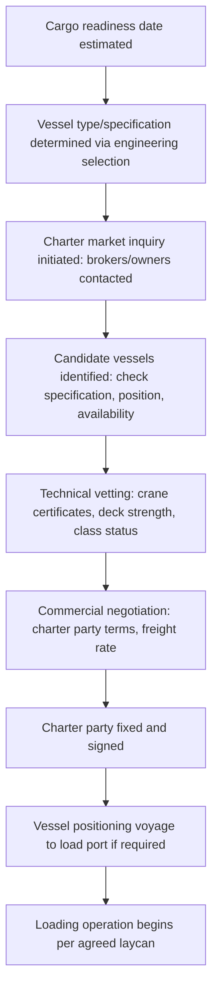

## Vessel Chartering and Availability Planning

### Overview

Vessel chartering and availability planning is the commercial and logistical process of securing suitable tonnage for a project cargo movement, encompassing charter type selection, fleet market analysis, lead-time management, and contractual risk allocation. Because heavy-lift and project cargo tonnage is a specialized and comparatively limited global fleet, availability planning frequently begins months before the cargo is ready to move, running in parallel with the engineering vessel-selection process rather than sequentially after it.

### Charter Types

#### Voyage Charter

**Key Points**

- Vessel owner provides the vessel, crew, and operation for a specific voyage (load port to discharge port) at an agreed freight rate
- Owner bears operating costs (fuel, port costs, crew) within the agreed freight; charterer pays a fixed or formula-based freight for the cargo movement
- Most common charter type for single-shipment project cargo movements where the charterer does not need ongoing vessel control

#### Time Charter

**Key Points**

- Charterer hires the vessel (with crew) for a defined period, directing its commercial employment while the owner retains technical/crew management
- Charterer pays hire (typically daily or monthly rate) plus voyage-specific costs (fuel, port costs) during the charter period
- Used where a project requires multiple shipments over an extended period, or where the charterer needs schedule flexibility across several ports/cargo movements

#### Bareboat (Demise) Charter

**Key Points**

- Charterer takes full operational control, including crewing and technical management, with the owner providing only the vessel itself
- Rare in project cargo chartering compared to voyage or time charter; more common in long-term fleet operation contexts

#### Contract of Affreightment (CoA)

**Key Points**

- An agreement to transport a specified quantity of cargo over multiple shipments/voyages over a defined period, without designating specific vessels in advance
- Owner has flexibility to allocate any suitable vessel from its fleet (or chartered-in tonnage) to fulfill each shipment under the CoA
- Suited to recurring project cargo flows (e.g., a multi-shipment infrastructure project) rather than one-off movements

### Availability Planning Process

#### Fleet Market Analysis

**Key Points**

- Specialized heavy-lift, open deck, RoRo, and dock-ship fleets are considerably smaller than general dry bulk or container fleets, meaning available tonnage at a given time and region can be limited
- Vessel positioning (where candidate vessels currently are relative to the load port) significantly affects both cost (positioning/ballast voyage costs passed to charterer) and available lead time
- Market conditions (overall project cargo demand cycles, e.g., driven by offshore wind, oil & gas, or infrastructure investment cycles) affect both rate levels and tonnage availability
- [Unverified] Specific fleet size figures and freight rate levels fluctuate with market conditions and should be sourced from current freight market reporting (e.g., specialized project cargo brokers, freight index providers) rather than assumed static

#### Lead Time Considerations

**Key Points**

- Laycan (laydays/cancelling date) defines the window within which the vessel must be ready to load; setting an achievable laycan requires coordination between cargo readiness and vessel positioning timelines
- Specialized tonnage (particularly dock ships and purpose-built heavy-lift carriers) often has longer lead times than general breakbulk/MPP tonnage due to smaller fleet size and higher demand concentration during active project cycles
- Early market engagement (well before cargo readiness) allows charterers to secure options or letters of intent on suitable tonnage, reducing the risk of unavailability at the critical booking window

### Technical Vetting Before Fixing

**Key Points**

- **Crane/lifting gear certification**: Confirms current SWL certificates match the cargo's lift requirements, including tandem lift certification where applicable
- **Class status and survey currency**: Confirms the vessel's classification society certificates and statutory certificates are current and free of outstanding conditions of class relevant to the intended cargo operation
- **Deck/hold strength documentation**: Confirms the vessel's loading manual supports the specific stowage plan for the cargo (point loads, distributed loads)
- **P&I and hull insurance standing**: Confirms adequate insurance coverage is in place and compatible with the cargo's value and risk profile
- **Vessel age and flag state**: May be relevant to charterer or cargo insurer requirements, particularly for high-value or sensitive cargo

[Inference] The relative weight given to each vetting criterion depends on the specific cargo, charterer risk tolerance, and any cargo-specific insurance or client requirements; there is no single universal vetting checklist applied uniformly across all project cargo charters.

### Contractual Risk Allocation

**Key Points**

- **Laytime and demurrage**: Charter party terms define allowed time for loading/discharge and penalty rates (demurrance) if that time is exceeded, a critical consideration for heavy-lift operations where loading/discharge duration is less predictable than standard container operations
- **Force majeure and weather clauses**: Define how weather-related delays (particularly relevant to float-on/float-off or tandem-lift operations with weather-sensitive windows) are allocated between owner and charterer
- **Cargo securing responsibility**: Charter party or separate contract terms define whether the vessel's crew, a specialized lashing contractor, or the charterer's own personnel are responsible for cargo securing, affecting liability allocation if cargo shifts in transit
- **Marine warranty surveyor (MWS) involvement**: For high-value or insurance-sensitive project cargo, an independent MWS may be required to approve the lift/loading plan, adding a step (and potential lead time) to the chartering and loading process

### Comparison: Charter Type Suitability

| Charter Type | Best Suited For | Charterer Control | Typical Duration |
| --- | --- | --- | --- |
| Voyage Charter | Single project cargo shipment | Low (owner operates vessel) | Single voyage |
| Time Charter | Multi-shipment project over a defined period | Moderate-High (charterer directs employment) | Weeks to months/years |
| Bareboat Charter | Long-term dedicated fleet operation | Full (charterer manages vessel) | Months to years |
| Contract of Affreightment | Recurring project cargo flows, multiple voyages | Low per-voyage (owner allocates vessels) | Multiple voyages over a defined period |

### Common Pitfalls and Operational Risks

**Key Points**

- Underestimating lead time for specialized tonnage (particularly dock ships), resulting in a compressed or infeasible chartering window relative to project schedule
- Fixing a vessel before completing full technical vetting, discovering deck strength or crane certification gaps after commercial commitment
- Ambiguous laytime/demurrage terms in the charter party, leading to disputes when heavy-lift loading takes longer than a standard cargo operation
- Failing to account for vessel positioning costs and time when comparing charter offers, leading to an inaccurate landed-cost comparison between candidate vessels
- [Inference] These pitfalls are commonly documented in project cargo chartering guidance and industry case studies; actual risk exposure depends on the specific charter market conditions, cargo, and counterparties involved

### Related Topics

- Vessel Selection Criteria for Project Cargo
- Dock Ships and Project Cargo Carriers
- Charter Party Clauses for Heavy-Lift and Project Cargo Voyages
- Marine Warranty Surveyor (MWS) Approval Processes
- Laytime, Demurrage, and Despatch Calculations
- Freight Market Analysis for Specialized Project Cargo Tonnage
- Cargo Insurance and Risk Allocation in Project Logistics