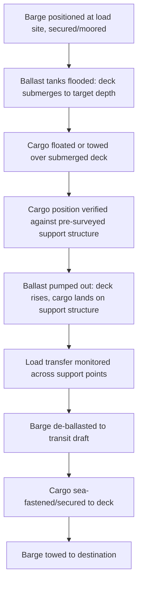

## Deck Barge and Submersible Barge Types

### Overview

Deck barges and submersible barges are non-self-propelled vessels central to heavy-lift and project cargo movement on inland waterways, coastal routes, and sheltered marine environments. Deck barges provide a flat, unobstructed working surface for cargo carried above the waterline, while submersible barges extend this capability by incorporating ballast systems that allow the deck to be lowered below the water surface, enabling float-on/float-off loading of cargo that cannot be craned or rolled aboard. Both types are typically towed or pushed by tugs, distinguishing them operationally from self-propelled heavy-lift vessels.

### Deck Barges

#### Defining Characteristics

**Key Points**

- Flat-deck, rectangular hull form (box-shaped) optimized for maximum usable deck area relative to overall dimensions
- No propulsion; moved by towing (astern tow via towline) or pushing (integrated push-boat/tug configuration common on river systems)
- Shallow draft relative to hull volume, enabling access to inland waterways and shallow coastal areas unsuitable for deep-draft self-propelled vessels
- Deck typically rated for high distributed loads (commonly in the range of several t/m² to tens of t/m² depending on barge construction), since deck barges frequently carry heavy modules, construction equipment, or cargo secured via SPMT loading

#### Common Applications

- Inland waterway transport of oversized modules (refinery equipment, power plant components) too large for road/rail transport
- Coastal transport of construction materials, cranes, or prefabricated structures
- Platform for temporary work (crane barges, accommodation barges), though these are functional variants rather than a separate structural class
- Load-out platform: cargo is often loaded onto a deck barge at a fabrication yard via SPMT drive-on (using a link-span or ramp) or via shore crane, then towed to a load port for transfer to an ocean-going vessel

#### Loading Methods onto Deck Barges

**Key Points**

- **Crane loading**: Shore or floating crane lifts cargo directly onto the barge deck; requires the barge to be secured alongside and ballasted/trimmed appropriately during the lift to manage list from off-center loading
- **SPMT roll-on**: Cargo is driven onto the barge via a temporary or fixed ramp/link-span; requires the barge to be ballasted to match the ramp height and held stable during the transfer
- **Skidding**: Cargo is moved onto the barge using a skid system (hydraulic jacks and skid rails/beams), often used for very heavy, low-clearance modules that cannot be lifted or rolled

### Submersible Barges

#### Defining Characteristics

**Key Points**

- Fitted with ballast tanks and pumping systems enabling controlled submersion of the deck below the waterline, functioning as a smaller-scale, typically non-self-propelled counterpart to a semi-submersible dock ship
- Used where cargo cannot be craned (too heavy or an unsuitable hull/support form) and no self-propelled dock ship is available, practical, or cost-effective for the specific route (e.g., sheltered inland or coastal float-on/float-off operations)
- Ballast system design parallels that of dock ships in principle (see Ballast Systems and Deck Strength Considerations) but is generally scaled to the barge's smaller size and the more sheltered operating environments in which submersible barges typically work

#### Float-On/Float-Off Sequence on a Submersible Barge

**Key Points**

- Submersion and de-ballasting rates on barges are generally slower relative to their deck area than on larger, purpose-built dock ships, since barge ballast pump capacity is typically sized to the barge's scale and intended (often sheltered-water) operating profile
- Sheltered-water or calm-condition operation is a common practical constraint for submersible barge float-on/float-off work, since barges generally lack the seakeeping characteristics and dynamic positioning capability of larger self-propelled dock ships
- [Inference] The degree of sea-state restriction is barge- and operation-specific, governed by the barge's stability approval and the towing/mooring arrangement used during the operation, rather than a fixed universal limit

### Structural Considerations

#### Deck Strength

$$q_{barge} = \frac{W_{cargo}}{A_{contact}}$$

Where $q_{barge}$ is the resulting deck loading pressure, $W_{cargo}$ is cargo weight, and $A_{contact}$ is the actual contact area (critical for SPMT axle-line point loads, which concentrate load over a small footprint compared to distributed cargo).

**Key Points**

- Deck barges used for SPMT-loaded heavy modules require verified point-load ratings at the specific deck positions where SPMT axle lines will travel and where the cargo will ultimately rest
- Load-spreading mats, timber grillage, or steel spreader beams are commonly used to distribute concentrated cargo loads across a wider deck area when the cargo's native footprint would otherwise exceed the barge's local point-load rating

#### Stability During Loading and Transit

**Key Points**

- Deck barges, lacking the length and hull form refinements of self-propelled vessels, can be more sensitive to list from off-center loading during crane operations, requiring active ballast/trim management
- Cargo height (vertical center of gravity contribution) is a significant factor in barge stability, since barges typically have a lower freeboard and different hull form characteristics compared to self-propelled ships, making a full vessel-specific stability calculation essential rather than relying on general assumptions
- Towing configuration (single tow, tandem tow, or barge train) affects the dynamic loads the barge and its cargo securing experience during transit, particularly in exposed coastal transit segments

### Comparison: Deck Barge vs Submersible Barge vs Self-Propelled Dock Ship

| Aspect | Deck Barge | Submersible Barge | Self-Propelled Dock Ship |
| --- | --- | --- | --- |
| Propulsion | None (towed/pushed) | None (towed/pushed) | Self-propelled |
| Loading method | Crane, SPMT roll-on, skidding | Float-on/float-off (ballast) | Float-on/float-off (ballast) |
| Typical operating environment | Inland, coastal, sheltered | Sheltered inland/coastal waters | Open ocean and coastal |
| Cargo weight ceiling | High (deck-strength dependent) | High (buoyancy-limited) | Very high (buoyancy-limited, larger scale) |
| Seakeeping capability | Limited | Limited | High |
| Typical route length | Short-medium (inland/coastal) | Short-medium (inland/coastal) | Long-distance ocean voyages feasible |

### Common Pitfalls and Operational Risks

**Key Points**

- Underestimating list/trim excursion during off-center crane loading onto a deck barge, particularly with barges of limited beam relative to cargo weight
- Applying an averaged deck load rating to SPMT axle-line point loads rather than verifying the specific point-load capacity at the actual travel and stowage positions
- Attempting submersible barge float-on/float-off operations in sea states exceeding the barge's stability approval and towing/mooring arrangement limits
- Neglecting free-surface effects from ballast tanks during barge trim/list correction, understating the actual stability margin available
- [Inference] These pitfalls are commonly documented in inland and coastal heavy-lift logistics guidance; actual risk exposure depends on the specific barge, cargo, and operating environment

### Related Topics

- Ballast Systems and Deck Strength Considerations
- Dock Ships and Project Cargo Carriers
- Tug and Towing Configuration for Barge Transport
- SPMT Load-Out and Skidding Systems
- Cargo Securing and Sea-Fastening for Barge Transit
- Inland Waterway Route Surveys and Air/Water Draft Restrictions
- Mooring and Station-Keeping During Barge Loading Operations