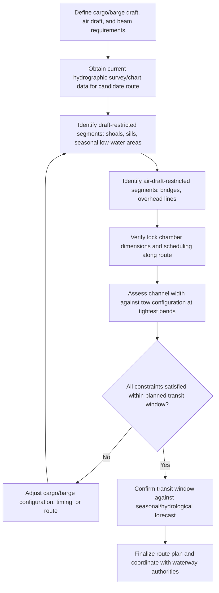

## Inland Waterway Route Planning and Draft Restrictions

### Overview

Inland waterway route planning is the process of surveying and confirming that a river, canal, or connected waterway system can physically accommodate a specific barge and cargo combination from load point to destination, accounting for water depth, vertical clearance, channel width, and lock/dam infrastructure. Draft restrictions — the maximum depth a loaded vessel or barge can safely draw without grounding — are the most operationally critical constraint in this planning process, since inland waterways lack the depth margins typical of ocean shipping lanes and are subject to seasonal and hydrological variability that ocean routes generally are not.

### Core Route Planning Parameters

#### Water Depth and Draft Margin

**Key Points**

- **Charted/surveyed depth**: The nominal depth shown on navigation charts or hydrographic surveys, which represents a reference condition (often a low-water or maintained-depth benchmark) rather than a guarantee of current conditions
- **Under-keel clearance (UKC)**: The margin maintained between the vessel/barge's actual draft and the channel bottom, accounting for survey uncertainty, squat effects, and sediment/silting between survey updates
- **Seasonal/hydrological variability**: River depths fluctuate significantly with rainfall, snowmelt, and drought conditions, meaning a route feasible in one season may become draft-restricted or impassable in another
- **Squat effect**: Increased effective draft experienced by a vessel/barge moving through shallow or confined water due to the Bernoulli-effect drawdown of the vessel relative to the surrounding water surface

$$UKC_{required} = UKC_{margin} + Squat + Survey_{uncertainty}$$

Where the specific $UKC_{margin}$ applied is determined by waterway authority regulations, pilotage practice, and the specific vessel/barge's maneuverability characteristics rather than a single universal constant. [Inference] Squat magnitude increases with vessel speed and decreases with available underkeel clearance, following established ship hydrodynamics principles, though the specific squat value for a given barge/route combination should be calculated using route-specific hydrodynamic guidance rather than assumed generically.

#### Vertical Clearance (Air Draft)

**Key Points**

- Bridges, overhead power lines, and other fixed overhead obstructions define a maximum air draft (vessel/cargo height above the waterline) for a given route segment
- Air draft restrictions are particularly critical for over-height project cargo carried on deck barges, since the combined barge freeboard, deck height, and cargo height must clear every overhead obstruction along the entire route
- Water level fluctuation affects air draft margin inversely to draft margin: higher water levels improve draft clearance but reduce air draft clearance under fixed bridges, requiring route planning to account for both constraints simultaneously across the full range of expected water levels during the transit window

#### Channel Width and Maneuvering Constraints

**Key Points**

- Channel width, combined with barge/tow beam and length, determines whether a given tow configuration can navigate bends, particularly on winding river sections
- Tow configuration (single barge, side-by-side, or tandem/multiple-barge tows) must be assessed against the tightest turning radius on the planned route, since a configuration navigable on straight reaches may be infeasible on sharper bends
- Two-way traffic considerations (meeting/passing other vessels) affect route timing and may require designated passing points on narrower channel segments

### Lock and Dam Infrastructure

**Key Points**

- **Lock chamber dimensions**: Length, width, and depth of each lock chamber along the route must accommodate the barge/tow configuration; a single undersized lock can render an otherwise suitable route infeasible
- **Lock capacity and scheduling**: Lock throughput capacity and scheduling (particularly at high-traffic locks) affects transit time predictability and may require advance booking or coordination with waterway authorities
- **Draft over lock sills**: Depth over the lock sill (the raised threshold at a lock entrance) can be a more restrictive draft constraint than the general channel depth, requiring separate verification
- [Unverified] Specific lock dimensions and scheduling procedures vary by waterway system and governing authority; current data should be sourced from the relevant waterway authority (e.g., a national inland waterways agency) rather than assumed from general principles

### Route Planning Workflow

### Seasonal and Hydrological Planning

**Key Points**

- Low-water seasons (often late summer/autumn in many temperate river systems, though this varies by region and specific waterway) can significantly reduce available draft, sometimes restricting or halting heavy-barge movements until water levels recover
- High-water/flood conditions can conversely restrict air draft under bridges and may trigger navigation restrictions or closures for safety reasons independent of draft considerations
- [Inference] The specific seasonal pattern affecting a given waterway depends on its regional climate and hydrological regime (snowmelt-fed versus rainfall-fed systems behave differently), so route timing should be planned against the specific waterway's historical and forecast hydrological data rather than general seasonal assumptions
- Real-time water level monitoring (via waterway authority gauges or river forecast services) during the transit window allows route plans to be adjusted if conditions diverge from the planning assumptions

### Draft Restriction Verification Table (Illustrative Structure)

| Route Segment | Charted Depth | Required UKC Margin | Seasonal Variation Risk | Notes |
| --- | --- | --- | --- | --- |
| Segment A (open channel) | [Site-specific] | [Route-specific] | Low-Moderate | Verify against current survey |
| Segment B (lock sill) | [Site-specific] | [Route-specific] | Low | Confirm with lock authority |
| Segment C (shoal area) | [Site-specific] | [Route-specific] | High | Priority for real-time monitoring |

[Unverified] This table illustrates the structure of a draft verification record; actual depth and margin figures must be populated from current, route-specific hydrographic and waterway authority data rather than generic values, as inland waterway conditions are highly location- and time-dependent.

### Common Pitfalls and Operational Risks

**Key Points**

- Relying on outdated hydrographic survey data without confirming current conditions, particularly in waterways prone to sedimentation or seasonal shoaling
- Overlooking draft over lock sills as a distinct constraint from general channel depth, discovering the restriction only at the lock itself
- Failing to account for combined draft and air-draft trade-offs across the full range of expected water levels during a multi-day transit
- Underestimating squat effect in confined, shallow channels, particularly at higher transit speeds
- [Inference] These pitfalls are commonly documented in inland waterway navigation and heavy-lift logistics guidance; actual risk exposure is highly specific to the waterway system, season, and vessel/barge configuration involved

### Related Topics

- Deck Barge and Submersible Barge Types
- Tug and Towing Configuration for Barge Transport
- Squat Effect and Underkeel Clearance Calculations
- Lock and Dam Transit Coordination for Heavy Cargo Barges
- Hydrographic Survey Data Sources and Waterway Authority Coordination
- Seasonal Hydrology and River Forecast Services for Route Timing
- Air Draft Management for Over-Height Barge Cargo