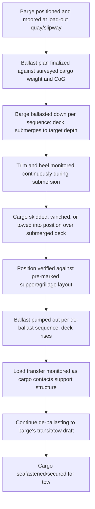

## Barge Ballasting for Float-On Load-Outs

### Overview

Barge ballasting for float-on load-outs is the specific operational discipline of using controlled ballast transfer to submerge a submersible barge's deck so that a cargo item can be floated aboard, then de-ballasting to lift the cargo clear of the water on the rising deck. While the general ballasting principles apply across dock ships and submersible barges alike (see Ballast Systems and Deck Strength Considerations), the load-out context specifically addresses the shore-to-barge or fabrication-yard-to-barge transfer operation, where cargo is typically towed or skidded into position from an adjacent quay or launch way rather than arriving under its own power from open water.

### Load-Out Operation Context

**Key Points**

- Float-on load-outs are commonly used to transfer large fabricated structures (modules, jackets, hulls, floating platforms) from a fabrication yard quay onto a barge for onward tow to an installation site or ocean-going vessel transfer point
- The operation typically occurs in sheltered, controlled water (a fabrication yard basin, sheltered harbor, or dedicated load-out slipway) rather than open water, distinguishing it operationally from offshore float-on/float-off transfers
- Cargo is usually moved into position over the submerged barge deck via skidding, winching, or a combination of tug-assisted towing (for a floating structure) and mooring line control, rather than self-propulsion

### Pre-Operation Engineering

#### Cargo and Barge Compatibility Verification

**Key Points**

- Cargo weight, center of gravity, and support point locations (keel blocks, cribbing, or grillage layout) must be matched against the barge's deck strength rating and available deck area
- Barge freeboard and ballast capacity must be sufficient to achieve the required submersion depth for the cargo to clear the deck edge and support structure during float-on
- Tidal range (where the operation occurs in tidal waters) must be factored into the achievable submersion depth, since barge ballasting works in combination with, not independent of, the surrounding water level

$$d_{required} = h_{cargo\_draft} + h_{clearance} - h_{tide\_adjustment}$$

Where $d_{required}$ is the necessary deck submersion depth, $h_{cargo\_draft}$ is the cargo's draft (or the draft of its temporary flotation/transport cradle) at the point of transfer, $h_{clearance}$ is a safety margin above the deck/support structure, and $h_{tide\_adjustment}$ accounts for the water level at the time of the operation. [Inference] The specific clearance margin applied is determined by the operation's engineering plan and marine warranty surveyor requirements rather than a fixed universal value.

#### Ballast Plan Development

**Key Points**

- A detailed ballast sequence plan specifies which tanks are filled/emptied, in what order, and at what rate to achieve controlled, even submersion without inducing unwanted trim or heel
- The plan must account for the barge's own light-ship weight distribution and any temporary load-out equipment (winches, generators, ballast control stations) added for the operation
- Redundancy in ballast pumping capacity (backup pumps, multiple independent systems) is a common risk-mitigation measure given the criticality of ballast control during the operation

### Load-Out Sequence

**Key Points**

- Continuous monitoring during both submersion and de-ballasting phases allows the ballast team to detect and correct any unplanned trim or heel before it affects cargo position accuracy or barge stability
- The load transfer phase (as cargo first contacts the rising deck/support structure) is a critical monitoring point, since uneven contact across support points can induce local overstress or unwanted barge heel if not corrected promptly

### Stability Management During Load-Out

**Key Points**

- The partially submerged condition during ballasting is a non-standard loading state requiring specific stability verification, since standard intact stability criteria are generally developed for normal (non-submerged-deck) loading conditions
- Free surface effects from ballast tanks being filled/emptied during the sequence temporarily reduce effective $GM$, requiring the ballast plan to maintain adequate stability margin throughout the transition rather than only at the start and end states
- Mooring line tension and tug-assist forces (where used to hold the barge in position during the operation) must be accounted for as external forces potentially affecting the barge's response to ballast changes

$$GM_{transition} = GM_{solid} - FSC_{active}$$

Where $FSC_{active}$ reflects the free surface correction from tanks actively being filled or emptied during the ballast sequence — [Inference] this value changes continuously through the operation as tank fill levels change, meaning the stability margin should be verified at multiple points through the sequence rather than assumed constant.

### Comparison: Sheltered Load-Out vs Open-Water Float-On/Float-Off

| Aspect | Sheltered Load-Out (Barge) | Open-Water FloFlo (Dock Ship) |
| --- | --- | --- |
| Operating environment | Fabrication yard basin, sheltered harbor | Open ocean/coastal, weather-window dependent |
| Cargo movement method | Skidding, winching, tug-assisted towing | Self-propelled tow or vessel's own power into position |
| Weather sensitivity | Lower (sheltered water) | Higher (sea state critical) |
| Tidal dependency | Often significant (fixed quay/slipway reference) | Present but generally less constraining given open water depth |
| Typical scale | Fabrication modules, jackets, smaller floating structures | Large offshore platforms, FPSOs, vessels |

### Common Pitfalls and Operational Risks

**Key Points**

- Underestimating required submersion depth by failing to account for tidal water level at the actual time of the operation rather than a reference tide level
- Ballasting unevenly across tanks, inducing unplanned trim or heel that misaligns cargo with the intended support/grillage layout
- Insufficient monitoring during the load-transfer phase, allowing uneven contact across support points to go uncorrected
- Inadequate backup ballast pump capacity, extending exposure time during a critical phase of the operation if primary pumps underperform
- [Inference] These pitfalls are commonly documented in heavy marine transport and load-out engineering guidance; actual risk exposure is specific to the barge, cargo, and load-out facility involved

### Related Topics

- Deck Barge and Submersible Barge Types
- Ballast Systems and Deck Strength Considerations
- Dock Ships and Project Cargo Carriers
- Skidding and Grillage Systems for Heavy Module Transfer
- Marine Warranty Surveyor (MWS) Approval for Load-Out Operations
- Tidal Planning for Sheltered-Water Marine Operations
- Mooring and Station-Keeping During Barge Loading Operations