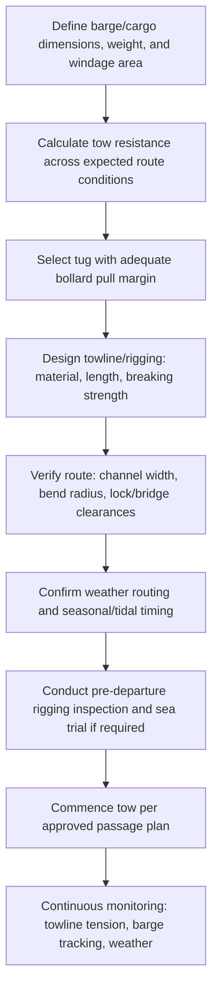

## Tug and Tow Operations for Barge Transport

### Overview

Tug and tow operations encompass the vessels, equipment, and procedures used to move non-self-propelled barges carrying heavy-lift and project cargo along inland waterways, coastal routes, and open-water passages. Since deck barges and submersible barges lack their own propulsion, the tug (or towboat, in river-pushing configurations) provides all propulsive force and, in many configurations, primary steering control — making tug selection, towing configuration, and rigging arrangement a critical determinant of the operation's safety and schedule reliability.

### Tug Types and Towing Configurations

#### Ocean/Coastal Towing (Astern Tow)

**Key Points**

- Tug tows the barge from astern via a towline (wire rope or synthetic fiber rope, often with a chain or wire pendant section near the barge for wear resistance and catenary weight)
- Towline length and catenary (the sag/curve in the towline under its own weight and the dynamic forces of the tow) are engineered to absorb shock loading from wave action and differential vessel/barge motion
- Bollard pull (the tug's rated static pulling force, typically expressed in tonnes) must be sized against the barge/cargo's total tow resistance, accounting for hull form, weather, and sea state along the route
- [Unverified] Specific bollard pull requirements are route-, weather-, and cargo-specific, calculated via a tow resistance and bollard pull study rather than a fixed rule of thumb

#### River/Inland Pushing (Push-Tow)

**Key Points**

- Towboat pushes one or more barges from astern using a rigid coupling (wire lashings, ratchet binders, or mechanical coupling systems) rather than a flexible towline
- Common configuration on river systems (particularly where barges are combined into multi-barge tows) due to improved steering control and fuel efficiency compared to astern towing in confined channels
- Tow configuration (single barge, side-by-side pairs, or multi-barge tandem/matrix arrangements) is constrained by channel width and bend radius (see Inland Waterway Route Planning and Draft Restrictions)

#### Alongside Towing

**Key Points**

- Tug is secured alongside the barge (rather than ahead via towline or astern via push-coupling), providing direct, immediate steering and propulsion control
- Commonly used for close-quarters maneuvering (harbor transits, approach to a load-out quay, or precise positioning during a float-on/float-off operation) rather than long-distance transit
- Provides the most responsive control of the three configurations but is generally less fuel-efficient and less suited to sustained open-water passages

### Towline and Rigging Engineering

#### Towline Selection

| Towline Material | Characteristics |
| --- | --- |
| Wire rope | High strength-to-diameter ratio, low stretch, more susceptible to fatigue/kinking over repeated use |
| Synthetic fiber (e.g., high-modulus polyethylene) | Lighter weight, some elasticity for shock absorption, buoyant variants available to reduce seabed contact risk in shallow water |
| Chain (pendant sections) | Used near the barge/tug connection points for abrasion resistance and to add catenary weight, damping dynamic snatch loads |

**Key Points**

- Towline breaking strength must include an adequate safety factor above the calculated maximum towing load, accounting for dynamic snatch loading in addition to steady-state tow resistance
- [Inference] The specific safety factor applied is determined by class society guidance, towage industry standards, and the specific operation's risk assessment rather than a single fixed value across all operations

#### Tow Resistance Calculation

$$R_{tow} = R_{hull} + R_{wind} + R_{wave} + R_{current}$$

Where $R_{tow}$ is total tow resistance requiring tug bollard pull to overcome, comprising hull resistance (a function of barge form, wetted surface, and tow speed), wind resistance (significant for high-freeboard cargo on deck barges), wave-added resistance, and current resistance where the route crosses tidal or river current flows. [Inference] Each resistance component is calculated using established towage engineering methods specific to the barge's hull form and the route's environmental conditions, rather than derived from a single generic formula in practice.

### Tow Planning Workflow

### Operational Monitoring During Tow

**Key Points**

- Towline tension monitoring (where instrumented) helps detect approaching overload conditions before towline failure, particularly in deteriorating weather
- Barge tracking (via GPS/AIS on the barge itself, where fitted, or visual/radar tracking from the tug) confirms the barge is following the intended track and has not developed unexpected yaw or sheer
- Weather monitoring throughout the tow allows early decisions on route deviation, sheltering, or speed reduction if conditions approach the tow's engineered limits
- Emergency towline/rigging failure procedures (backup towline deployment, barge anchoring if fitted, or emergency tug assistance) should be established before departure rather than improvised during an incident

### Comparison: Towing Configuration Trade-offs

| Configuration | Steering Control | Typical Use | Fuel Efficiency |
| --- | --- | --- | --- |
| Astern tow | Moderate (via towline geometry and rudder) | Open-water/coastal long-distance transit | Moderate |
| Push-tow | High (direct coupling) | River/inland channels | High |
| Alongside tow | Highest (direct control) | Close-quarters maneuvering, harbor transit | Lower |

### Common Pitfalls and Operational Risks

**Key Points**

- Selecting a tug based on nominal bollard pull without verifying it against a route- and weather-specific tow resistance calculation, particularly for high-windage deck cargo
- Underestimating dynamic snatch loading in towline design, leading to premature towline failure in moderate sea states
- Attempting a multi-barge push-tow configuration on a river segment whose bend radius does not accommodate the tow's combined length and width
- Inadequate weather routing contingency planning, leaving the tow exposed to deteriorating conditions without a pre-identified shelter or deviation option
- [Inference] These pitfalls are commonly documented in towage industry guidance and marine casualty case studies; actual risk exposure depends on the specific tug, barge, cargo, and route/weather conditions involved

### Related Topics

- Deck Barge and Submersible Barge Types
- Inland Waterway Route Planning and Draft Restrictions
- Barge Ballasting for Float-On Load-Outs
- Towline and Rigging Engineering for Ocean Towage
- Weather Routing for Marine Transport Operations
- Cargo Securing and Sea-Fastening for Barge Transit
- Emergency Towing and Contingency Procedures