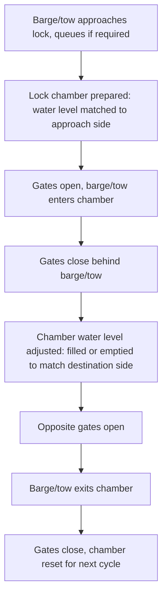

## Lock and Dam Transit Considerations

### Overview

Lock and dam transit considerations address the specific engineering, operational, and scheduling requirements for moving heavy-lift cargo barges through lock chambers that manage elevation changes along regulated inland waterways. Locks and dams enable navigation on rivers with varying elevation profiles by creating a series of controlled pools, but each lock chamber imposes hard physical limits on barge/tow dimensions and introduces scheduling dependencies that can materially affect a project cargo transit timeline.

### Lock Infrastructure Fundamentals

#### Lock Chamber Dimensions

**Key Points**

- **Chamber length and width**: Define the maximum barge or tow configuration (single barge or multi-barge arrangement) that can physically enter and be locked through in a single cycle
- **Sill depth**: The depth of water over the raised threshold at the lock's upstream and/or downstream gates, which can be a more restrictive draft constraint than the general channel depth on either side
- **Lift height**: The elevation change achieved by the lock, determining the range over which water level inside the chamber must be raised or lowered during the cycle
- [Unverified] Specific chamber dimensions, sill depths, and lift heights vary by individual lock and waterway system; current specifications should be obtained directly from the governing waterway authority rather than assumed from general lock design principles

#### Lock Operation Cycle

**Key Points**

- Water level adjustment during the cycle creates transient currents and turbulence within the chamber, requiring the barge/tow to be adequately moored or held (via lines to chamber bollards) throughout the filling/emptying phase
- Multiple barges transiting together (a multi-barge tow) must fit within chamber dimensions with adequate clearance for mooring line handling and to avoid contact between barges or with chamber walls during water level changes

### Dimensional and Weight Verification for Transit

**Key Points**

- Barge/tow length and width must be verified against chamber dimensions with adequate clearance margin, not simply confirmed as numerically smaller than the chamber's nominal dimensions
- Loaded barge draft must clear the sill depth at both the upstream and downstream gates, verified against current water levels rather than only reference/charted depths
- Air draft (barge freeboard plus cargo height) must clear any overhead structure associated with the lock itself (control houses, overhead walkways, or crane structures at the lock site), in addition to general route bridge clearances
- [Inference] Lock authorities typically require advance notification of oversized or unusual tow configurations specifically to verify these clearances before scheduling transit, though the specific notification process and lead time required vary by waterway authority

### Scheduling and Traffic Coordination

**Key Points**

- Lock throughput capacity is finite; high-traffic locks may have queuing delays that are difficult to predict precisely in advance, introducing schedule risk for time-sensitive project cargo movements
- Some waterway authorities offer priority scheduling or advance booking for oversized/unusual tows, though this generally requires early coordination given the administrative lead time involved
- Lock maintenance closures (scheduled or emergency) can eliminate a route option entirely for the closure duration, making awareness of maintenance schedules an important input to route timing
- Multi-lock routes compound scheduling risk, since a delay at any single lock in the sequence propagates through the remainder of the transit

### Mooring and Handling Within the Chamber

**Key Points**

- Mooring lines to chamber-side bollards or floating mooring bitts (where fitted) must be actively tended during water level changes to prevent the barge from surging, listing, or contacting chamber walls as water level and resulting buoyancy change
- Fendering (temporary or barge-integrated) protects both the barge and chamber walls from contact damage during the confined maneuvering required to enter, position within, and exit the chamber
- For oversized tows occupying most of the chamber's available width, the margin for corrective maneuvering is minimal, making precise approach speed and alignment control especially important on entry

### Draft and Clearance Verification Checklist

**Key Points**

- Confirm current water level and sill depth at both gate ends against loaded barge draft with adequate margin
- Confirm chamber length/width against tow configuration with adequate clearance for mooring and to avoid wall contact
- Confirm air draft clearance against all lock-site overhead structures
- Confirm lock scheduling/booking status and any known maintenance closures along the full multi-lock route
- Confirm mooring/fendering arrangement is adequate for the specific tow's size and the chamber's water level change rate

### Comparison: Single-Lock vs Multi-Lock Route Risk

| Factor | Single-Lock Route | Multi-Lock Route |
| --- | --- | --- |
| Cumulative scheduling risk | Lower | Higher (delays compound across locks) |
| Dimensional verification effort | Single chamber to verify | Every chamber along route must be verified |
| Exposure to maintenance closures | Limited to one lock | Exposure at each lock in sequence |
| Coordination complexity | Lower | Higher (multiple authority coordination points if locks are separately administered) |

### Common Pitfalls and Operational Risks

**Key Points**

- Verifying tow dimensions against nominal chamber dimensions without an adequate clearance margin for mooring line handling and wall contact avoidance
- Overlooking sill depth as a distinct, potentially more restrictive constraint than general channel depth on either side of the lock
- Underestimating cumulative schedule risk across a multi-lock route, where a delay at an early lock affects arrival timing at every subsequent lock
- Inadequate mooring/fendering arrangement for oversized tows with minimal chamber clearance margin, increasing contact damage risk during water level changes
- [Inference] These pitfalls are commonly documented in inland waterway navigation guidance and heavy-lift logistics case studies; actual risk exposure is specific to the waterway system, individual lock, and tow configuration involved

### Related Topics

- Inland Waterway Route Planning and Draft Restrictions
- Tug and Tow Operations for Barge Transport
- Deck Barge and Submersible Barge Types
- Waterway Authority Coordination and Transit Permitting
- Mooring and Station-Keeping During Barge Loading Operations
- Air Draft Management for Over-Height Barge Cargo
- Multi-Lock Route Scheduling and Contingency Planning