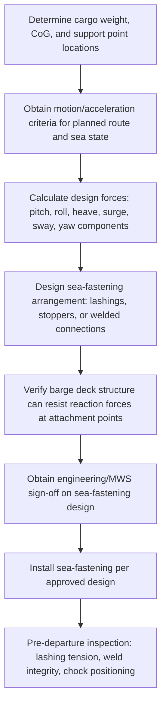

## Barge Mooring and Sea-Fastening Practices

### Overview

Barge mooring and sea-fastening practices cover the two related but distinct disciplines of securing a barge in place during stationary operations (loading, lock transit, weather waiting) and securing cargo to the barge deck for the dynamic loads experienced during tow. Mooring addresses barge-to-shore or barge-to-structure connection; sea-fastening addresses cargo-to-barge connection. Both are safety-critical, since a mooring failure risks the barge itself, while a sea-fastening failure risks the cargo directly and can compromise barge stability if a heavy unit shifts or breaks free during transit.

### Mooring Practices

#### Mooring Line Configuration

**Key Points**

- Mooring lines are typically arranged in a spread pattern (breast lines, spring lines, and head/stern lines) to resist forces from multiple directions — wind, current, wake from passing vessels, and tidal change
- **Breast lines**: Run perpendicular to the barge, primarily resisting lateral (off-quay) movement
- **Spring lines**: Run at an angle fore-and-aft, resisting surge (fore-aft movement along the berth)
- **Head and stern lines**: Run from the bow and stern to shore points, providing overall position control
- Line material selection (synthetic fiber, wire rope) follows similar trade-offs to towlines: synthetic fiber offers elasticity for shock absorption, wire offers higher strength-to-diameter ratio with less stretch

#### Mooring Load Considerations

$$F_{mooring} = F_{wind} + F_{current} + F_{wake} + F_{tidal}$$

Where the total mooring load a line arrangement must resist combines wind force on the barge's exposed area (particularly significant for high-freeboard deck cargo), current force against the hull, wake forces from passing vessel traffic, and forces from tidal water level and flow changes. [Inference] Each component's magnitude depends on the specific site conditions and barge/cargo windage profile, requiring a site- and load-specific mooring analysis rather than a generic calculation.

**Key Points**

- Mooring line pretension and slack management must account for tidal range at the mooring location, since a line tensioned correctly at one tide state may become dangerously slack or overtensioned at another if not actively tended
- Fendering between the barge and quay/adjacent vessels protects against contact damage from surge motion within the mooring's slack tolerance
- Emergency quick-release capability on mooring lines is a common safety feature, allowing rapid disconnection if conditions deteriorate beyond the mooring arrangement's design limits

#### Mooring During Loading Operations

**Key Points**

- Crane loading operations impose additional dynamic loads on mooring lines as the barge responds to shifting weight distribution during the lift
- SPMT roll-on operations require the barge to remain essentially motionless relative to the ramp/link-span throughout the transfer, demanding a stiffer, more actively monitored mooring arrangement than routine cargo-free mooring
- [Inference] The specific mooring stiffness and monitoring requirements for a loading operation are typically defined in the operation's method statement or lift plan, tailored to the specific loading method and cargo sensitivity involved

### Sea-Fastening Practices

#### Sea-Fastening Design Principles

**Key Points**

- Sea-fastening must resist dynamic forces experienced during tow: pitch, roll, heave, surge, sway, and yaw accelerations, which combine to produce forces significantly exceeding the cargo's static weight under adverse conditions
- Design forces are calculated using acceleration values appropriate to the specific route's expected sea states, tow speed, and barge motion characteristics, rather than static weight alone
- Common sea-fastening methods include welded steel brackets/stoppers, chain lashings with tensioners, wire rope lashings, and (for very heavy units) direct welding of cargo support structure to the barge deck

$$F_{design} = W_{cargo} \cdot (1 + a_{combined}/g)$$

Where $F_{design}$ is the design force the sea-fastening arrangement must resist, $W_{cargo}$ is the cargo's static weight, and $a_{combined}$ represents the combined dynamic acceleration (from pitch, roll, heave, and other motion components) expressed as a fraction of gravitational acceleration $g$. [Inference] The specific $a_{combined}$ value used is derived from motion analysis or class society guidance specific to the barge, route, and expected sea state, not a fixed multiplier applied universally.

#### Sea-Fastening Methods by Cargo Type

| Cargo Type | Common Sea-Fastening Method |
| --- | --- |
| Wheeled/SPMT-carried modules | Chain lashings to deck padeyes/lashing points, wheel chocks |
| Large fabricated structures (jackets, hulls) | Welded steel stoppers/brackets, grillage tie-down |
| Palletized/crated general cargo | Chain or wire lashings, timber shoring/blocking |
| Very heavy indivisible units | Engineered welded connections directly to reinforced deck structure |

[Unverified] Method selection depends on cargo-specific engineering assessment, class society or marine warranty surveyor requirements, and voyage-specific risk factors; the table reflects general industry practice rather than a prescriptive standard applicable to every cargo unit.

#### Sea-Fastening Verification Workflow

### Inspection and Monitoring During Tow

**Key Points**

- Pre-departure inspection confirms all sea-fastening elements (lashing tension, weld condition, chock/stopper positioning) match the approved design before the tow begins
- Periodic inspection during tow (where accessible and safe to do so) allows early detection of lashing loosening, chafing, or shifting before it develops into a cargo-securing failure
- Weather monitoring during tow informs decisions on route deviation or speed reduction if forecast conditions approach or exceed the sea-fastening design's assumed sea state
- [Inference] Specific inspection frequency and access provisions during tow depend on the barge's configuration and the voyage's duration and route, established in the voyage's method statement rather than a universal fixed interval

### Comparison: Mooring vs Sea-Fastening Focus

| Aspect | Mooring | Sea-Fastening |
| --- | --- | --- |
| What is secured | Barge itself | Cargo to barge deck |
| Primary forces resisted | Wind, current, wake, tidal | Pitch, roll, heave, surge, sway, yaw (tow dynamics) |
| Typical duration of concern | Stationary periods (loading, lock transit, weather waiting) | Entire tow/transit duration |
| Failure consequence | Barge drift, contact damage, loss of position | Cargo shift, cargo loss, potential barge stability compromise |

### Common Pitfalls and Operational Risks

**Key Points**

- Setting mooring line tension for one tide state without accounting for the full tidal range at the mooring location, risking overtensioning or dangerous slack
- Designing sea-fastening based on static cargo weight alone without incorporating dynamic acceleration components appropriate to the actual route and sea state
- Insufficient pre-departure inspection, allowing a marginal lashing or weld defect to go undetected before the tow begins
- Failing to reassess sea-fastening adequacy when route or weather conditions change from those assumed in the original design
- [Inference] These pitfalls are commonly documented in marine cargo loss-prevention and towage industry guidance; actual risk exposure is specific to the barge, cargo, route, and operating conditions involved

### Related Topics

- Deck Barge and Submersible Barge Types
- Tug and Tow Operations for Barge Transport
- Barge Ballasting for Float-On Load-Outs
- Lock and Dam Transit Considerations
- Cargo Securing Manuals and Sea-Fastening Design for Breakbulk Modules
- Marine Warranty Surveyor (MWS) Approval Processes
- Weather Routing for Marine Transport Operations