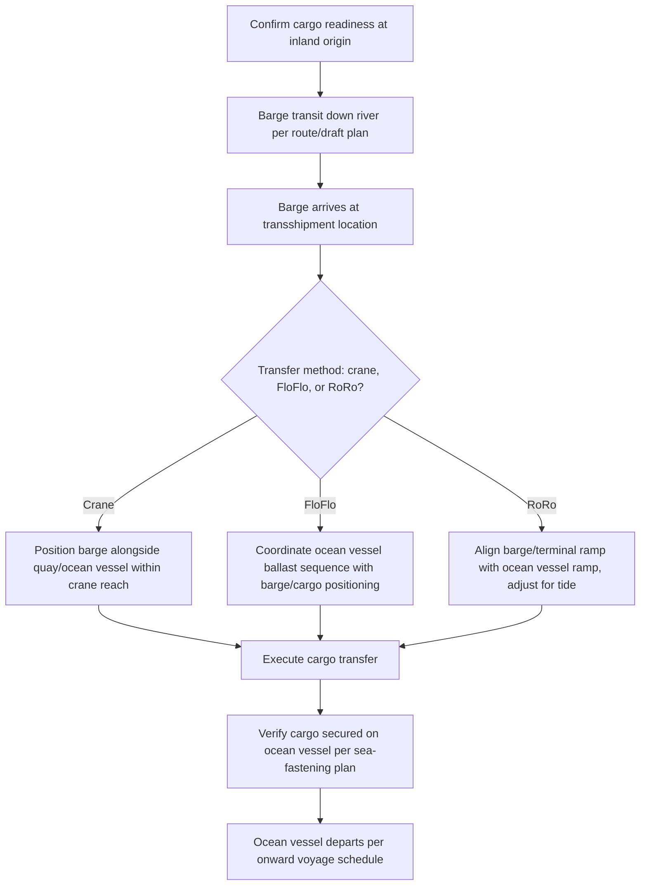

## River-to-Ocean Transshipment Planning

### Overview

River-to-ocean transshipment planning addresses the engineering and logistical coordination required to transfer heavy-lift cargo from an inland waterway barge to an ocean-going vessel (or vice versa), typically occurring where a river system's draft, air draft, or vessel-size limitations prevent ocean vessels from proceeding further upriver to the cargo's ultimate origin or destination. This transshipment point becomes a critical node in the overall project logistics chain, requiring careful synchronization of two distinct transport modes with different vessel types, scheduling constraints, and handling methods.

### Why Transshipment Is Required

**Key Points**

- Ocean-going vessels typically have deeper drafts and greater dimensions than are navigable on many inland waterway systems, making direct port-to-inland-origin transport infeasible for larger project cargo units
- River barges provide shallow-draft access to inland fabrication yards, industrial sites, or river ports that ocean vessels cannot reach, necessitating a transfer point where cargo moves from barge to ship
- The reverse flow (ocean vessel to river barge) occurs where cargo arrives by sea but must continue to an inland destination beyond ocean vessel navigability, following the same transshipment logic in the opposite direction

### Transshipment Location Selection

**Key Points**

- **River mouth/estuary ports**: Natural transition points where river draft restrictions end and ocean vessel access begins, often already developed with port infrastructure supporting both barge and ocean vessel operations
- **Anchorage transshipment**: Where no suitable port infrastructure exists, cargo transfer may occur at a sheltered anchorage using floating cranes, side-by-side mooring, or barge-to-barge/barge-to-ship transfer methods
- **Dedicated transshipment terminals**: Purpose-built facilities with both barge berths and ocean vessel berths, sometimes including load-out facilities for direct float-on/float-off or crane transfer between the two vessel types

[Inference] Location selection is driven by a combination of existing infrastructure availability, cargo-specific handling requirements, and route economics; there is no single universal transshipment location model applicable across all river-to-ocean logistics chains.

### Transfer Methods

#### Direct Crane Transfer

**Key Points**

- A shore crane, floating crane, or the ocean vessel's own heavy-lift gear (if geared) lifts cargo directly from the barge deck to the ocean vessel's hold or deck
- Requires the barge and ocean vessel to be positioned within crane reach, typically alongside the same quay or moored alongside each other
- Cargo weight must be verified against the crane's SWL at the actual working radius between barge and vessel positions, which may differ from the crane's rated maximum capacity at minimum radius

#### Float-On/Float-Off Transfer

**Key Points**

- Where the ocean vessel is itself a dock ship (semi-submersible), the barge (or its cargo, if the cargo can be separated from the barge) may be floated directly onto the ocean vessel's submerged deck, bypassing the need for crane lift entirely
- This method is particularly suited to cargo units too heavy for available crane capacity at the transshipment location
- Requires careful coordination of the ocean vessel's ballast sequence with the barge's positioning, following the same float-on/float-off principles described in Dock Ships and Project Cargo Carriers, but with an additional layer of coordination between two independently operated vessels

#### Roll-On/Roll-Off Transfer

**Key Points**

- Where cargo is wheeled or SPMT-carried and both the barge/terminal and ocean vessel have compatible ramp infrastructure, cargo can be rolled directly from barge/quay to the ocean RoRo vessel
- Requires ramp height/angle compatibility between the barge or terminal ramp and the ocean vessel's stern/quarter ramp, often necessitating a link-span structure to bridge tidal water level variation

### Transshipment Coordination Workflow

### Scheduling Synchronization

**Key Points**

- River barge transit time (subject to current, lock transits, and seasonal draft conditions) and ocean vessel arrival/berthing windows (subject to port scheduling, tidal access, and voyage charter laycan terms) must be synchronized to minimize costly waiting time on either side
- Weather windows affecting the ocean vessel's approach or the transfer operation itself (particularly for crane or FloFlo transfer methods sensitive to sea state) add a further scheduling variable independent of river-side conditions
- Buffer time is commonly built into the schedule to absorb minor delays on either the river or ocean side without cascading into a missed vessel laycan or extended barge demurrage
- [Unverified] Specific buffer durations and demurrage terms are project- and contract-specific, negotiated as part of the overall charter and logistics contract rather than following a fixed industry standard

### Stakeholder Coordination

**Key Points**

- River barge operator/towing company, ocean vessel owner/operator, transshipment terminal operator, and cargo owner/project logistics coordinator each have distinct schedules and contractual interests that must be aligned
- Port/terminal authorities at the transshipment point may impose their own scheduling, permitting, or safety zone requirements affecting both barge and ocean vessel movements during the transfer
- Marine warranty surveyor involvement (for high-value or insurance-sensitive cargo) may extend across both the river and ocean transport legs, requiring coordinated approval of the transshipment method itself in addition to each leg's individual handling plan

### Comparison: Transfer Method Suitability

| Transfer Method | Best Suited For | Key Constraint |
| --- | --- | --- |
| Direct crane transfer | Cargo within available crane SWL at transshipment location | Crane reach/capacity at working radius |
| Float-on/Float-off | Cargo exceeding crane capacity, or non-craneable hull forms | Ocean vessel must be a dock ship; sea-state sensitive |
| Roll-on/Roll-off | Wheeled/SPMT-carried cargo | Ramp compatibility and tidal alignment between barge/terminal and ocean vessel |

### Common Pitfalls and Operational Risks

**Key Points**

- Underestimating scheduling risk from independently variable river transit time and ocean vessel arrival windows, leading to costly waiting time on one side of the transfer
- Selecting a transfer method based on nominal cargo weight without verifying actual crane capacity at the specific working radius required at the transshipment location
- Overlooking ramp height/angle compatibility between barge/terminal and ocean vessel infrastructure until the vessels are already positioned for transfer
- Insufficient coordination among the multiple stakeholders involved (barge operator, ocean vessel owner, terminal, cargo owner), leading to conflicting assumptions about responsibility for specific transfer steps
- [Inference] These pitfalls are commonly documented in multimodal project logistics guidance and case studies; actual risk exposure depends on the specific route, cargo, transfer method, and stakeholder arrangement involved

### Related Topics

- Deck Barge and Submersible Barge Types
- Dock Ships and Project Cargo Carriers
- Inland Waterway Route Planning and Draft Restrictions
- Vessel Chartering and Availability Planning
- Open Deck and Roll-On/Roll-Off Vessels
- Multimodal Project Cargo Coordination and Handoff Planning
- Marine Warranty Surveyor (MWS) Approval Processes