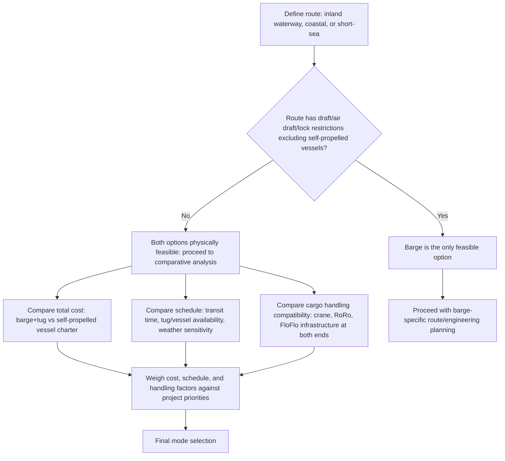

## Barge versus Vessel Selection for Regional Moves

### Overview

Barge versus vessel selection for regional moves is the comparative decision process determining whether a project cargo movement within a limited geographic range (coastal, inland waterway, or short-sea) should use a towed barge or a self-propelled vessel. Unlike long-distance ocean transport, where self-propelled vessels are the default choice, regional moves frequently present a genuine choice between the two modes, each with distinct cost, schedule, and handling trade-offs that make the selection a deliberate engineering and commercial analysis rather than an automatic default.

### Core Decision Factors

#### Route and Infrastructure Compatibility

**Key Points**

- Inland waterway routes with draft, air draft, or lock chamber restrictions may exclude self-propelled vessels entirely, making a barge the only physically feasible option regardless of cost comparison
- Coastal or short-sea routes without significant waterway restrictions open the comparison to both options, shifting the decision toward cost, schedule, and handling considerations
- Port/terminal infrastructure at both ends of the route (crane availability, ramp compatibility, load-out facilities) affects which mode aligns better with available loading/discharge methods

#### Propulsion and Schedule Control

| Factor | Self-Propelled Vessel | Barge (Towed) |
| --- | --- | --- |
| Speed | Generally higher | Generally lower (tow speed constrained by tug capability and towline limits) |
| Schedule flexibility | Higher (independent maneuvering, no tug coordination dependency) | Lower (dependent on tug availability and towing schedule) |
| Weather routing independence | Higher (vessel's own seakeeping and power) | Lower (tow configuration more weather-sensitive) |
| Route restriction sensitivity | Lower (generally deeper draft tolerance, though vessel-specific) | Higher (shallow draft advantage, but towing adds its own constraints) |

[Inference] These are general tendencies rather than absolute rules; specific vessel and barge/tug combinations can vary significantly from the typical pattern described, particularly with modern high-powered tugs or shallow-draft self-propelled vessel designs.

#### Cost Structure Comparison

**Key Points**

- Barge charter rates are typically lower than self-propelled vessel charter rates for comparable cargo capacity, but a separate tug charter cost must be added to the total barge transport cost
- Self-propelled vessel charter rates typically bundle propulsion, crew, and vessel operation into a single rate, simplifying cost comparison but at a generally higher baseline
- Total transit time affects both direct charter cost (daily/voyage rates accumulate over a longer barge tow duration) and indirect costs (project schedule delay, cargo storage/demurrage at either end)
- [Unverified] Specific rate differentials between barge+tug and self-propelled vessel options fluctuate with current freight market conditions and should be sourced from current market quotes rather than assumed as a fixed percentage difference

### Cargo-Specific Selection Factors

**Key Points**

- Cargo requiring float-on/float-off handling (non-craneable, or exceeding available crane capacity) may only be feasible via submersible barge or dock ship, narrowing the choice based on cargo handling method rather than general route/cost comparison
- Cargo requiring SPMT roll-on/roll-off handling favors whichever option (barge or RoRo vessel) offers compatible ramp/link-span infrastructure at both load and discharge points
- Time-sensitive cargo (e.g., cargo on a critical path for an installation schedule) may favor the faster self-propelled vessel option despite higher cost, reflecting a schedule-risk-driven rather than purely cost-driven decision

### Selection Decision Workflow

### Handling Method Alignment

**Key Points**

- Selecting barge or vessel independently of confirming compatible loading/discharge infrastructure at both ends of the route risks a mismatch discovered late in planning (e.g., a barge selected for cost reasons but lacking crane access at the discharge point)
- Where cargo handling method (crane, RoRo, FloFlo) is the primary driver, mode selection often follows directly from the handling method decision rather than being evaluated independently (see Vessel Selection Criteria for Project Cargo for the broader handling-method-driven selection logic)
- [Inference] In practice, cargo handling compatibility frequently narrows the options before cost and schedule comparison becomes the deciding factor, meaning the workflow above is often iterative rather than strictly linear

### Risk and Reliability Considerations

**Key Points**

- Barge/tow operations introduce an additional point of coordination (tug scheduling, towline rigging, weather-dependent tow windows) compared to a single self-propelled vessel charter, which some project planners weigh as increased coordination risk
- Self-propelled vessels reduce dependency on a separate tug's availability and performance, but specialized self-propelled tonnage (particularly dock ships) may have longer charter lead times and higher baseline cost than barge+tug combinations
- Regional moves in areas with limited specialized vessel availability may find barge+tug combinations more readily available than a suitably specified self-propelled vessel, shifting the practical decision toward availability rather than theoretical preference

### Comparison Summary Table

| Consideration | Favors Barge | Favors Self-Propelled Vessel |
| --- | --- | --- |
| Shallow draft/inland waterway route | Yes | No (often excluded by draft) |
| Lower baseline charter cost | Often yes | Often no |
| Faster transit/higher schedule flexibility | No | Yes |
| Independent weather routing capability | Lower | Higher |
| Availability in regions with limited specialized fleet | Often yes (more barges/tugs generally available) | Depends on specific vessel type demand |
| Cargo requiring FloFlo beyond crane capacity | Submersible barge or dock ship, cargo-handling-driven either way | Same |

### Common Pitfalls and Operational Risks

**Key Points**

- Selecting a mode based on charter rate comparison alone without accounting for total transit time and its schedule/cost implications
- Committing to a barge or vessel option before confirming compatible loading/discharge infrastructure exists at both ends of the specific route
- Underestimating the coordination risk and potential delay introduced by a separate tug charter when comparing barge+tug total cost/schedule against a bundled self-propelled vessel charter
- Overlooking route-specific physical restrictions (draft, air draft, lock dimensions) that may eliminate the self-propelled vessel option before cost comparison is even relevant
- [Inference] These pitfalls are commonly documented in regional project logistics planning guidance; actual risk exposure depends on the specific route, cargo, and available fleet/market conditions

### Related Topics

- Vessel Selection Criteria for Project Cargo
- Deck Barge and Submersible Barge Types
- Tug and Tow Operations for Barge Transport
- Vessel Chartering and Availability Planning
- Inland Waterway Route Planning and Draft Restrictions
- River-to-Ocean Transshipment Planning
- Dock Ships and Project Cargo Carriers