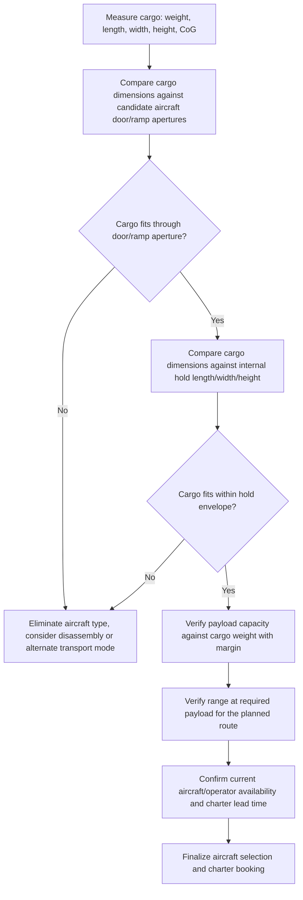

## Outsized Cargo Aircraft Types and Payload Capacities

### Overview

Outsized cargo aircraft form a specialized segment of air freight distinct from standard palletized/containerized cargo operations, purpose-built or purpose-configured to accept single pieces of freight exceeding the dimensional or weight limits of conventional side-loading freighters. This segment spans military strategic airlifters (originally designed for defense logistics but widely chartered commercially), purpose-built civil outsize freighters, and specialized nose/beluga-type aircraft designed around a specific cargo profile. Aircraft selection for outsized cargo is governed less by maximum payload weight alone than by the combination of payload, internal hold volume, and door/ramp dimensions, since a cargo item can be within an aircraft's weight limit yet still fail to physically fit through its loading aperture.

### Aircraft Classification

**Key Points**

- **Military strategic airlifters**: Long-range, high-payload aircraft such as the Lockheed C-5M Super Galaxy, originally designed for military logistics but frequently chartered for civil heavy/outsize cargo
- **Purpose-built civil outsize freighters**: Aircraft designed specifically around oversized industrial cargo, most notably the Antonov An-124 Ruslan, featuring front and rear loading ramps, onboard cranes, and a kneeling undercarriage for ramp-angle loading
- **Nose-loading widebody freighters**: Commercial freighters with a hinged nose door (in addition to side cargo doors) enabling long items to be loaded straight into the main deck, such as the Boeing 747-8F [Aviall Group](https://aviallgroup.com/insights/worlds-largest-cargo-aircraft-ranked)
- **Side-loading widebody freighters**: High-payload, long-range commercial freighters without a nose door, such as the Boeing 777F, which serves as the twin-engine benchmark for long-range main-deck freight without a nose door [Aviall Group](https://aviallgroup.com/insights/worlds-largest-cargo-aircraft-ranked)
- **Purpose-built oversized-parts carriers**: Aircraft designed to carry outsize aircraft components rather than general industrial cargo, such as the Airbus Beluga/BelugaXL and Boeing Dreamlifter

[Unverified] Fleet composition and aircraft availability within each category change over time due to production status, sanctions, and operator-specific fleet decisions; current availability should be verified against operator and charter broker data at the time of a specific project rather than assumed static.

### Key Aircraft Specifications

| Aircraft | Max Payload | Notable Characteristics |
| --- | --- | --- |
| Antonov An-124 Ruslan | Up to roughly 120 tonnes | Hold approximately 36 m long and 6.4 m wide, full-width nose and rear doors, onboard cranes, kneeling undercarriage |
| Lockheed C-5M Super Galaxy | 281,001 pounds (127,460 kg) | Military strategic airlifter; largest active payload among aircraft covered here |
| Boeing 747-8F | Up to approximately 137 tonnes | Nose door lets operators load long items straight in along the main deck; production ended in 2023 |
| Boeing 777F | Up to approximately 102 tonnes | Twin-engine benchmark for long-range main-deck freight without a nose door |
| McDonnell Douglas MD-11F | Up to approximately 90 tonnes, around 26 main-deck pallet positions | Long-range palletized freight workhorse |
| Antonov An-225 Mriya | Approximately 250-tonne payload capacity | Was the largest cargo aircraft ever built; destroyed in 2022, only one airframe was ever completed |

[Unverified] Payload figures above are manufacturer/reference maximums for the heaviest variant of each type and represent structural limits rather than typical operational payload, which is often lower once fuel, range, and specific route requirements are factored in.

### The Three-Constraint Selection Model

Outsize cargo aircraft selection differs fundamentally from palletized freight booking because payload, internal volume, and main-deck door size are three separate constraints, and the aircraft that wins on tonnes frequently loses on shape. [Gettransport](https://blog.gettransport.com/trends-in-logistic/biggest-cargo-planes-world-2026/)

**Key Points**

- **Payload (weight)**: The maximum structural weight the aircraft can carry, but this alone does not confirm the cargo can be loaded
- **Internal hold volume and hold dimensions**: The cargo must fit within the hold's length, width, and height once inside — a constraint independent of weight
- **Door/ramp dimensions**: The cargo must physically pass through the loading aperture (nose door, rear ramp, or side door) to reach the hold in the first place, and this aperture is frequently narrower than the internal hold cross-section

**Example**

When a client calls about moving a transformer, a helicopter, or a factory press by air, the first number they quote is almost always the wrong one — they ask for the plane with the biggest payload, when what actually decides the job is whether the cargo fits through the door and into the hold in one piece. [Gettransport](https://blog.gettransport.com/trends-in-logistic/biggest-cargo-planes-world-2026/)

### Loading Systems for Outsized Cargo

**Key Points**

- **Full-width nose and rear ramp doors**: The An-124's design allows drive-through loading, where wheeled cargo or cargo mounted on ground support equipment can be driven straight through the aircraft rather than requiring separate loading and positioning steps
- **Kneeling undercarriage**: The An-124's kneeling undercarriage lowers the aircraft's ramp angle to reduce the loading slope for wheeled or skidded cargo [Aviall Group](https://aviallgroup.com/insights/worlds-largest-cargo-aircraft-ranked)
- **Onboard cranes**: Integrated cranes on the An-124 assist with cargo positioning inside the hold without requiring external crane support at every airport [Aviall Group](https://aviallgroup.com/insights/worlds-largest-cargo-aircraft-ranked)
- **Nose-door straight-in loading**: On nose-loading freighters like the 747-8F, cargo is loaded axially along the main deck's full length rather than through a side door, accommodating longer single items than a side-door aircraft of similar payload

### Aircraft Selection Workflow for Outsized Cargo

### Fleet Availability Considerations

**Key Points**

- The Antonov An-124 fleet, historically the dominant outsize project cargo aircraft, has experienced significant availability disruption due to geopolitical sanctions following the 2022 Russia-Ukraine conflict, with Volga-Dnepr Group reported to be operating only three An-124 aircraft out of a fleet of eleven, with four aircraft stranded abroad due to sanctions [Caasint](https://caasint.com/volga-dnepr-group-set-for-sale-after-impact-of-sanctions/)
- At least one Volga-Dnepr An-124 has remained seized at Toronto Pearson International Airport since 2022, with a Canadian court rejecting the airline's legal appeal against the sanctions in 2026 [Simple Flying](https://simpleflying.com/antonov-an-124-toronto-sanction-challenge-rejected/)
- Geopolitical tensions have impacted An-124 fleet availability more broadly, affecting the operators historically relied upon for this aircraft type [Private Jets Connect](https://private-jets-connect.com/en/cargo/guide/plus-gros-avions-cargo-monde/)
- The Boeing 747-8F, despite being the largest option in scheduled and charter service for palletized and containerized air freight, with production having ended in 2023, means the existing operational fleet is a fixed, non-replenishing pool going forward [Gettransport](https://blog.gettransport.com/trends-in-logistic/biggest-cargo-planes-world-2026/)
- [Inference] This combination of An-124 sanctions-driven unavailability and 747-8F production cessation suggests outsize air charter capacity may face longer-term tightening, though the actual market impact depends on fleet retirement rates, potential new entrant aircraft, and future geopolitical developments that cannot be reliably projected

### Comparison: Outsize vs Standard Freighter Selection Logic

| Aspect | Standard Palletized Freighter | Outsize Cargo Aircraft |
| --- | --- | --- |
| Primary selection driver | Payload weight and volume, route economics | Door/ramp aperture fit, then hold volume, then payload |
| Typical loading method | Side cargo door, pallet/container systems | Nose or rear ramp, drive-through or crane-assisted |
| Fleet flexibility | High (many operators, many aircraft types) | Low (limited fleet, specialized operators, longer charter lead times) |
| Representative aircraft | Boeing 777F, MD-11F | Antonov An-124, Lockheed C-5M (military charter) |

### Common Pitfalls and Operational Risks

**Key Points**

- Selecting an aircraft based on payload capacity alone without first verifying the cargo physically clears the door/ramp aperture, a distinct constraint from both payload and internal hold volume
- Assuming An-124 availability without confirming current operator fleet status, given the significant sanctions-driven reduction in operational aircraft since 2022
- Overlooking that a nose door is a distinguishing feature enabling straight-in loading of long main-deck pieces that a side-door-only aircraft cannot accept, regardless of that aircraft's payload rating [Aviall Group](https://aviallgroup.com/insights/worlds-largest-cargo-aircraft-ranked)
- Underestimating charter lead time for specialized outsize aircraft, given the small global fleet size relative to standard freighter capacity
- [Inference] These pitfalls are commonly cited in project air cargo charter guidance; actual risk exposure depends on current fleet availability, the specific cargo's dimensions, and market conditions at the time of booking

### Related Topics

- Vessel Selection Criteria for Project Cargo
- Air Cargo Charter Booking and Lead-Time Planning for Outsized Freight
- Loading Systems and Ground Support Equipment for Outsize Air Cargo
- Cargo Securing and Restraint Systems for Air Freight
- Route and Range Planning for Heavy Air Charters
- Comparing Air Charter versus Sea Freight for Time-Critical Project Cargo
- Sanctions and Geopolitical Risk in Specialized Aviation Logistics