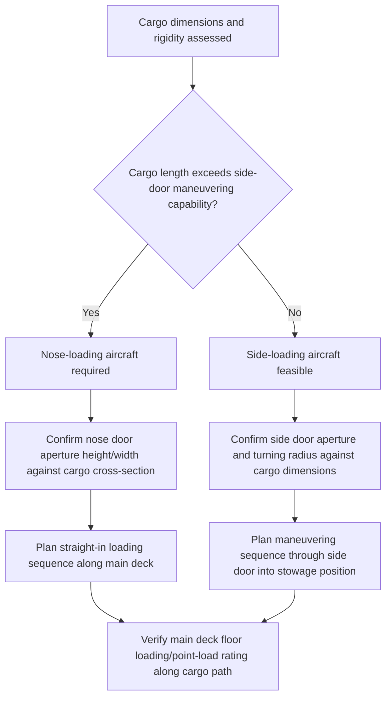

## Nose-Loading and Wide-Body Freighter Configurations

### Overview

Nose-loading and wide-body freighter configurations describe the structural and operational designs that determine how cargo enters a widebody freighter's main deck, a factor that fundamentally shapes which cargo shapes and lengths a given aircraft can accept regardless of its payload rating. The presence or absence of a nose door — a hinged forward fuselage section that swings upward to expose the full cross-section of the main deck — is the single most consequential configuration difference among widebody freighters serving the outsized and long-piece cargo market, since it enables straight-in loading of items too long to maneuver through a side door.

### Nose-Loading Configuration

#### Structural Design

**Key Points**

- The entire forward fuselage section, including the flight deck structure above the cargo floor line, is hinged to swing upward, exposing the full width and height of the main deck cargo floor from the very front of the aircraft
- This design allows cargo to be loaded axially (straight down the length of the main deck) rather than requiring a turn or maneuver through a side aperture, accommodating single pieces approaching the full length of the main cargo deck
- The nose door mechanism adds structural complexity and weight compared to a fixed nose section, a design trade-off accepted specifically to enable the straight-in loading capability

#### Operational Advantages

**Key Points**

- Long, rigid cargo items (pipeline sections, satellite components, large machinery, aerospace structures) that cannot be angled through a side door can be loaded straight in via the nose
- Loading and unloading can, in some ground handling configurations, occur simultaneously from both nose and any available side/aft doors, potentially reducing ground time for mixed cargo loads
- The nose door lets operators load long items straight in along the main deck — the specific feature that keeps nose-loading freighters relevant in the outsize/long-piece cargo market even as payload-focused competition comes from side-loading twin-engine freighters

#### Representative Aircraft

**Key Points**

- The Boeing 747-8F is the principal nose-loading widebody freighter in current service, with production having ended in 2023, meaning the operational fleet is a fixed pool rather than one being replenished with new aircraft
- The Boeing 747-8F is the largest commercial freighter in widespread service, combining a nose door with a maximum payload figure among the highest of nose-loading commercial types
- [Inference] With 747-8F production ended, aircraft in this specific configuration category may face gradual fleet reduction through retirement over time, though the pace of any such reduction depends on operator fleet management decisions and airframe utilization patterns that cannot be reliably projected

### Side-Loading (Non-Nose) Configuration

#### Structural Design

**Key Points**

- Cargo enters through one or more side doors (typically on the main deck and/or lower deck), with the nose section remaining a fixed, non-opening structure
- Side doors are generally narrower relative to the aircraft's overall fuselage cross-section than a full nose opening, constraining the maximum length of rigid cargo that can be maneuvered through the aperture and turned to lie along the cabin's length
- Simpler structural design (no forward hinge mechanism) compared to nose-loading aircraft, a factor in the type's fuel efficiency and payload-to-structural-weight ratio

#### Operational Trade-offs

**Key Points**

- The Boeing 777F is the twin-engine benchmark for long-range main-deck freight, without a nose door, and burns far less fuel per trip as a twin-engine jet compared to four-engine nose-loading types, which is a significant factor in its adoption across long-haul trade lanes
- Its payload is lower than the 747-8F's, around 102-103 tonnes versus approximately 137 tonnes, reflecting a trade-off between the 777F's fuel efficiency advantage and the 747-8F's greater payload and nose-loading capability
- Side-loading aircraft dominate long-haul palletized cargo where efficiency matters and pieces fit through the side cargo door, meaning the side-loading configuration is generally preferred whenever the cargo does not specifically require nose-door access

### Comparison: Nose-Loading vs Side-Loading Configuration

| Aspect | Nose-Loading (e.g., 747-8F) | Side-Loading (e.g., 777F) |
| --- | --- | --- |
| Maximum single-piece length capability | Higher (straight-in axial loading) | Lower (constrained by door turning geometry) |
| Fuel efficiency | Lower (four-engine, heavier structure) | Higher (twin-engine) |
| Typical payload | Higher (~137 tonnes) | Lower (~102-103 tonnes) |
| Production status | Ended (2023) | Active production and fleet growth |
| Best suited for | Long rigid pieces, oversize industrial cargo requiring straight-in loading | Palletized/containerized freight fitting through side door, efficiency-driven long-haul lanes |

### Loading Sequence Considerations by Configuration

### Floor Loading and Restraint System Considerations

**Key Points**

- Main deck cargo floors on both nose-loading and side-loading widebody freighters are fitted with restraint rail/track systems allowing cargo to be secured at multiple points along the deck, independent of the loading door configuration
- Distributed and point-load ratings for the main deck floor must be verified against the specific cargo's weight and contact footprint, following the same distributed-versus-point-load engineering principles applicable to maritime deck strength (see Ballast Systems and Deck Strength Considerations for the analogous maritime discipline)
- [Unverified] Specific floor loading ratings are aircraft-type and even airframe-specific (given potential structural modifications or reinforcement on individual aircraft), and should be verified against the specific aircraft's loading manual rather than assumed generically

### Common Pitfalls and Operational Risks

**Key Points**

- Assuming a side-loading aircraft's payload capacity alone qualifies it for a long rigid cargo piece without verifying the item can actually be maneuvered through the side door and turned into stowage position
- Overlooking that 747-8F production has ended when planning long-term project logistics dependent on nose-loading capacity, without confirming current fleet availability from operators
- Failing to verify point-load ratings along the specific main deck floor path the cargo will traverse during loading, rather than relying on an average distributed load figure
- [Inference] These pitfalls are commonly cited in air charter and outsize logistics guidance; actual risk exposure depends on the specific cargo, aircraft, and operator fleet status at the time of booking

### Related Topics

- Outsized Cargo Aircraft Types and Payload Capacities
- Loading Systems and Ground Support Equipment for Outsize Air Cargo
- Cargo Securing and Restraint Systems for Air Freight
- Ballast Systems and Deck Strength Considerations
- Air Cargo Charter Booking and Lead-Time Planning for Outsized Freight
- Comparing Air Charter versus Sea Freight for Time-Critical Project Cargo
- Route and Range Planning for Heavy Air Charters