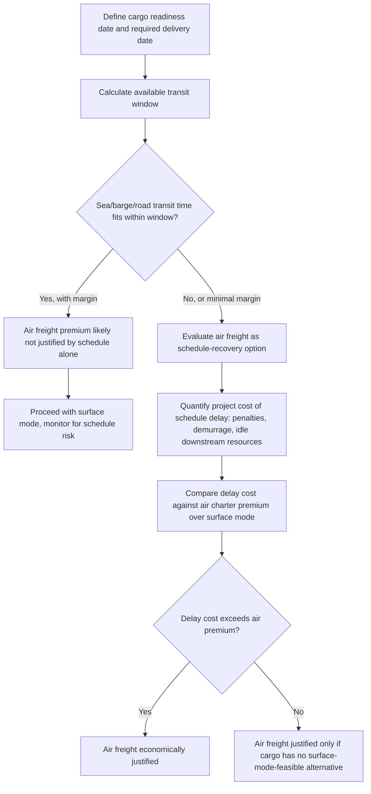

## Air Freight Cost and Time Trade-Off Analysis

### Overview

Air freight cost and time trade-off analysis is the decision framework used to determine whether the substantial cost premium of air transport for outsized or heavy cargo is justified by the schedule advantage it provides, relative to sea, barge, or road alternatives. Because outsize air charter costs can run into the hundreds of thousands of dollars for a single flight, this analysis typically extends beyond a simple per-unit freight rate comparison to incorporate total project schedule value, penalty/demurrage exposure, and the specific engineering constraints that might make air the only feasible option regardless of cost.

### Core Cost Components

#### Direct Charter Cost

**Key Points**

- Charter costs for outsize aircraft vary enormously by aircraft type and route: a Boeing 737F charter can cost from roughly 30,000 to 80,000 EUR per flight, while a Boeing 747-400F can reach 300,000 to 500,000 EUR for an intercontinental flight
- Specialized outsize aircraft (An-124-class) typically command charter rates reflecting both the aircraft's high operating cost and the limited fleet available to meet demand, particularly given the sanctions-driven reduction in An-124 fleet availability
- [Unverified] Specific charter rates fluctuate significantly with fuel prices, route, aircraft availability, and current market demand; the figures cited represent illustrative ranges from industry sources rather than a fixed, universally applicable rate card

#### Ancillary and Ground Handling Costs

**Key Points**

- Specialized ground support equipment (cranes, ramps, cradles) required for outsize cargo loading/unloading at both origin and destination airports adds cost beyond the base charter rate
- Route positioning costs (ferrying the aircraft to the load location if it is not already there) can represent a significant portion of total charter cost, particularly for aircraft types with limited global basing
- Permits, overflight clearances, and airport handling fees at each stop along the route (particularly relevant for aircraft requiring technical fuel stops) add further cost layers not always reflected in a headline charter rate

### Core Time Components

**Key Points**

- Flight time itself is typically the smallest component of total transit time for an air freight movement, especially relative to sea freight's multi-week transit durations
- Ground handling time at origin and destination — including specialized loading/unloading for outsize cargo, customs clearance, and any required ground support equipment mobilization — can materially extend total door-to-door time despite the short flight duration
- Aircraft and crew availability/positioning lead time, particularly for specialized outsize aircraft with a small global fleet, can extend the effective lead time before a charter can even be flown, independent of the flight itself

### Trade-Off Analysis Framework

### Quantifying the Schedule Value of Air Freight

$$V_{schedule} = C_{delay/day} \times (T_{surface} - T_{air})$$

Where $V_{schedule}$ is the value of the time saved by choosing air over surface transport, $C_{delay/day}$ is the project's cost of schedule delay per day (which may include contractual penalties, idle downstream labor/equipment, or lost production/revenue from a delayed facility startup), and $(T_{surface} - T_{air})$ is the transit time difference between the two modes. [Inference] The specific $C_{delay/day}$ value is entirely project-specific, derived from the project's own contractual and operational context rather than a general industry figure, meaning this framework requires project-specific inputs to produce a meaningful comparison rather than functioning as a standalone calculation.

**Key Points**

- Air freight is economically justified when $V_{schedule}$ exceeds the incremental cost premium of air over the surface alternative
- This calculation is most decisive for cargo on a genuine critical path (e.g., a component whose late arrival directly delays a facility startup or contractual milestone), and least decisive for cargo with schedule float or alternative sourcing options
- [Inference] In practice, many air freight decisions for outsize cargo are driven by factors beyond pure cost-time trade-off, including cargo characteristics that make surface transport infeasible (excessive weight/dimensions for available vessels, lack of suitable port/route access) rather than a purely economic optimization

### Non-Schedule Drivers for Air Freight Selection

**Key Points**

- **Route infeasibility for surface modes**: Landlocked destinations without suitable rail/road access, or destinations where port/waterway infrastructure cannot accommodate the cargo's dimensions or weight
- **Cargo sensitivity**: Time-sensitive cargo susceptible to degradation, or high-value cargo where extended transit duration increases exposure to damage or loss risk
- **Emergency/urgent replacement**: Unplanned equipment failure requiring rapid replacement part delivery to avoid extended facility downtime, where the delay cost calculation described above becomes acute and immediate rather than a planning-stage estimate

### Comparative Cost-Time Profile by Mode

| Mode | Relative Cost (per tonne-km, illustrative) | Relative Transit Time | Best Suited For |
| --- | --- | --- | --- |
| Sea freight (conventional/heavy-lift vessel) | Lowest | Longest (weeks) | Non-time-critical, large-volume/weight cargo |
| Barge/inland waterway | Low | Long (days to weeks) | Regional moves, draft-restricted routes |
| Road/rail | Moderate | Moderate (days) | Overland segments within dimensional/weight limits |
| Air freight (outsize charter) | Highest | Shortest (hours to a few days including ground handling) | Critical-path, route-infeasible, or emergency cargo |

[Unverified] Relative cost figures are illustrative and vary enormously by specific route, cargo, and market conditions; a genuine cost comparison requires current freight quotes for the specific movement rather than generic mode-level assumptions.

### Break-Even Considerations

**Key Points**

- A break-even analysis comparing air premium against surface-mode cost savings is most meaningful when both modes are genuinely feasible options for the specific cargo (i.e., the cargo's weight/dimensions do not eliminate one mode outright)
- Partial solutions — such as air-freighting only the most critical, time-sensitive component of a larger shipment while the remainder moves by sea — are common in project logistics, allowing the cost premium to be limited to the specific items where schedule value justifies it
- [Inference] This partial/hybrid approach is frequently used in practice to manage overall project logistics cost while still protecting the critical path, though the specific split between air and surface freight is a project-specific engineering and commercial decision

### Common Pitfalls and Operational Risks

**Key Points**

- Comparing only headline freight rates between air and surface modes without incorporating the project-specific cost of schedule delay, which often dominates the true economic comparison for critical-path cargo
- Underestimating ground handling and permit/clearance lead times for outsize air charters, eroding the schedule advantage air freight is chosen to provide
- Assuming air freight is available on short notice without confirming actual aircraft and ground support equipment availability, particularly given constrained fleets for specialized outsize aircraft types
- Applying a single mode decision to an entire shipment when a hybrid approach (air for critical items, surface for the remainder) might better balance cost and schedule
- [Inference] These pitfalls are commonly documented in project logistics planning guidance; actual risk exposure depends on the specific cargo, route, and market conditions involved

### Related Topics

- Outsized Cargo Aircraft Types and Payload Capacities
- Nose-Loading and Wide-Body Freighter Configurations
- Air Cargo Charter Booking and Lead-Time Planning for Outsized Freight
- Vessel Chartering and Availability Planning
- Vessel Selection Criteria for Project Cargo
- Multimodal Project Cargo Coordination and Handoff Planning
- Critical Path Analysis for Project Logistics Scheduling