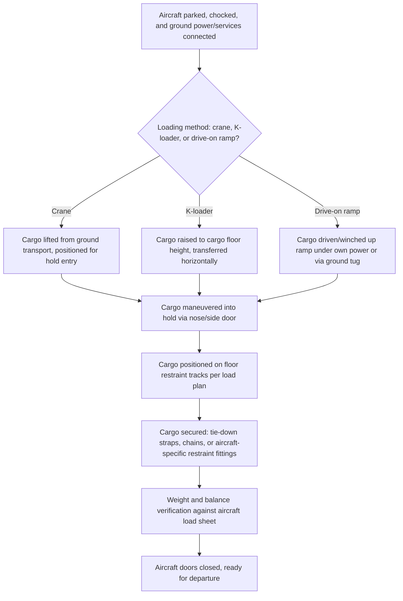

## Airport Ground Handling for Oversized Freight

### Overview

Airport ground handling for oversized freight covers the specialized equipment, procedures, and infrastructure required to move outsize cargo between an aircraft and ground transport at the airport interface — a stage that frequently determines whether an air charter's schedule advantage is realized or eroded. Unlike standard palletized air cargo, which moves through automated cargo handling systems designed around ULD (Unit Load Device) dimensions, outsize cargo typically requires bespoke handling arrangements at both origin and destination, making airport selection and ground handling capability an integral part of outsize air freight planning rather than an afterthought.

### Airport Infrastructure Requirements

#### Runway and Apron Considerations

**Key Points**

- Outsize aircraft (particularly An-124-class and other heavy strategic airlifters) require runway length, pavement strength, and apron space capable of accommodating their weight and dimensions, which can exceed the design parameters of smaller regional airports
- Apron space adjacent to the aircraft's parking position must accommodate ground support equipment (cranes, ramps, loading vehicles) with adequate clearance for maneuvering around the cargo during loading/unloading
- Airport selection for outsize charters is frequently constrained to a subset of airports with confirmed capability to handle the specific aircraft type, rather than any airport nominally within range of the cargo's origin or destination

#### Ground Support Equipment (GSE)

**Key Points**

- **Mobile cranes**: Used to lift cargo from ground transport onto the aircraft's cargo floor level, or directly into the hold via nose/side doors, when the cargo cannot be rolled or winched aboard
- **Loaders/K-loaders**: Scissor-lift platform vehicles that raise palletized or crated cargo to the aircraft's cargo floor height for horizontal transfer into the hold
- **Ramps and drive-on systems**: For aircraft with kneeling undercarriage or built-in ramps (such as the An-124), wheeled or skidded cargo may be driven or winched directly into the hold without requiring a separate lifting step
- **Cradles and dunnage**: Custom-built support structures matching the cargo's specific geometry, used to distribute load appropriately on the aircraft's cargo floor and to interface between the cargo and standard GSE where the cargo's native support points are incompatible

[Unverified] The specific GSE available at any given airport varies significantly by facility; confirming actual on-site or mobilizable GSE capability for the specific cargo and aircraft combination is a necessary pre-charter verification step rather than an assumption based on airport size or category.

### Loading/Unloading Sequence

**Key Points**

- Weight and balance verification is a critical final step, since cargo positioned outside its planned location on the floor restraint grid can shift the aircraft's center of gravity outside safe limits for flight
- Cargo securing on aircraft floor restraint systems follows aircraft-specific certified tie-down points and rated capacities, distinct from (though procedurally analogous to) the lashing and securing principles used in maritime cargo securing

### Floor Loading and Restraint Systems

**Key Points**

- Aircraft main deck cargo floors are fitted with restraint rail/track systems at standardized spacing, allowing tie-down fittings to be positioned to match the specific cargo's geometry and required restraint points
- Point-load and distributed-load ratings for the cargo floor must be verified against the aircraft's specific loading manual at the intended stowage position, since floor strength can vary by location along the deck (e.g., over structural frames versus between them)
- [Unverified] Specific floor loading ratings and restraint track specifications are aircraft-type and airframe-specific; ground handling planning requires the specific aircraft's loading manual rather than generic assumptions

### Customs, Security, and Documentation

**Key Points**

- Outsize cargo frequently requires advance customs pre-clearance or special permitting given its non-standard dimensions and often high declared value, adding lead time to the ground handling process beyond the physical loading itself
- Security screening procedures for oversize cargo may differ from standard palletized cargo screening methods, given that the cargo's size and shape can preclude conventional X-ray or scanning equipment
- Documentation accuracy (weight, dimensions, CoG, dangerous goods declarations if applicable) submitted in advance allows ground handling teams to pre-position appropriate GSE and plan the loading sequence before the aircraft's arrival

### Airport Selection Criteria for Outsize Charters

**Key Points**

- Confirmed runway/apron capability for the specific aircraft type intended for the charter
- Availability of appropriate GSE (cranes, K-loaders, ramps) either on-site or readily mobilizable to the airport for the operation
- Customs and permitting infrastructure capable of handling the specific cargo's documentation and clearance requirements
- Ground transport connectivity (road access, crane reach from the apron to a staging area) linking the airport to the cargo's ultimate origin or destination
- [Inference] In practice, outsize cargo charters are frequently routed through a relatively small subset of airports with established outsize handling experience and equipment, rather than the full range of airports theoretically within range, reflecting practical infrastructure and expertise constraints

### Comparison: Standard Air Cargo vs Outsize Ground Handling

| Aspect | Standard Palletized Air Cargo | Outsize Freight Ground Handling |
| --- | --- | --- |
| Loading equipment | Automated ULD handling systems, standard K-loaders | Custom cranes, cradles, drive-on ramps, bespoke dunnage |
| Airport suitability | Most cargo-handling airports | Limited subset with confirmed outsize capability |
| Documentation lead time | Standard cargo manifest procedures | Extended pre-clearance often required for dimensions/value |
| Securing method | Standard ULD locks and net restraints | Aircraft-specific tie-down points, custom rigging per cargo shape |
| Ground handling duration | Typically short, standardized | Often extended, cargo-specific planning required |

### Common Pitfalls and Operational Risks

**Key Points**

- Selecting an airport based on general cargo-handling reputation without confirming specific GSE availability for the exact cargo and aircraft combination planned
- Underestimating customs/permitting lead time for high-value or unusually dimensioned cargo, eroding the schedule advantage the air charter was intended to provide
- Inadequate coordination between cargo documentation submission and ground handling team preparation, resulting in GSE not being pre-positioned before aircraft arrival
- Failing to verify floor loading ratings at the specific stowage position on the aircraft's cargo floor before finalizing the load plan
- [Inference] These pitfalls are commonly documented in outsize air cargo handling guidance and industry case studies; actual risk exposure depends on the specific airport, aircraft, cargo, and ground handling provider involved

### Related Topics

- Outsized Cargo Aircraft Types and Payload Capacities
- Nose-Loading and Wide-Body Freighter Configurations
- Air Freight Cost and Time Trade-Off Analysis
- Air Cargo Charter Booking and Lead-Time Planning for Outsized Freight
- Cargo Securing and Restraint Systems for Air Freight
- Customs Documentation and Pre-Clearance for High-Value Project Cargo
- Multimodal Project Cargo Coordination and Handoff Planning