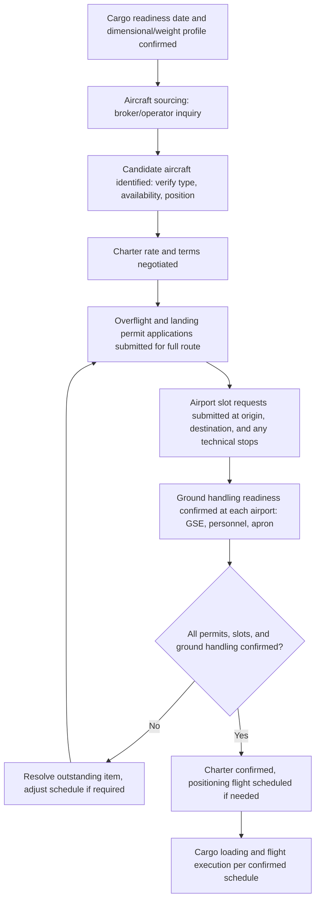

## Air Charter Booking and Slot Coordination

### Overview

Air charter booking and slot coordination is the commercial and operational process of securing an outsize aircraft for a specific cargo movement and aligning that aircraft's flight schedule with airport slot availability, overflight/landing permits, and ground handling readiness at every point along the route. Because outsize charter aircraft represent a small global fleet with limited scheduling flexibility, this process typically requires earlier engagement and more parallel-track coordination than standard commercial air cargo booking, where capacity is generally more fungible across multiple carriers and flights.

### Charter Booking Process

#### Aircraft Sourcing

**Key Points**

- Charter brokers specializing in outsize/heavy air cargo maintain relationships with a limited set of operators (military-derived strategic airlifter operators, purpose-built outsize freighter operators such as Antonov-type aircraft operators, and widebody freighter charter providers) and can identify available aircraft matching the cargo's specific dimensional and weight profile
- Direct engagement with operators is also common for repeat or high-value project cargo movements, particularly where an established relationship provides better visibility into aircraft availability and scheduling flexibility
- Aircraft positioning (where the candidate aircraft currently is relative to the load airport) significantly affects both charter cost and the earliest feasible loading date, since a positioning/ferry flight may be required before the cargo flight itself

#### Charter Rate and Terms Negotiation

**Key Points**

- Charter rates for outsize aircraft are typically quoted on a per-flight or per-route basis rather than a standardized per-kilogram rate, reflecting the bespoke nature of each outsize cargo movement
- Terms typically address responsibility for ground handling equipment mobilization, permit/clearance costs, fuel cost fluctuation, and delay/cancellation provisions specific to the charter
- [Unverified] Specific charter terms and rate structures vary by operator and broker; current terms should be obtained through direct quotation for the specific cargo and route rather than assumed from general industry patterns

### Slot Coordination

#### Airport Slot Availability

**Key Points**

- Major airports, particularly those with constrained capacity, allocate landing and takeoff slots that must be reserved in advance, and outsize aircraft (given their size and specialized parking/apron requirements) may face additional constraints beyond standard slot availability
- Ground handling readiness (GSE availability, trained personnel, apron space) must be confirmed to align with the requested slot, since a slot reservation alone does not guarantee the airport can physically service the outsize aircraft at that time
- [Inference] Airports with established outsize cargo handling experience typically offer more predictable slot coordination for this aircraft category, though this is a general pattern rather than a guarantee applicable to every such airport

#### Overflight and Landing Permits

**Key Points**

- International charter flights typically require overflight permits for each country's airspace transited, in addition to a landing permit at the destination (and any technical stop) airports
- Permit lead times vary significantly by country and can become a critical path item for the overall charter timeline, particularly for routes crossing multiple international borders or airspace with more restrictive permitting regimes
- Military-derived strategic airlifters chartered for civil use may face additional or different permitting requirements compared to purpose-built civil freighters, depending on the aircraft's registration and operator status

### Booking and Coordination Workflow

### Lead Time Management

**Key Points**

- Permit applications (particularly overflight permits for multi-country routes) often represent the longest lead-time item in the overall booking process and should be initiated as early as possible relative to the target flight date
- Aircraft positioning lead time depends entirely on the specific aircraft's current location relative to the load airport, making early aircraft sourcing important to establish a realistic overall timeline
- Ground handling coordination (confirming GSE and trained personnel availability at each airport) should proceed in parallel with permit and slot coordination rather than sequentially after them, since a ground handling gap discovered late can delay the operation even if all permits and slots are secured
- [Inference] The relative weight of each lead-time component (permits, positioning, ground handling) varies by specific route and aircraft type, meaning a generic lead-time estimate should be treated as a planning starting point rather than a guaranteed timeline for any specific charter

### Contingency and Schedule Risk Management

**Key Points**

- Weather-related delays affecting either the charter flight itself or ground handling operations at any point along the route can cascade through a tightly scheduled multi-stop itinerary
- Aircraft mechanical/technical delays are a recognized risk in charter operations, particularly for older airframes common in the specialized outsize fleet, and contingency planning (backup aircraft options, schedule buffer) helps manage this exposure
- Permit validity periods and airport slot windows may have their own constraints (e.g., a permit valid only for a specific date range), requiring the overall schedule to be managed as an interdependent system rather than a series of independently adjustable steps
- [Inference] These risk factors are commonly cited in charter operations guidance; actual risk exposure depends on the specific aircraft, route, season, and operator involved

### Comparison: Standard Commercial Air Cargo Booking vs Outsize Charter Booking

| Aspect | Standard Commercial Air Cargo | Outsize Charter Booking |
| --- | --- | --- |
| Capacity fungibility | High (multiple carriers/flights available) | Low (small specialized fleet) |
| Booking lead time | Often short (days) | Often extended (weeks to months) |
| Permit/slot complexity | Standardized, generally lower friction | Often requires bespoke permit and slot coordination |
| Ground handling planning | Standardized procedures at most airports | Cargo- and aircraft-specific planning required |
| Schedule flexibility | Higher (rebooking on alternative flights generally feasible) | Lower (limited alternative aircraft/schedule options) |

### Common Pitfalls and Operational Risks

**Key Points**

- Initiating overflight/landing permit applications late relative to the target flight date, given that permits are frequently the longest lead-time item in the process
- Confirming aircraft charter terms before verifying ground handling readiness at every airport along the route, risking a late-discovered gap that delays the operation
- Underestimating the schedule risk introduced by aircraft positioning requirements when the sourced aircraft is not already near the load airport
- Treating permits, slots, and ground handling as independently manageable rather than an interdependent schedule requiring coordinated planning
- [Inference] These pitfalls are commonly documented in outsize air charter and project logistics guidance; actual risk exposure depends on the specific route, aircraft, operator, and regulatory environment involved

### Related Topics

- Outsized Cargo Aircraft Types and Payload Capacities
- Airport Ground Handling for Oversized Freight
- Air Freight Cost and Time Trade-Off Analysis
- Vessel Chartering and Availability Planning
- Customs Documentation and Pre-Clearance for High-Value Project Cargo
- Multimodal Project Cargo Coordination and Handoff Planning
- Route and Range Planning for Heavy Air Charters