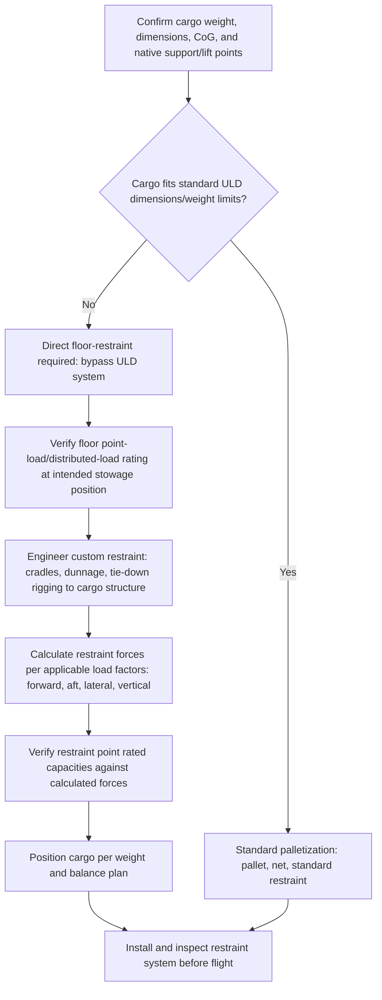

## Palletization and Restraint Systems for Air Cargo

### Overview

Palletization and restraint systems for air cargo cover the standardized and custom methods used to unitize, position, and secure cargo aboard aircraft, ensuring loads remain fixed in place throughout the flight envelope's dynamic forces while respecting the aircraft's structural floor loading limits. For outsized and heavy-lift air freight, this discipline extends beyond standard Unit Load Device (ULD) systems into custom-engineered restraint arrangements, since oversized cargo frequently exceeds the dimensional and weight parameters standard ULDs and pallet nets are designed around.

### Standard ULD Systems

#### ULD Fundamentals

**Key Points**

- Unit Load Devices are standardized pallets and containers designed to interface with an aircraft's automated cargo handling systems (roller decks, power drive units) and restraint rail infrastructure
- Standard aircraft pallets (e.g., the widely used 88x125 inch and 96x125 inch main deck pallet sizes) are built to defined structural and dimensional specifications, allowing predictable handling across different aircraft types within a compatible family
- Pallet nets and straps secure cargo to the pallet base, distributing restraint forces across multiple attachment points rather than relying on a single connection

#### Limitations for Outsized Cargo

**Key Points**

- Standard ULDs are dimensionally and weight-limited, meaning outsize cargo by definition exceeds what a standard pallet/net system can accommodate, requiring cargo to bypass ULD-based handling entirely and interface directly with the aircraft's main deck floor restraint system
- Even where a portion of an outsize shipment could technically fit a standard ULD, mixed loads (some ULD-based, some direct-floor-restrained) require careful load planning to avoid conflicts in floor space allocation and restraint point availability

### Main Deck Floor Restraint Systems

#### Restraint Rail and Track Infrastructure

**Key Points**

- Aircraft main deck cargo floors incorporate longitudinal restraint rails/tracks at standardized spacing, into which tie-down fittings can be inserted and positioned to match the specific cargo's geometry
- Each restraint point on the track system has a certified rated capacity (in specific load directions — forward, aft, lateral, vertical) documented in the aircraft's loading manual, distinct from the floor's general distributed or point-load bearing capacity
- Restraint point spacing and rated capacity vary by aircraft type and even by position along the deck, making aircraft-specific loading manual reference essential rather than assuming a uniform restraint capability across the entire floor

#### Custom Restraint Engineering for Outsize Cargo

**Key Points**

- Cargo lacking standard lifting/tie-down points requires custom-engineered rigging (straps, chains, or fabricated brackets) interfacing between the cargo's actual structure and the aircraft's certified restraint points
- Restraint calculations must account for the flight envelope's dynamic load factors — forward (emergency braking/deceleration), aft, lateral, and vertical accelerations specified in the aircraft's certification basis — rather than static weight alone
- Custom cradles, dunnage, or load-spreading structures are frequently used to both protect the cargo floor from point-load overstress and to provide suitable attachment geometry for restraint devices

$$F_{restraint} = W_{cargo} \times g_{factor}$$

Where $F_{restraint}$ is the restraint force a tie-down arrangement must be capable of resisting in a given direction, $W_{cargo}$ is the cargo's weight, and $g_{factor}$ is the load factor specified for that direction in the applicable airworthiness/certification standard for cargo restraint (forward load factors are typically the highest, reflecting emergency deceleration scenarios). [Inference] Specific $g_{factor}$ values are defined by the relevant airworthiness authority's cargo restraint standards and the specific aircraft's certification basis, and should be obtained from the aircraft operator's loading engineering documentation rather than assumed as a fixed universal figure.

### Load Planning and Weight & Balance

#### Center of Gravity Management

**Key Points**

- Cargo position along the aircraft's main deck directly affects the aircraft's overall center of gravity, which must remain within certified limits for all phases of flight (takeoff, cruise, landing) as fuel burns and, where applicable, cargo positions might theoretically shift
- For a single heavy outsize item, the load plan typically positions the cargo at a specific station (longitudinal position) calculated to keep the loaded aircraft's CG within limits, rather than allowing flexibility in placement as might be possible with multiple smaller, redistributable units
- Weight and balance calculations are performed by the aircraft operator's load planning function using the specific aircraft's weight and balance manual, cross-checked against the cargo's confirmed weight and CoG from the shipper's engineering data

#### Floor Loading Verification

**Key Points**

- Distributed load (per unit area) and point load (concentrated contact area) ratings both apply to aircraft cargo floors, following the same underlying principles as maritime deck strength verification (see Ballast Systems and Deck Strength Considerations), though aircraft-specific figures differ substantially from marine vessel deck ratings given the different structural design context
- Load-spreading dunnage or beams are used where cargo's native support footprint would otherwise exceed the floor's rated point-load capacity at the intended stowage position
- [Unverified] Specific aircraft floor loading ratings are type- and even position-specific along the deck; verification requires the specific aircraft's loading manual rather than generic assumptions carried over from other aircraft types

### Restraint and Load Planning Workflow

### Comparison: Standard ULD vs Custom Floor Restraint

| Aspect | Standard ULD/Pallet System | Custom Floor Restraint (Outsize Cargo) |
| --- | --- | --- |
| Handling method | Automated roller deck/power drive systems | Manual positioning, often crane or ramp-assisted |
| Restraint hardware | Standard pallet nets, straps | Custom rigging, chains, fabricated brackets |
| Weight/dimension limits | Standardized ULD specifications | Limited by aircraft floor/restraint point capacity, not a standard pallet spec |
| Engineering effort per shipment | Minimal (standardized process) | Significant (cargo-specific restraint engineering typically required) |
| Load planning complexity | Lower (multiple ULDs offer CG flexibility) | Higher (single large item often has a fixed, narrow CG-compliant position) |

### Common Pitfalls and Operational Risks

**Key Points**

- Assuming a cargo item's weight alone determines restraint adequacy without calculating actual restraint forces across all relevant load factor directions (forward, aft, lateral, vertical)
- Applying a generic floor loading assumption rather than verifying the specific aircraft's rated capacity at the exact intended stowage position
- Underestimating the load planning complexity of a single large, non-repositionable cargo item compared to multiple smaller units, particularly regarding CG compliance margin
- Using improvised rigging attachment points on cargo lacking engineered lift/tie-down structure without proper structural assessment of the cargo's ability to bear the resulting restraint loads
- [Inference] These pitfalls are commonly documented in air cargo loading and restraint engineering guidance; actual risk exposure depends on the specific aircraft, cargo, and load planning process involved

### Related Topics

- Airport Ground Handling for Oversized Freight
- Outsized Cargo Aircraft Types and Payload Capacities
- Nose-Loading and Wide-Body Freighter Configurations
- Ballast Systems and Deck Strength Considerations
- Air Charter Booking and Slot Coordination
- Weight and Balance Calculations for Cargo Aircraft
- Cargo Securing Manuals and Sea-Fastening Design for Breakbulk Modules