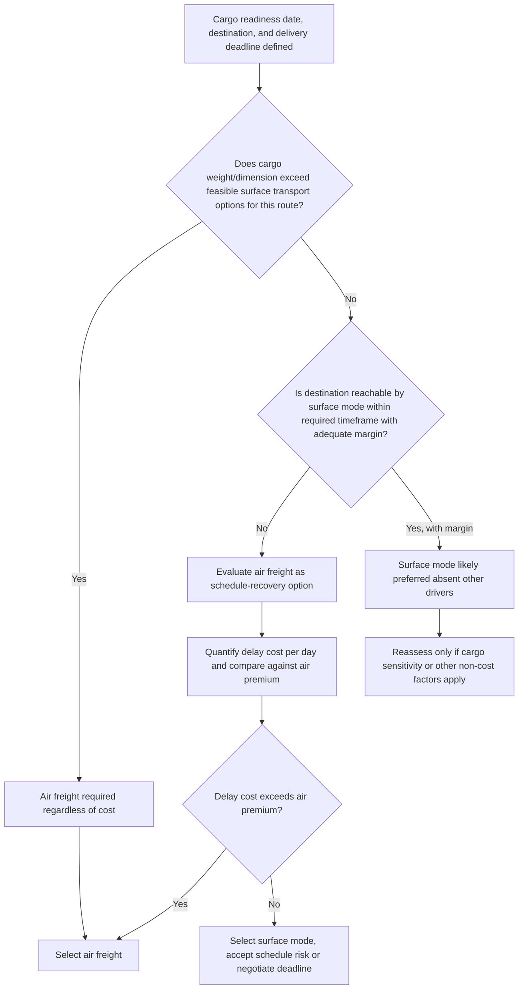

## When Air Freight Is Selected Over Sea or Land Transport

### Overview

This topic synthesizes the decision logic determining when air freight is the appropriate mode choice for outsized or heavy-lift cargo, drawing together the cost-time trade-off framework, cargo-specific constraints, and route feasibility considerations covered elsewhere in this chapter. Rather than introducing new mechanisms, this topic functions as an integrative decision model: air freight selection typically emerges from either a genuine schedule-value calculation favoring air despite its cost premium, or from surface-mode infeasibility that removes sea/land transport as a viable option regardless of cost.

### Primary Decision Pathways

#### Pathway 1: Schedule Value Justifies the Premium

**Key Points**

- Applies where both air and surface transport are physically feasible for the cargo, and the decision reduces to a genuine cost-time trade-off (see Air Freight Cost and Time Trade-Off Analysis for the quantitative framework)
- Most relevant for cargo on a project's critical path, where the cost of schedule delay ($C_{delay/day}$) is high enough that the air freight premium is smaller than the value of time saved
- Common in scenarios such as emergency equipment replacement, where unplanned downtime cost dwarfs the air charter premium, or contractual milestone protection, where a fixed penalty clause makes the delay cost explicit and quantifiable

#### Pathway 2: Surface Transport Is Infeasible

**Key Points**

- Applies where the cargo's characteristics or the route's infrastructure eliminate sea, barge, or road/rail transport as options entirely, making air freight the only remaining choice independent of cost
- Common drivers include landlocked destinations lacking suitable waterway or rail access, cargo dimensions/weight exceeding available vessel or road/rail infrastructure capacity for the specific route, or time-critical cargo sensitivity (e.g., perishable or condition-sensitive items) that surface transit durations cannot accommodate regardless of value calculations
- [Inference] In practice, many real-world air freight decisions for outsize cargo blend both pathways — a cargo item might be technically surface-transportable via a complex, multi-leg route, but the schedule and coordination risk of that route pushes the decision toward air freight even though a pure infeasibility argument would not apply

### Decision Framework

### Cargo and Route Factors Favoring Air Freight

**Key Points**

- **Landlocked or waterway-inaccessible destinations**: Where the final destination has no practical river, canal, or coastal access, air freight may bypass the need for a complex multimodal surface routing entirely
- **Cargo exceeding available vessel/barge capacity for the specific route**: Where local waterway draft, lock dimensions, or vessel availability cannot accommodate the cargo (see Vessel Selection Criteria for Project Cargo and Inland Waterway Route Planning and Draft Restrictions for the surface-mode constraints that might trigger this), air freight may be the only remaining option despite the cargo's outsize nature also constraining aircraft choice
- **Genuine emergency replacement scenarios**: Unplanned failure of critical equipment where facility downtime cost is immediate and severe, making the air freight decision urgent rather than a planned comparison
- **Contractual milestone protection with quantified penalties**: Where a specific, dated penalty clause makes the cost of delay an explicit, calculable figure rather than an estimated or qualitative risk

### Cargo and Route Factors Favoring Surface Transport

**Key Points**

- **Non-critical-path cargo with schedule float**: Where the project timeline has adequate margin, the cost premium of air freight is difficult to justify against a purely schedule-driven calculation
- **Cargo within standard heavy-lift vessel/barge capacity via an established route**: Where sea or inland waterway transport is both feasible and routine for the cargo type, the established surface logistics chain typically offers lower cost with acceptable, predictable transit time
- **Very large or heavy single items exceeding all outsize aircraft capacity**: Certain project cargo (large modules, offshore structures) exceeds even the largest outsize aircraft's payload or dimensional limits, making sea transport (potentially via dock ship/FloFlo, see Dock Ships and Project Cargo Carriers) the only physically feasible option

### Hybrid and Partial-Air Strategies

**Key Points**

- Air-freighting only the most schedule-critical component of a larger shipment, while the remainder moves by sea or land, is a common strategy for balancing overall project cost against critical-path protection
- This approach requires the critical component to be genuinely separable from the rest of the shipment without compromising the installation or commissioning sequence at the destination
- [Inference] The decision to split a shipment this way is project-specific, weighing the air freight cost for the critical portion against the schedule risk it mitigates, following the same underlying cost-time trade-off logic applied to a subset of the total cargo rather than the whole shipment

### Comparison Summary: Air vs Surface Selection Drivers

| Driver Category | Favors Air Freight | Favors Surface Transport |
| --- | --- | --- |
| Schedule urgency | High (critical path, emergency, penalty-bound) | Low (adequate schedule float) |
| Route/infrastructure access | Surface mode infeasible or route too complex | Established, routine surface logistics chain exists |
| Cargo dimensional/weight fit | Within outsize aircraft limits, exceeds surface option at this route | Within standard vessel/barge/road capacity |
| Cost sensitivity | Secondary to schedule/feasibility concerns | Primary driver where schedule allows |
| Cargo condition sensitivity | High (perishable, time-sensitive condition) | Low (stable over extended transit) |

### Common Pitfalls and Operational Risks

**Key Points**

- Defaulting to air freight based on urgency perception without quantifying actual delay cost against the air premium, potentially overspending on cargo that does not genuinely require it
- Assuming surface transport is feasible without verifying route-specific constraints (draft, lock dimensions, vessel availability) that might in fact eliminate it as an option
- Overlooking hybrid/partial-air strategies that could protect the critical path at lower overall cost than air-freighting an entire shipment
- Underestimating the cargo dimensional/weight ceiling of even the largest outsize aircraft when a cargo item might in fact require sea transport (via dock ship or heavy-lift vessel) regardless of schedule pressure
- [Inference] These pitfalls are commonly documented in project logistics mode-selection guidance; actual risk exposure depends on the specific cargo, route, schedule, and cost context of the individual project

### Related Topics

- Air Freight Cost and Time Trade-Off Analysis
- Outsized Cargo Aircraft Types and Payload Capacities
- Vessel Selection Criteria for Project Cargo
- Dock Ships and Project Cargo Carriers
- Barge versus Vessel Selection for Regional Moves
- Multimodal Project Cargo Coordination and Handoff Planning
- Critical Path Analysis for Project Logistics Scheduling