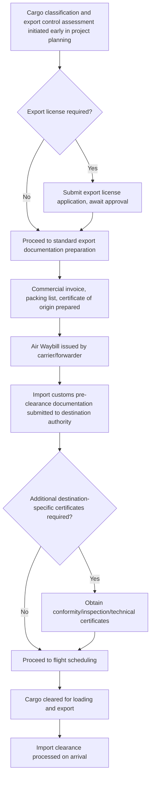

## Customs and Documentation for Air Project Cargo

### Overview

Customs and documentation for air project cargo covers the regulatory clearance, declaration, and paperwork processes required to move outsized or high-value cargo across international borders via air freight. Because project cargo frequently involves high declared values, non-standard dimensions, and sometimes dual-use or controlled goods (industrial machinery, oilfield equipment, specialized technology components), the customs and documentation burden is typically heavier and requires more advance lead time than standard commercial air freight, making this discipline a critical path item in its own right rather than a routine administrative step.

### Core Documentation Requirements

#### Commercial and Transport Documentation

**Key Points**

- **Commercial invoice**: States the cargo's declared value, description, and terms of sale, forming the basis for customs valuation and duty/tax assessment at both export and import
- **Air Waybill (AWB)**: The contract of carriage and primary transport document for air freight, functioning similarly to a bill of lading in ocean freight but generally non-negotiable
- **Packing list**: Details the specific contents, dimensions, and weights of each piece, particularly important for outsize cargo shipped as a single large item or as multiple pieces requiring individual identification
- **Certificate of origin**: Confirms the cargo's country of manufacture/origin, relevant for tariff classification and any applicable trade agreement preferences

#### Export Control and Licensing

**Key Points**

- Certain industrial equipment, particularly items with potential dual-use applications (oilfield equipment, specialized machinery, technology components) may require export licenses from the origin country's export control authority before shipment
- Export control classification (determining whether a specific item requires a license and under what conditions) should be confirmed early in project planning, since licensing review periods can extend significantly beyond standard shipping lead times
- [Inference] The specific export control regime and licensing requirements applicable to a given piece of cargo depend on the item's technical classification, origin country, and destination country, and must be assessed against the specific national regulations involved rather than assumed generically

#### Import Customs Clearance

**Key Points**

- Import customs clearance requires the destination country's specific documentation set, which may include additional certificates (conformity, inspection, or technical standards compliance) beyond the standard commercial documentation
- Customs valuation methodology (typically based on transaction value, but subject to specific national customs authority rules) determines the duty and tax basis, which can be a significant cost factor for high-value project cargo
- Temporary import provisions (where cargo will be re-exported after a project, such as specialized construction equipment) may allow duty deferral or exemption under specific customs regimes, requiring advance application and compliance with conditions
- [Unverified] Specific import documentation requirements and duty/tax rates vary significantly by destination country and cargo classification; current requirements should be verified against the destination country's customs authority guidance rather than assumed from general principles

### Documentation Timeline and Lead Time

**Key Points**

- Export license applications, where required, are frequently the longest lead-time item in the documentation chain and should be initiated as early as possible in project planning, potentially before the specific charter or flight is even booked
- Destination country import pre-clearance, submitted in advance of the cargo's physical arrival, allows customs review to proceed in parallel with the flight itself rather than beginning only after arrival, reducing ground time at the destination airport
- [Inference] Coordinating documentation lead times against the overall charter booking and airport ground handling timeline (see Air Charter Booking and Slot Coordination and Airport Ground Handling for Oversized Freight) is necessary since a documentation delay can negate the schedule advantage the air freight decision was made to capture

### Dimensional and Value Declaration Considerations

**Key Points**

- Outsize cargo's declared dimensions and weight must be accurately reflected in the Air Waybill and supporting documentation, since discrepancies discovered during ground handling or customs inspection can trigger delays or penalties
- High declared values common to project cargo (industrial machinery, specialized equipment) may trigger additional customs scrutiny or bonding/security requirements in some jurisdictions, a factor worth confirming during pre-shipment planning rather than discovering at the border
- Insurance documentation, while not strictly a customs requirement, is frequently requested or expected alongside commercial documentation for high-value project cargo shipments

### Special Considerations for Military-Origin or Dual-Use Aircraft Charters

**Key Points**

- Where outsize cargo charters use military-derived strategic airlifters or aircraft with government/defense operator associations, additional documentation or clearance layers may apply beyond standard civil cargo customs procedures
- [Inference] The specific additional requirements depend on the aircraft's registration, operator status, and the specific countries involved in the routing, and should be confirmed directly with the charter operator and relevant customs/aviation authorities rather than assumed from general civil freight documentation practice

### Comparison: Standard Commercial Air Cargo vs Project Cargo Documentation

| Aspect | Standard Commercial Air Cargo | Air Project Cargo |
| --- | --- | --- |
| Export control review | Often minimal or routine | Frequently requires detailed classification review, possible licensing |
| Import documentation complexity | Standard commercial set | Often requires additional certificates (conformity, inspection, temporary import) |
| Declared value scrutiny | Standard | Elevated given typically higher cargo values |
| Documentation lead time | Days | Weeks to months, particularly where export licensing applies |
| Customs pre-clearance benefit | Helpful but often less critical | Often essential to protect the air freight schedule advantage |

### Common Pitfalls and Operational Risks

**Key Points**

- Underestimating export license review timelines, particularly for dual-use industrial equipment, and discovering the requirement only after a charter has already been booked
- Submitting inaccurate dimensional or weight declarations that are later found to conflict with actual cargo measurements during ground handling, triggering delays
- Failing to confirm destination-country-specific certificate requirements (conformity, inspection) until the cargo has already arrived, negating the air freight schedule advantage
- Overlooking additional documentation or clearance layers associated with military-derived or government-linked charter aircraft when planning the customs process
- [Inference] These pitfalls are commonly documented in project cargo compliance and logistics guidance; actual risk exposure depends on the specific cargo classification, origin/destination countries, and charter arrangement involved

### Related Topics

- Air Charter Booking and Slot Coordination
- Airport Ground Handling for Oversized Freight
- Air Freight Cost and Time Trade-Off Analysis
- When Air Freight Is Selected Over Sea or Land Transport
- Outsized Cargo Aircraft Types and Payload Capacities
- Vessel Chartering and Availability Planning
- Multimodal Project Cargo Coordination and Handoff Planning