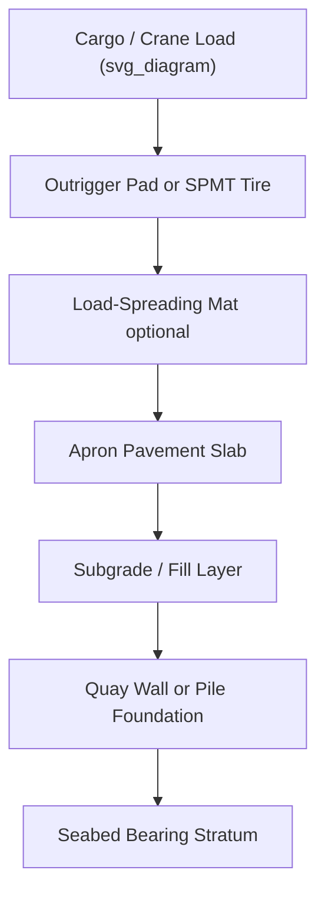

## Quay Load-Bearing Capacity and Point Load Limits

### Definition and Scope

Quay load-bearing capacity refers to the maximum load a berth structure — the quay wall, apron pavement, and underlying foundation — can safely sustain without structural damage, excessive settlement, or failure. In project cargo and heavy-lift operations, this capacity governs where cranes can track, where cargo can be set down, and how weight must be distributed across the quay surface. Point load limits are the specific subset of this capacity concerned with concentrated loads applied over small contact areas — crane outriggers, SPMT (Self-Propelled Modular Transporter) axle lines, jack-up legs, and skid shoes — as opposed to distributed loads like stacked containers or general cargo laid on dunnage.

### Why This Matters in Heavy-Lift Operations

**Key Points**

- Quays are engineered for specific design loads (typically expressed in $t/m^2$ uniformly distributed load, or UDL) that assume containerized or general cargo handling patterns.
- Heavy-lift cargo (transformers, reactors, wind turbine components, modules) transmits load through a small number of contact points rather than spreading it evenly.
- Exceeding local bearing capacity can cause apron cracking, differential settlement, buried utility damage, or in severe cases, quay wall rotation or failure.
- Unlike distributed load exceedance (which tends to show gradual signs), point load failure can be sudden, especially over buried culverts, ducts, or apron slabs with unknown reinforcement.

### Components of Quay Structural Capacity

**Quay Wall Structure**

The quay wall itself (gravity wall, sheet pile wall, or combi-wall) resists lateral earth and water pressure and transfers vertical loads to the seabed via piles or a spread footing. Its allowable surcharge (load applied behind or above the wall) is set during design and is typically the limiting factor near the waterline.

**Apron Pavement**

The paved area behind the quay wall, usually rigid concrete pavement or a reinforced slab, distributes surface loads down into the subgrade. Apron capacity is generally expressed as:

- Uniform distributed load (UDL) in $t/m^2$
- Point load rating in tonnes per contact area (e.g., per outrigger pad)
- Axle load limits for SPMTs, in tonnes per axle line

**Subgrade and Foundation**

Beneath the pavement, soil bearing capacity, fill compaction quality, and any buried infrastructure (drainage, fuel lines, fiber ducts, fender anchor bolts) constrain how load can be transmitted deeper into the ground.

### Load Types Relevant to Heavy-Lift

| Load Type | Typical Source | Distribution Pattern |
| --- | --- | --- |
| UDL | Stacked cargo, general freight | Spread over large area |
| Point load | Crane outriggers, jack-up legs | Small footprint, high intensity |
| Line load | SPMT axle lines, rail-mounted gantries | Linear strip |
| Rolling load | SPMT in motion, multi-wheel dollies | Moving footprint, dynamic factor applies |
| Impact load | Cargo set-down, crane luffing shock | Short-duration spike above static value |

### Point Load Calculation Fundamentals

For a crane outrigger pad, the ground bearing pressure is approximated as:

$$P = \frac{F}{A}$$

where $F$ is the vertical reaction force at that outrigger (accounting for load moment distribution across all outriggers, not simply total weight divided by number of legs) and $A$ is the effective contact area of the pad or mat.

**Example**

A mobile crane with four outriggers lifting a 200 t load, with crane self-weight of 100 t, may impose up to 40% of total reactive load on the most heavily loaded outrigger during a slewed lift. If that outrigger carries 120 t through a $1.0\ m \times 1.0\ m$ mat:

$$P = \frac{120}{1.0} = 120\ t/m^2$$

If the apron's rated point load capacity is $80\ t/m^2$, this exceeds the limit and requires either load-spreading mats, a larger pad footprint, or crane repositioning.

### SPMT and Multi-Axle Considerations

SPMTs distribute load through many axle lines, each with multiple tires, producing a line load rather than a single point load. Key parameters:

- Axle load per line (function of total cargo + trailer weight ÷ number of axle lines, adjusted for load imbalance)
- Tire contact pressure, generally lower per unit area than crane outriggers but applied over larger footprint
- Dynamic amplification factor during rolling transit, typically 1.1–1.3× static value depending on surface roughness and speed

[Inference] Exact dynamic amplification factors vary by SPMT manufacturer specification and quay surface condition; project-specific engineering calculations should confirm the applicable factor rather than relying on generic multipliers.

### Mitigation Techniques for Exceeding Local Capacity

**Key Points**

- **Load-spreading mats**: Steel or timber mats placed under outriggers or SPMT tracks to enlarge the effective contact area and reduce $t/m^2$ pressure.
- **Trackway/road plates**: Steel plates bridging weak zones (buried ducts, expansion joints) to bridge load across a wider footprint.
- **Ground improvement**: Local pavement reinforcement, additional compaction, or temporary concrete overlay for repeated heavy transits.
- **Route/position planning**: Positioning crane pads or SPMT paths to avoid known weak points (culverts, joints, previously repaired pavement sections).
- **Load reduction**: Splitting lifts, reducing tandem lift percentages, or reconfiguring axle line counts on SPMTs.

### Quay Strengthening and Survey Process

1. **Obtain quay design data** — original geotechnical and structural drawings, design UDL, point load ratings, and any prior load testing records from the port authority.
2. **Ground-penetrating radar (GPR) survey** — identify buried utilities, voids, or reinforcement inconsistencies beneath the intended operating footprint.
3. **Load case modeling** — engineering firm or the crane/SPMT contractor models each critical load case (crane slewed at maximum radius, SPMT at maximum axle load, cargo set-down impact) against the quay's rated capacity.
4. **Method statement approval** — port authority reviews and approves the load case study, mat specifications, and operational restrictions before mobilization.
5. **On-site verification** — pre-lift inspection of pavement condition, mat placement, and outrigger/tire footprint confirmation against the approved plan.

### Diagram: Load Path from Cargo to Subgrade

### Typical Point Load Capacity Ranges by Berth Type

[Unverified] The following figures are illustrative ranges drawn from common port design practice and are not universal; actual values are always berth-specific and must be confirmed against the terminal's engineering documentation.

| Berth/Apron Type | Typical UDL Rating | Typical Point Load Rating |
| --- | --- | --- |
| Container terminal apron | $30$–$50\ t/m^2$ | Moderate; not optimized for concentrated loads |
| Heavy-lift/project cargo berth | $80$–$150\ t/m^2$ | High; purpose-built for crane and SPMT operations |
| General cargo berth | $15$–$25\ t/m^2$ | Low; unsuitable for heavy-lift without reinforcement |
| Ro-Ro ramp/apron | Variable, line-load rated | Rated for axle lines rather than single point loads |

### Common Failure Modes

- **Localized pavement cracking or punching shear** beneath undersized outrigger mats
- **Differential settlement** where load path crosses zones of inconsistent fill compaction
- **Buried utility rupture** from point loads directly over unmarked ducts or pipes
- **Quay wall surcharge exceedance**, potentially inducing wall rotation or displacement if heavy cargo is positioned too close to the wall coping line without a stepped-back exclusion zone

### Conclusion

Quay load-bearing capacity and point load limits form a foundational engineering constraint in project cargo operations, directly shaping crane positioning, SPMT routing, and lift planning. Because failure modes can be abrupt and costly, verified quay data, professional load case engineering, and physical mat mitigation are treated as mandatory steps rather than optional precautions in any heavy-lift berth operation.

**Related Topics**

- Ground-Penetrating Radar (GPR) Surveys for Quay Assessment
- SPMT Axle Load Distribution and Route Engineering
- Crane Outrigger Mat Design and Sizing
- Quay Wall Types: Gravity, Sheet Pile, and Combi-Wall Structures
- Method Statement and Lift Plan Approval Process with Port Authorities
- Ro-Ro Ramp Load Rating and Linkspan Engineering
- Dynamic Load Amplification Factors in Heavy Transport