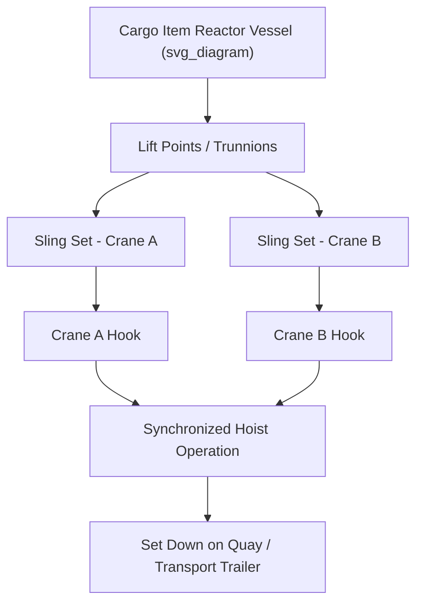

## Stevedoring Operations for Breakbulk and Heavy Lift

### Definition and Scope

Stevedoring refers to the loading, discharging, and handling of cargo at the ship-to-shore interface. For breakbulk and heavy-lift project cargo, stevedoring is fundamentally different from containerized operations: instead of standardized units handled by fixed-cycle gantry cranes, stevedores manage irregularly shaped, high-value, and often single-piece critical items using a combination of ship's gear, shore cranes, floating cranes, and specialized rigging. Stevedoring in this context encompasses the physical handling operation itself plus the supervision, rigging engineering, and safety management required to execute it.

### Breakbulk vs Heavy-Lift Stevedoring

**Key Points**

- **Breakbulk cargo** consists of individually handled units (crates, bales, machinery, steel coils, bagged goods) that are not containerized but are generally within the lifting capacity of standard shore or ship cranes.
- **Heavy-lift cargo** consists of single items exceeding typical crane capacity thresholds (commonly items over 100–200 t, though thresholds vary by port), requiring specialized cranes, engineered rigging, and often multi-crane tandem lifts.
- Both categories often coexist in the same vessel call, requiring stevedoring plans that sequence conventional and heavy-lift operations without one blocking the other.
- Heavy-lift stevedoring typically requires a dedicated lift plan, rigging study, and often a marine warranty surveyor's approval before the operation proceeds.

### Key Roles in Stevedoring Operations

| Role | Responsibility |
| --- | --- |
| Stevedoring superintendent | Overall operational planning and coordination on the quay/vessel |
| Rigger/rigging foreman | Rigging design execution, sling and shackle selection, lift point verification |
| Crane operator | Operating shore crane, floating crane, or supervising ship's gear operation |
| Banksman/signaler | Visual and radio communication between crane operator and rigging crew |
| Lashing gang | Securing cargo for sea transit (for outbound) or removing lashings (inbound) |
| Marine surveyor | Independent verification of lift plan, rigging, and vessel stability for heavy lifts |

### Equipment Used in Breakbulk and Heavy-Lift Stevedoring

**Shore Cranes**

Mobile harbor cranes, crawler cranes, and fixed quay cranes rated for heavy lift (commonly 100–1,000+ t capacity at reduced radius) are used where quay-side lifting is preferred over ship's gear.

**Ship's Gear**

Many breakbulk and heavy-lift vessels are equipped with onboard cranes or heavy-lift derricks (sometimes rated up to 800–2,000 t in tandem configuration on specialized heavy-lift vessels). Ship's gear is often used when quay crane capacity is insufficient or when the vessel is purpose-built for self-loading/discharging.

**Floating Cranes**

For cargo exceeding both shore and ship's gear capacity, floating sheerleg or revolving cranes (some rated well over 1,000 t) may be brought alongside for the lift.

**Rigging Equipment**

Slings, shackles, spreader bars, lifting beams, and grommets engineered to the specific lift, selected and certified according to the cargo's lifting points, weight, and center of gravity.

### Stevedoring Planning Process for Heavy-Lift Cargo

1. **Pre-arrival planning** — review of cargo manifest, lift plans, and vessel stowage plan; identification of items requiring heavy-lift or tandem-lift handling.
2. **Lift plan development** — engineering calculation of sling angles, rigging loads, and crane capacity charts at required radius; typically produced by a qualified lift engineer or the crane contractor.
3. **Vessel stability review** — for shipboard lifts, verification that removing or shifting cargo does not create a stability or trim issue during the lift sequence.
4. **Toolbox talk and method statement briefing** — all personnel briefed on the specific lift sequence, hazards, and emergency procedures before work begins.
5. **Execution and supervision** — lift performed under direct supervision of the stevedoring superintendent and rigging foreman, with banksman communication throughout.
6. **Post-lift verification** — inspection of cargo placement, securing (if applicable), and rigging equipment before demobilization.

### Example: Tandem Lift Discharge of a Reactor Vessel

**Example**

A 300 t reactor vessel exceeds the capacity of the port's single largest mobile harbor crane (rated 250 t at the required radius). A tandem lift is planned using two mobile harbor cranes:

- Total lift weight plus rigging is distributed with a safety margin (commonly each crane is loaded to no more than 75–80% of its rated capacity in tandem configurations, per crane manufacturer and lift engineering guidance) to account for load-sharing uncertainty.
- A common lift plan target might load Crane A at 160 t and Crane B at 140 t, both within their derated tandem capacity.
- Cranes are synchronized via radio communication and matched lift speed to prevent load imbalance during the hoist.
- A rigging study confirms sling angles remain within safe limits (commonly a minimum 60° angle from horizontal is targeted, since flatter angles multiply the effective load per sling significantly).

[Inference] Specific tandem-lift derating percentages and target sling angles vary by crane manufacturer, lift engineering firm standard, and applicable class society or regulatory guidance (e.g., DNV, LEEA); the figures above illustrate common industry practice rather than a universal fixed rule.

### Diagram: Tandem Lift Load Path

### Sling Load Calculation Fundamentals

For a two-point lift with unequal leg angles, the tension in each sling leg is derived from the load and included angle. For a symmetric two-leg sling at angle $\theta$ from horizontal, the tension per leg is:

$$T = \frac{W}{2 \sin\theta}$$

where $W$ is the total load weight and $\theta$ is the sling angle from horizontal. As $\theta$ decreases (flatter sling angle), sling tension increases sharply — at $30°$, each leg carries the full load weight ($T = W$), compared to roughly $0.58W$ at $60°$.

### Safety and Regulatory Considerations

**Key Points**

- Heavy-lift stevedoring operations commonly fall under both general port/marine safety regulations and lifting equipment regulations (e.g., LOLER in the UK, or equivalent national frameworks).
- Marine warranty surveyors are frequently engaged for high-value or high-risk lifts, particularly where cargo insurance requires independent verification of the lift plan.
- Weather windows (wind speed limits, sea state for floating crane operations) are critical constraints and are typically defined explicitly in the lift plan with go/no-go thresholds.
- Exclusion zones around the lift area must be enforced to protect personnel not directly involved in the operation.

### Common Risks and Mitigation

| Risk | Mitigation |
| --- | --- |
| Load imbalance in tandem lifts | Synchronized crane operation, real-time load monitoring via load cells |
| Sling angle miscalculation | Independent rigging study and third-party verification for critical lifts |
| Vessel list/trim during lift | Ballast management plan coordinated with vessel's chief officer |
| Weather-related lift suspension | Pre-defined weather thresholds and lift postponement protocols |
| Miscommunication between crane operators | Dedicated radio channel, single point of command (lift supervisor) |

### Conclusion

Stevedoring for breakbulk and heavy-lift cargo requires a fundamentally different operational and engineering approach than containerized handling, centered on cargo-specific lift planning, rigging engineering, and tightly supervised execution. The distinction between breakbulk and heavy-lift categories drives which equipment, personnel, and regulatory oversight are required, and successful operations depend on rigorous pre-planning as much as on crane capacity itself.

**Related Topics**

- Quay Load-Bearing Capacity and Point Load Limits
- Rigging Engineering: Slings, Shackles, and Spreader Bars
- Tandem and Multi-Crane Lift Planning
- Marine Warranty Surveying for Heavy-Lift Cargo
- Vessel Stability and Ballast Management During Cargo Operations
- Lashing and Securing of Project Cargo for Sea Transit
- Heavy-Lift Vessel Types and Onboard Crane Configurations