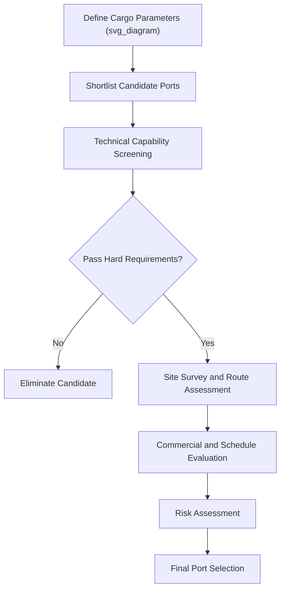

## Port Selection Criteria for Project Cargo

### Definition and Scope

Port selection for project cargo is the evaluation and decision process used to determine which port, terminal, or berth is most suitable for receiving, staging, and dispatching heavy-lift and out-of-gauge (OOG) cargo. Unlike routine containerized shipping, where port choice is often driven primarily by liner service networks and cost, project cargo port selection is driven by physical and infrastructural compatibility — a port must be technically capable of handling the specific cargo before commercial factors are even considered.

### Why Specialized Port Selection Matters

**Key Points**

- Not all ports that handle containers or bulk cargo have the infrastructure to handle heavy-lift or oversized project cargo.
- A single unsuitable port choice can cascade into transport plan failure, requiring costly re-routing, cargo splitting, or emergency infrastructure works.
- Port selection is typically finalized early in project logistics planning because it constrains vessel selection, inland transport routing, and schedule.
- Multiple candidate ports are often evaluated in parallel (a "port comparison study") before final selection, particularly for first-of-kind or unusually large cargo.

### Primary Technical Selection Criteria

**Quay and Berth Infrastructure**

- Quay load-bearing capacity and point load ratings (see: Quay Load-Bearing Capacity and Point Load Limits)
- Berth length and depth (draft) relative to the intended vessel
- Availability of heavy-lift-rated cranes (shore-based or floating) matching cargo weight
- Berth occupancy/availability windows relative to project schedule

**Laydown and Storage Capacity**

- Availability of adequate laydown area or pre-assembly yard space near the berth
- Ground-bearing capacity of storage areas for extended dwell periods
- Weather protection and security infrastructure for high-value cargo

**Access and Onward Transport**

- Access route clearance from the port gate to the public road/rail network (height, width, weight, turning radius restrictions)
- Availability of heavy-haul-capable road or rail corridors from port to final site
- Proximity to the final destination, reducing overall inland transport risk and cost

**Regulatory and Customs Environment**

- Customs clearance efficiency and experience with project cargo/temporary import regimes
- Port authority familiarity with heavy-lift operations and permitting processes
- Local labor availability with heavy-lift rigging and stevedoring experience

### Port Selection Evaluation Framework

| Criterion Category | Example Factors | Typical Weight in Decision |
| --- | --- | --- |
| Technical capability | Crane capacity, quay bearing capacity, berth draft | High — often a hard pass/fail filter |
| Storage and staging | Laydown area, pre-assembly yard availability | High |
| Access/onward transport | Route clearance, heavy-haul corridor availability | High |
| Schedule/availability | Berth slot availability, congestion levels | Medium-High |
| Cost | Port tariffs, handling costs, storage fees | Medium |
| Regulatory/customs | Clearance speed, permitting complexity | Medium |
| Experience/track record | Prior project cargo handled, specialized labor pool | Medium |
| Weather/seasonal risk | Storm season, tidal windows, ice conditions | Variable by region |

### Port Selection Process

1. **Define cargo and transport parameters** — establish maximum dimensions, weights, and quantities across all shipments in the project.
2. **Shortlist candidate ports** — based on geographic proximity to final site and known project cargo handling capability.
3. **Technical capability screening** — request quay data, crane capacity charts, and laydown area specifications from each candidate port; eliminate ports failing hard technical requirements.
4. **Site survey** — physical inspection of berth, laydown areas, and access routes for shortlisted candidates, often including a route survey to the final site.
5. **Commercial and schedule evaluation** — compare tariffs, berth availability windows, and estimated dwell times.
6. **Risk assessment** — evaluate congestion history, weather risk windows, political/regulatory stability, and labor availability.
7. **Final selection and contracting** — port services agreement executed, often including specific provisions for heavy-lift operations, laydown area leasing, and liability terms.

### Example: Comparing Two Candidate Ports for a Refinery Module Project

**Example**

A project requiring delivery of six modules, the largest at 450 t and 18 m wide, compares two candidate ports:

- **Port A**: Established container terminal, 14 m draft, but maximum quay point load rating of 60 t/m² and no dedicated pre-assembly yard; nearest heavy-haul route has a 4.2 m height-restricted overpass 8 km from the gate.
- **Port B**: Smaller general cargo port, 12 m draft (sufficient for the planned vessel), quay rated to 120 t/m² with an adjacent 5-hectare laydown yard, and a direct heavy-haul route to the site with no height restrictions.

Despite Port A's larger scale and container throughput, Port B is selected due to superior technical compatibility with the specific cargo — illustrating that scale and general cargo throughput are not reliable proxies for project cargo suitability.

### Diagram: Port Selection Decision Flow

### Common Risks in Port Selection

| Risk | Mitigation |
| --- | --- |
| Overestimating port capability from general reputation | Independent technical verification via site survey and data request |
| Route clearance issues discovered late | Full corridor survey (height, width, weight) before final selection |
| Berth congestion delaying vessel arrival | Contractual berth reservation windows, contingency port identification |
| Insufficient laydown space discovered post-contract | On-site laydown area verification, written space allocation guarantees |
| Regulatory/customs delays | Early engagement with customs brokers experienced in project cargo |

### Conclusion

Port selection for project cargo is a technically driven decision process where physical infrastructure compatibility — quay bearing capacity, crane availability, laydown space, and route access — takes precedence over conventional commercial port selection factors like throughput volume or liner connectivity. A rigorous, criteria-based evaluation early in project planning reduces the risk of costly downstream failures in the transport chain.

**Related Topics**

- Quay Load-Bearing Capacity and Point Load Limits
- Laydown Area Planning and Pre-Assembly Yards
- Heavy-Haul Route Engineering and Corridor Surveys
- Stevedoring Operations for Breakbulk and Heavy Lift
- Customs and Temporary Import Regimes for Project Cargo
- Berth Scheduling and Vessel Slot Coordination
- Route Survey Methodology for Oversized Cargo