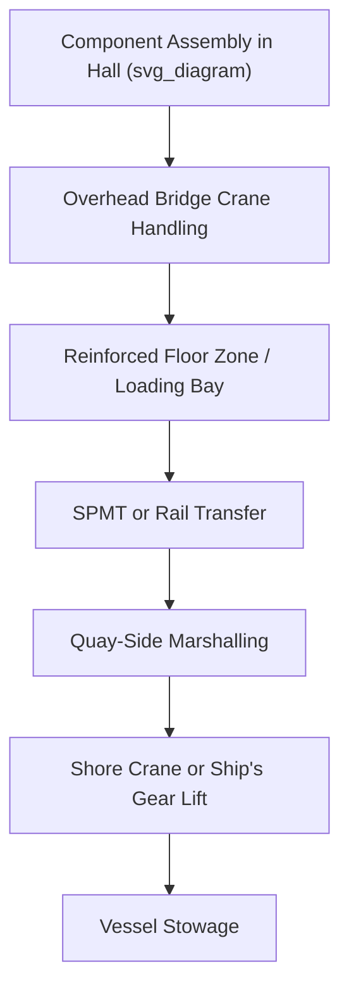

## Terminal Lifting Equipment and Heavy-Lift Halls

### Definition and Scope

Terminal lifting equipment encompasses the fixed and mobile cranes, gantries, and specialized handling systems deployed at ports and terminals to load, discharge, and reposition heavy-lift and project cargo. Heavy-lift halls are enclosed or semi-enclosed structures — often found at specialized manufacturing ports, offshore fabrication yards, or dedicated project cargo terminals — that combine overhead crane systems with weather protection and controlled environments for handling, assembly, or storage of high-value or environmentally sensitive components.

### Categories of Terminal Lifting Equipment

**Key Points**

- Terminal lifting equipment ranges from general-purpose mobile harbor cranes to purpose-built heavy-lift gantries exceeding 1,000 t capacity.
- Equipment selection depends on cargo weight, required lift height/radius, operational frequency, and whether the lift is quay-side, yard-side, or hall-based.
- Many project cargo terminals maintain a mixed fleet, using conventional equipment for breakbulk and reserving specialized heavy-lift assets for critical items.

### Mobile Harbor Cranes

Mobile harbor cranes are wheel- or crawler-mounted, slewing cranes commonly rated from 100 t up to 500+ t at reduced radius. They offer flexibility to reposition along the quay and are widely used for breakbulk and moderate heavy-lift operations.

- **Advantages**: mobility, relatively fast mobilization, no fixed rail infrastructure required
- **Limitations**: capacity decreases sharply with radius; ground-bearing capacity at the crane's outrigger or crawler footprint becomes the limiting factor for very heavy lifts (see: Quay Load-Bearing Capacity and Point Load Limits)

### Crawler Cranes

Crawler cranes, often mobilized to the quay or yard for specific heavy-lift campaigns, can be configured with heavy-lift attachments (Superlift or Ringer configurations) to achieve capacities of 1,000–3,000 t.

- Typically used for the heaviest single-piece lifts (reactors, large modules, turbine generators)
- Require substantial ground preparation and load-spreading due to high point loads under crawler tracks
- Longer mobilization and setup time compared to wheeled mobile cranes

### Gantry Cranes and Terminal-Fixed Systems

Rail-mounted or fixed gantry cranes are used at terminals with recurring heavy-lift throughput, such as offshore wind component ports or heavy fabrication yards.

- Capacity often in the 500–2,000 t range for dedicated project cargo gantries
- Fixed rail infrastructure limits operational footprint but provides high repeatability and precision for repetitive lift cycles (e.g., loading successive wind turbine towers)
- Commonly integrated with pre-assembly yard layouts for direct load-out to vessel or SPMT

### Floating Cranes

For cargo exceeding shore-based crane capacity, floating sheerleg or revolving floating cranes are brought alongside. Capacities for major floating cranes can exceed 3,000–14,000 t for the largest units globally, though such extreme-capacity assets are limited in number and typically reserved for offshore construction rather than routine terminal operations.

[Unverified] Specific floating crane capacity figures vary by operator and asset; the ranges cited reflect commonly referenced classes of equipment rather than a verified comprehensive registry.

### Comparison of Terminal Lifting Equipment

| Equipment Type | Typical Capacity Range | Mobility | Best Suited For |
| --- | --- | --- | --- |
| Mobile harbor crane | 100–500 t | High | Breakbulk, moderate heavy-lift |
| Crawler crane (heavy config) | 500–3,000 t | Low (requires mobilization) | Single heaviest lifts, campaign-based work |
| Fixed/rail gantry crane | 500–2,000 t | Fixed | High-frequency, repeatable heavy-lift terminals |
| Floating crane | 1,000–14,000+ t | Marine-mobile | Cargo exceeding shore crane capacity |
| Ship's gear/derrick | Up to 2,000 t (tandem) | Vessel-bound | Self-loading heavy-lift vessels |

### Heavy-Lift Halls: Function and Design

**Key Points**

- Heavy-lift halls provide a weatherproof, often climate-controlled environment for handling cargo sensitive to moisture, temperature, or contamination (e.g., precision machinery, electronics-heavy modules, painted/coated surfaces).
- Overhead bridge cranes within the hall typically range from tens to several hundred tonnes capacity, engineered into the building's structural frame.
- Halls are frequently used for final assembly, quality inspection, testing, and packing operations immediately before or after sea transport.
- Floor loading capacity within the hall is engineered similarly to open yard laydown areas, with point load ratings specified for crane rail loading and cargo footprints.

### Example: Heavy-Lift Hall Configuration for Transformer Manufacturing Export

**Example**

A transformer manufacturing facility with an adjacent export terminal may operate a heavy-lift hall featuring:

- Twin overhead bridge cranes rated 250 t each, capable of tandem lift up to approximately 450 t combined (accounting for load-sharing derating)
- Reinforced floor sections rated for point loads under transformer support feet, often significantly higher than the general hall floor rating
- Integrated rail or SPMT loading bay allowing direct transfer from the hall floor onto transport equipment without an intermediate outdoor staging step
- Climate control to limit moisture ingress into insulation systems prior to sealing for transport

### Diagram: Heavy-Lift Hall to Vessel Load-Out Path

### Selection Criteria for Terminal Lifting Equipment

| Factor | Consideration |
| --- | --- |
| Cargo weight and dimensions | Determines minimum required crane capacity and hook height |
| Lift frequency | High-frequency operations favor fixed gantry systems; one-off lifts favor mobile/crawler cranes |
| Ground/floor bearing capacity | Must be verified against crane outrigger, crawler, or rail loading |
| Weather sensitivity of cargo | Drives need for heavy-lift hall vs open yard handling |
| Mobilization timeline | Crawler cranes and floating cranes often require significant lead time to mobilize |
| Redundancy requirements | Tandem lift capability needed if single-crane capacity is insufficient |

### Common Risks and Mitigation

| Risk | Mitigation |
| --- | --- |
| Crane capacity insufficient at required radius | Verify full load chart at actual working radius, not just maximum rated capacity |
| Ground/floor failure under crane point loads | Load-spreading mats, engineered floor reinforcement, GPR survey |
| Extended mobilization delay for crawler/floating cranes | Early booking, contingency equipment identification in planning phase |
| Weather exposure damage outside hall environments | Temporary weather enclosures, scheduling sensitive operations for hall availability |
| Tandem lift synchronization failure | Load cell monitoring, single point of lift command, rehearsed communication protocol |

### Conclusion

Terminal lifting equipment and heavy-lift halls together define the physical handling capability of a port or terminal for project cargo. Selecting the right equipment class — mobile, crawler, fixed gantry, or floating crane — and understanding when a controlled hall environment is warranted are decisions that directly shape schedule, cost, and cargo integrity outcomes across the broader logistics chain.

**Related Topics**

- Quay Load-Bearing Capacity and Point Load Limits
- Laydown Area Planning and Pre-Assembly Yards
- Stevedoring Operations for Breakbulk and Heavy Lift
- Tandem and Multi-Crane Lift Planning
- Crane Load Charts and Radius-Dependent Capacity
- Offshore Wind Component Port Infrastructure
- Floating Crane Operations and Marine Lift Planning