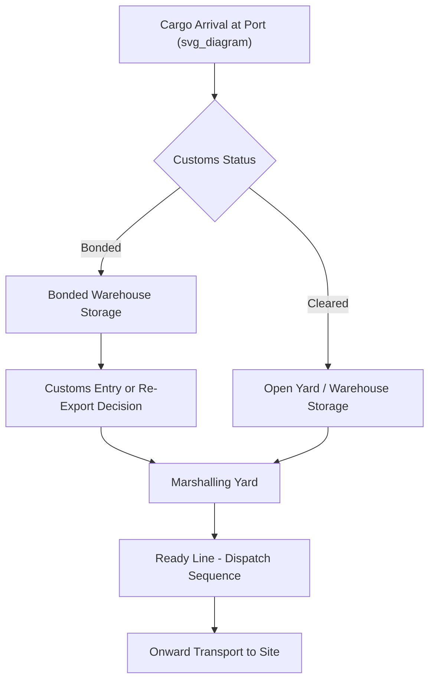

## Port Storage, Bonded Warehousing, and Cargo Marshalling

### Definition and Scope

Port storage encompasses the range of facilities and processes used to hold project cargo temporarily within a port or terminal environment between transport legs. Bonded warehousing refers specifically to storage under customs control, where duties and taxes on imported goods remain suspended until the cargo is cleared for domestic use, re-exported, or otherwise released. Cargo marshalling is the operational process of organizing, sequencing, and staging cargo for onward movement — ensuring the right item is in the right place at the right time for loading, whether onto a vessel, rail car, or heavy-haul transport unit.

### Why These Functions Matter for Project Cargo

**Key Points**

- Project cargo often arrives and departs on different schedules than it is consumed at the final site, making storage and marshalling essential buffer functions.
- Bonded warehousing allows project developers to defer or avoid import duties on equipment that may be re-exported, temporarily imported for assembly, or subject to project-specific customs regimes.
- Marshalling errors — wrong sequencing, misplaced items, or inaccessible stacking — are a common source of schedule delay and rehandling cost in project logistics.
- Storage duration for project cargo is often significantly longer than for containerized freight, requiring different commercial and physical planning assumptions.

### Port Storage Types

| Storage Type | Description | Typical Use Case |
| --- | --- | --- |
| Open yard storage | Uncovered outdoor storage on paved or improved ground | Weather-resistant heavy equipment, steel structures |
| Covered/sheltered storage | Roofed but not fully enclosed storage | Cargo needing partial weather protection |
| Warehouse storage | Fully enclosed, often climate-controlled | Sensitive electronics, machinery, packaged goods |
| Bonded warehouse | Enclosed storage under customs control | Imported cargo with deferred duty status |
| Pre-assembly yard | Specialized yard for staged assembly (see separate topic) | Modules requiring on-site assembly before dispatch |

### Bonded Warehousing Fundamentals

**Key Points**

- Cargo held in a bonded warehouse is legally considered not yet imported for duty purposes, even though it is physically within the destination country.
- Duty and tax liability is triggered only when cargo is withdrawn from bond for domestic consumption; if re-exported directly from bond, duty may be avoided entirely.
- Bonded status typically requires the warehouse operator to hold a customs bond/license and maintain strict inventory control auditable by customs authorities.
- Common project cargo use cases include: temporary import of specialized equipment for assembly then re-export, staged import of project components to defer duty until final consumption, and consolidation of multi-origin shipments before formal customs entry.

### Customs and Regulatory Considerations

- Bonded warehouse periods are typically time-limited (commonly ranging from several months up to a few years depending on jurisdiction), after which cargo must be entered for consumption, re-exported, or otherwise disposed of under customs supervision.
- Temporary admission regimes (such as those under the ATA Carnet system or equivalent national schemes) may apply to certain categories of project equipment intended for re-export.
- [Inference] Specific bonded storage time limits and temporary admission eligibility vary significantly by jurisdiction and cargo classification; applicable rules should always be confirmed with local customs authorities or a licensed customs broker rather than assumed from general practice.

### Cargo Marshalling Process

**Key Points**

- Marshalling planning begins before cargo arrival, using the vessel stowage plan, cargo manifest, and onward transport schedule to pre-determine yard positioning.
- Marshalling areas are typically organized by dispatch sequence rather than arrival sequence, ensuring first-needed items are positioned for easiest access regardless of when they arrived.
- Effective marshalling minimizes double-handling — the costly and risk-increasing practice of moving heavy cargo more times than structurally necessary.

### Marshalling Sequence Example

**Example**

For a project requiring sequential delivery of five process modules to a construction site, the marshalling yard might be organized as follows:

1. Modules are received in whatever order the vessel discharges them (often not matching installation sequence).
2. Marshalling team cross-references the site's installation schedule and repositions modules within the yard so that Module 1 (needed first on site) is positioned nearest the dispatch gate.
3. As Module 1 departs, Module 2 is repositioned forward, maintaining a rolling "ready line" of cargo staged for imminent dispatch.
4. Remaining modules stay in buffer storage until their position in the ready line is reached, minimizing unnecessary crane moves.

### Diagram: Storage and Marshalling Flow

### Storage Duration and Cost Planning

Project cargo storage costs are typically structured with escalating rates to discourage long-term port congestion:

$$C_s = \sum_{i=1}^{n} r_i \times d_i$$

where $C_s$ is total storage cost, $r_i$ is the applicable daily/weekly rate for tier $i$ (often increasing after an initial free period), and $d_i$ is the number of days cargo remains in that tier.

**Example**

A typical tariff structure might offer 10 free days, then $50/day per unit for days 11–20, escalating to $150/day per unit beyond day 20. Planning marshalling and dispatch schedules to stay within lower-cost tiers is a common cost-control objective in project logistics.

### Common Risks and Mitigation

| Risk | Mitigation |
| --- | --- |
| Customs delays extending bonded storage duration | Early document preparation, engagement of experienced customs broker |
| Escalating storage costs from schedule slippage | Tiered cost monitoring, proactive dispatch scheduling |
| Marshalling errors causing wrong-sequence dispatch | Barcode/RFID tracking, clear yard mapping, dispatch sequence verification checks |
| Double-handling from poor yard organization | Dispatch-sequence-based yard layout, "ready line" staging methodology |
| Cargo damage during extended storage | Periodic inspection regime, weatherproofing/corrosion protection maintenance |

### Conclusion

Port storage, bonded warehousing, and cargo marshalling together manage the temporal and regulatory gap between cargo arrival and its consumption at the final project site. Efficient marshalling reduces rehandling and cost, while correct use of bonded warehousing can materially affect a project's duty exposure — making both areas central to project cargo cost and schedule control rather than purely administrative afterthoughts.

**Related Topics**

- Laydown Area Planning and Pre-Assembly Yards
- Customs and Temporary Import Regimes for Project Cargo
- Port Selection Criteria for Project Cargo
- Demurrage and Detention Management in Project Logistics
- Cargo Tracking Technologies (RFID/Barcode) in Project Logistics
- Vessel Stowage Planning for Breakbulk and Heavy-Lift Cargo