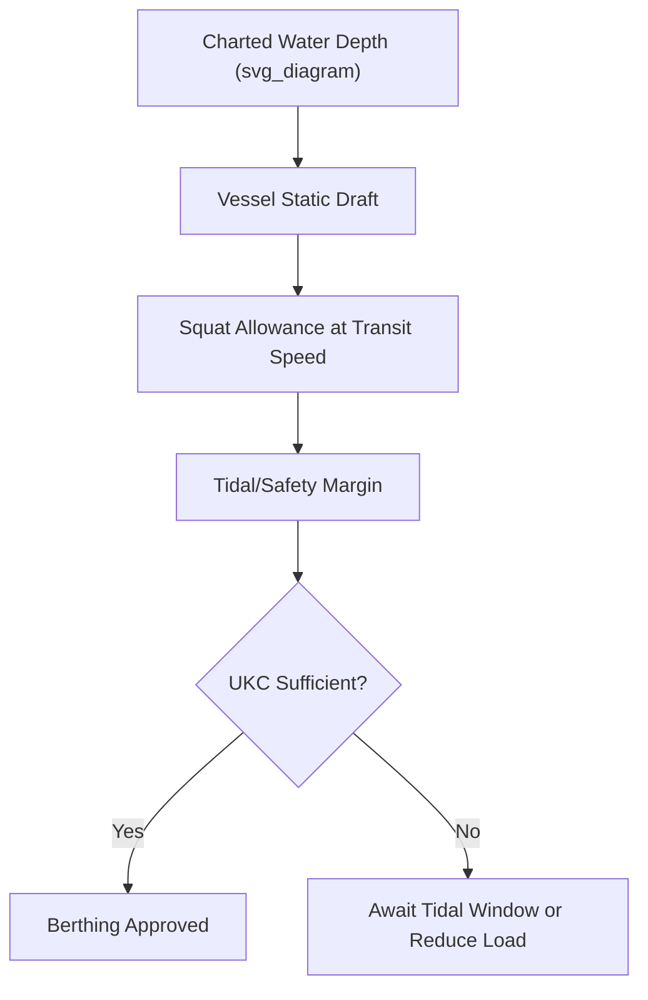

## Vessel Berthing and Draft Requirements

### Definition and Scope

Vessel berthing refers to the process and requirements for safely bringing a vessel alongside a quay, dolphin, or mooring structure to conduct cargo operations. Draft requirements define the minimum water depth needed for a vessel to safely navigate to, maneuver within, and remain berthed at a given port or terminal without grounding. For heavy-lift and project cargo vessels — which are often larger, less maneuverable, or have unusual hull forms compared to standard cargo ships — berthing and draft planning carry additional constraints tied to vessel type, cargo configuration, and the physical limits of the receiving port.

### Key Draft-Related Terminology

**Key Points**

- **Draft**: the vertical distance between the waterline and the lowest point of the vessel's hull (keel), determining minimum water depth required.
- **Under Keel Clearance (UKC)**: the minimum safe margin maintained between the vessel's keel and the seabed, accounting for tide, squat, and safety margin.
- **Air draft**: the vertical distance from the waterline to the highest point of the vessel or its cargo, relevant for bridge and overhead obstruction clearance.
- **Chart datum**: the reference water level (often lowest astronomical tide) against which charted depths are measured.
- **Squat effect**: the phenomenon where a moving vessel's effective draft increases due to reduced water pressure beneath the hull at speed, particularly significant in shallow or confined channels.

### Draft Calculation Fundamentals

Under keel clearance is calculated as:

$$UKC = D_c - (D_v + S + T_m)$$

where $D_c$ is charted water depth, $D_v$ is the vessel's static draft, $S$ is the squat allowance, and $T_m$ is any additional tidal or safety margin required by the port authority. Ports typically mandate a minimum UKC (often expressed as a percentage of draft, such as 10–15%, or a fixed minimum in meters) depending on seabed type and channel conditions.

[Inference] Specific minimum UKC requirements vary by port authority, seabed composition (soft mud vs rock), and vessel type; the percentage figures cited reflect commonly referenced industry practice rather than a single universal standard, and actual applicable limits must be confirmed with the relevant port authority's pilotage or harbor master guidelines.

### Tidal Considerations for Draft-Constrained Berthing

**Key Points**

- Many project cargo vessels, particularly heavy-lift semi-submersibles or vessels carrying tall cargo, are drafted close to or exceeding a port's low-tide depth.
- Tidal windows — specific time periods when water depth is sufficient — may be required for arrival, departure, or both.
- Neap and spring tide cycles significantly affect available tidal windows; spring tides offer greater tidal range and potentially deeper high-water windows but also lower low-water depths.
- Vessels requiring tidal-window transits must coordinate arrival timing precisely with pilotage and port scheduling, sometimes with only narrow multi-hour windows available per tidal cycle.

### Berthing Process and Requirements

1. **Pre-arrival notification** — vessel provides estimated time of arrival, draft, dimensions, and cargo details to the port authority and pilotage service.
2. **Pilotage and tug assignment** — a harbor pilot boards to assist navigation into the berth; tugs are assigned based on vessel size, maneuverability, and weather conditions.
3. **Channel and approach navigation** — vessel transits the approach channel within charted depth and width limits, often under speed restrictions to manage squat effect.
4. **Berthing maneuver** — vessel is brought alongside using a combination of engine, thruster, tug assistance, and mooring line handling.
5. **Mooring** — vessel is secured using mooring lines to bollards or dolphins, with line configuration and tension managed according to the berth's mooring plan and any wind/current exposure.
6. **Gangway/access setup and cargo operation readiness** — once secured, access is established and cargo operations (stevedoring, ballasting adjustments) can begin.

### Berth Compatibility Assessment for Project Cargo Vessels

| Factor | Consideration |
| --- | --- |
| Vessel draft vs berth depth | Static draft plus squat and tidal margin must remain within available depth at all operational states |
| Vessel length vs berth length | Sufficient quay length required for safe mooring and fendering, especially for long heavy-lift vessels |
| Air draft vs overhead obstructions | Bridges, power lines, or cranes along the approach must clear the vessel's maximum air draft, especially relevant when cargo extends above deck |
| Beam vs channel/berth width | Wide-beam vessels (e.g., semi-submersible heavy-lift ships) may require wider turning basins or dredged channels |
| Fendering compatibility | Berth fender system must be rated for the vessel's displacement and approach velocity |
| Mooring bollard capacity | Bollard pull ratings must match mooring line loads for the vessel size and expected weather exposure |

### Example: Semi-Submersible Heavy-Lift Vessel Berthing Constraint

**Example**

A semi-submersible heavy-lift vessel carrying a jack-up rig has a static draft of 8.5 m fully loaded. The destination berth has a charted depth of 10.2 m at chart datum, with a tidal range of 2.8 m. Port authority policy requires minimum 1.0 m UKC plus a squat allowance of 0.3 m at the vessel's approach speed.

$$Required\ depth = 8.5 + 0.3 + 1.0 = 9.8\ m$$

Since charted depth (10.2 m) exceeds this requirement even at chart datum (effectively low water reference), the vessel can berth without requiring a specific tidal window — unlike a deeper-draft vessel that might need to time arrival to coincide with a rising or high tide.

### Diagram: Draft and Under Keel Clearance Relationship

### Mooring and Environmental Considerations

- **Wind and current exposure**: heavy-lift vessels often present large windage areas, especially when carrying tall or wide-deck cargo, increasing mooring line loads and tug requirements.
- **Fender loading**: berthing approach velocity and vessel displacement must remain within the berth fender system's design energy absorption capacity to avoid quay or hull damage.
- **Emergency mooring/quick-release requirements**: some terminals require quick-release mooring hooks for vessels carrying hazardous or high-value cargo to enable rapid departure if needed.

### Common Risks and Mitigation

| Risk | Mitigation |
| --- | --- |
| Grounding due to insufficient UKC | Conservative UKC margins, real-time tide monitoring, pilotage guidance |
| Missed tidal window causing schedule delay | Precise tidal window calculation well in advance, contingency scheduling buffer |
| Air draft collision with overhead obstruction | Pre-transit air draft verification against charted obstruction heights |
| Excessive mooring line loads in high wind | Weather monitoring, additional mooring lines or tug standby during exposure periods |
| Berth fender overload during approach | Speed control during berthing, experienced pilotage, tug assistance calibrated to vessel size |

### Conclusion

Vessel berthing and draft requirements form a foundational navigational and infrastructural constraint on project cargo operations, particularly for heavy-lift and semi-submersible vessels operating near the physical limits of port depth and berth dimensions. Careful integration of draft calculations, tidal planning, and berth compatibility assessment is essential to avoid grounding risk, schedule delay, or vessel/infrastructure damage during port calls.

**Related Topics**

- Port Selection Criteria for Project Cargo
- Quay Load-Bearing Capacity and Point Load Limits
- Heavy-Lift Vessel Types and Onboard Crane Configurations
- Tidal Window Planning for Draft-Constrained Vessels
- Pilotage and Tug Operations for Large Vessels
- Fendering Systems and Berth Structural Design