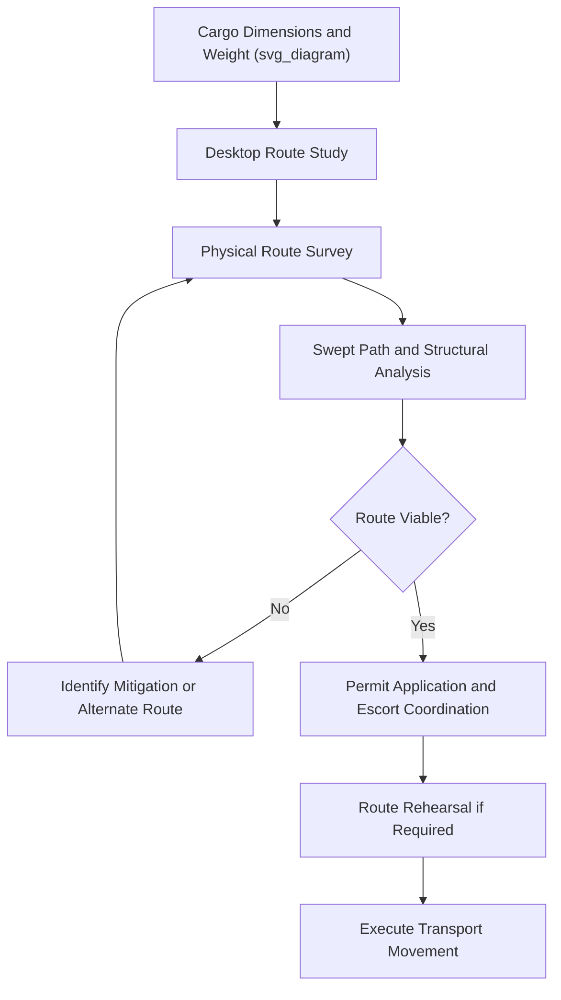

## Rail and Road Connectivity at Project Cargo Terminals

### Definition and Scope

Rail and road connectivity refers to the inland transport infrastructure linking a port or terminal to the broader transportation network, enabling the onward movement of cargo from the quay to its final destination. For heavy-lift and project cargo, this connectivity is often the binding constraint in the entire logistics chain: a port may have excellent marine and lifting infrastructure, but if the surrounding road or rail network cannot physically accommodate oversized or overweight loads, the port is effectively unusable for that cargo.

### Why Connectivity Planning Is Critical

**Key Points**

- Project cargo frequently exceeds standard legal dimensions and weights for road and rail transport, requiring route-specific engineering assessment rather than reliance on general infrastructure ratings.
- A single substandard bridge, overpass, tunnel, or rail curve radius along an otherwise capable route can force complete re-routing, cargo splitting, or alternative transport modes.
- Connectivity assessment is typically conducted in parallel with port selection, since the two are interdependent (see: Port Selection Criteria for Project Cargo).
- Both permanent infrastructure limits and temporary conditions (construction, weight-restricted bridges, seasonal load limits) must be accounted for.

### Road Connectivity Considerations

**Route Geometry**

- Turning radii at intersections and roundabouts, evaluated against the swept path of the longest/widest transport combination (e.g., multi-axle SPMT or extendable trailer configurations)
- Road width and shoulder condition, particularly on rural or secondary routes not designed for heavy-haul traffic
- Gradient and cross-slope limits, affecting traction and stability for very heavy or tall loads

**Structural Limits**

- Bridge weight ratings, often expressed as maximum axle load or gross vehicle weight, requiring bridge engineering assessment for loads exceeding standard design vehicles
- Culvert and buried utility capacity beneath the road surface at each crossing point
- Overhead clearance at bridges, gantries, power lines, and signage structures relative to the cargo's maximum air draft on the transport trailer

**Traffic and Permitting**

- Abnormal load permits, typically required from road authorities and sometimes police escort mandates above certain dimension/weight thresholds
- Traffic management plans for lane closures, rolling roadblocks, or night-time movement windows
- Coordination with utility companies for temporary removal of overhead lines or street furniture along the route

### Rail Connectivity Considerations

**Key Points**

- Rail transport can offer significant weight capacity advantages over road for very heavy single items, since load is distributed across many wheels and a continuous rail rather than concentrated axle groups.
- Rail gauge, loading gauge (structure clearance envelope), and curve radii all constrain maximum cargo dimensions that can be moved by rail.
- Specialized rail cars (Schnabel cars, well cars, depressed-center flat cars) are often required for oversized or overweight cargo, and availability of such rolling stock can itself be a scheduling constraint.
- Rail connectivity to the final site is often incomplete for greenfield project locations, requiring transload to road or other transport modes at a rail terminus.

### Road vs Rail Comparison for Heavy-Lift Inland Transport

| Factor | Road (Heavy-Haul Trailer/SPMT) | Rail (Specialized Rail Cars) |
| --- | --- | --- |
| Typical weight capacity | High with multi-axle configurations, but axle/bridge limited | Very high, load spread over rail and many wheels |
| Dimensional flexibility | High — route can sometimes be adjusted for clearance issues | Limited by fixed loading gauge and curve radii |
| Route flexibility | High — multiple route options often available | Low — fixed infrastructure, limited alternative routings |
| Final-mile capability | Generally good — can often reach site directly | Often requires transload to road for final mile |
| Permitting complexity | Moderate to high, jurisdiction-dependent | Often lower per movement but constrained by rail network scheduling |
| Speed | Faster point-to-point for short-medium distances | Efficient for long-distance, bulk-scale movement |

### Route Survey Process

1. **Desktop route study** — initial route options identified using mapping data, known bridge/structure ratings, and general road classification.
2. **Physical route survey** — site team measures and photographs every bridge, overpass, roundabout, utility crossing, and narrow point along the candidate route.
3. **Swept path analysis** — software-based simulation of the transport vehicle's turning geometry through each critical junction.
4. **Structural assessment** — bridge and culvert engineers assess load capacity against the cargo's axle configuration and total weight.
5. **Obstruction removal planning** — identification of temporary utility relocations, signage removal, or vegetation clearance required.
6. **Permit application and escort coordination** — formal permits obtained from road/rail authorities, with police or pilot vehicle escorts arranged as required.
7. **Route rehearsal (for critical movements)** — for extremely high-value or tight-clearance moves, a rehearsal run with an empty or dummy load may be conducted.

### Example: Route Survey Finding for a Transformer Delivery

**Example**

A route survey for delivering a 350 t power transformer identifies:

- A 40-tonne-rated bridge at km 12 requiring either temporary reinforcement or a 15 km detour via an alternative bridge rated for the required load.
- A roundabout at km 18 with insufficient turning radius for the transporter's swept path, requiring temporary removal of a central island curb.
- An overhead power line at km 25 requiring temporary de-energization and lifting during the transport window.

Based on these findings, the project team elects to reinforce the km 12 bridge temporarily (assessed as more cost-effective than the 15 km detour, which would have crossed additional weight-restricted structures) and schedules the movement for early Sunday morning to minimize traffic disruption and align with the utility company's line de-energization window.

### Diagram: Road/Rail Connectivity Assessment Flow

### Common Risks and Mitigation

| Risk | Mitigation |
| --- | --- |
| Undiscovered structural limit along route | Comprehensive physical route survey, not reliance on desktop data alone |
| Permit delays from multiple jurisdictions | Early permit application, dedicated permitting coordinator for multi-jurisdiction routes |
| Rail rolling stock unavailability | Early booking of specialized rail cars, contingency road transport plan |
| Traffic disruption complaints/restrictions | Off-peak or night-time movement scheduling, public notification in advance |
| Utility conflicts (power lines, cables) | Early utility company engagement, temporary de-energization or relocation planning |

### Conclusion

Rail and road connectivity at project cargo terminals determines whether cargo that successfully arrives by sea can actually reach its final destination, making route engineering as critical as port and quay capability in overall project logistics planning. Rigorous physical route surveys, structural assessments, and early permitting engagement are essential to avoid late-stage discovery of route-blocking constraints.

**Related Topics**

- Port Selection Criteria for Project Cargo
- Heavy-Haul Route Engineering and Corridor Surveys
- SPMT Axle Load Distribution and Route Engineering
- Abnormal Load Permitting and Escort Requirements
- Specialized Rail Car Types for Oversized Cargo
- Swept Path Analysis and Turning Radius Engineering