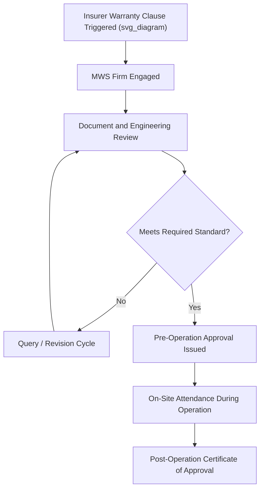

## Role and Scope of the Marine Warranty Surveyor

### Definition and Scope

A Marine Warranty Surveyor (MWS) is an independent, technically qualified surveyor engaged to review, approve, and monitor marine operations — most commonly heavy-lift transport, offshore installation, and sea transit of project cargo — on behalf of cargo underwriters or hull and machinery insurers. The MWS role exists because marine cargo insurance policies for high-value or high-risk operations typically include a "warranty" clause requiring that the operation be approved by an insurer-appointed surveyor as a condition of coverage. Without MWS approval, insurance coverage for the operation may be void or significantly limited.

### Why Marine Warranty Surveying Exists

**Key Points**

- Insurers cannot independently verify the technical adequacy of every heavy-lift or marine transport operation they underwrite, so they delegate this verification to specialized MWS firms.
- The warranty clause creates a direct financial incentive for the cargo owner/operator to follow MWS recommendations, since failure to obtain approval can void coverage entirely.
- MWS involvement is standard practice for high-value cargo, first-of-kind operations, non-standard lift or transport configurations, and voyages through higher-risk sea areas or seasons.
- The MWS is independent of the cargo owner, carrier, and insurer's claims department — their technical judgment is expected to be free from commercial pressure from any single party.

### Scope of MWS Involvement

**Pre-Operation Review**

- Review of engineering calculations for lift plans, rigging, sea-fastening design, and stability analysis
- Assessment of vessel suitability for the specific cargo and voyage (structural capacity, stability, route weather exposure)
- Review of method statements and procedures for loading, securing, and discharge operations

**On-Site Attendance**

- Physical attendance during critical operations such as loadout, sea-fastening installation, and discharge
- Verification that approved procedures are actually followed during execution, not just documented in advance
- Authority to halt or require correction of operations observed to deviate from approved plans or pose unacceptable risk

**Documentation and Certification**

- Issuance of a Certificate of Approval (or similar warranty survey report) confirming the operation met the required standard
- Documentation of any deviations, conditions, or exceptions noted during the survey
- Records serve as the technical basis for insurance claims handling if an incident occurs

### Typical Operations Requiring MWS Involvement

| Operation Type | Reason for MWS Requirement |
| --- | --- |
| Heavy-lift cargo sea transport | High cargo value, sea-fastening adequacy critical to voyage safety |
| Offshore installation lifts | High technical complexity, significant loss potential if lift fails |
| Towage operations | Tow line/bollard pull adequacy affects vessel and tow safety |
| Float-on/float-off (FLO/FLO) loading | Complex ballasting and stability sequence with narrow safety margins |
| Jack-up rig moves | High-value asset, specialized leg/hull stress considerations |
| First-of-kind or non-standard lifts | No established track record to rely on for risk assessment |

### MWS Review Process

1. **Engagement and scope definition** — insurer or cargo owner engages the MWS firm, defining which operations require survey and approval.
2. **Document review** — MWS reviews lift plans, sea-fastening calculations, vessel stability booklets, route/weather routing plans, and method statements.
3. **Query and revision cycle** — MWS raises technical queries or requests calculation revisions; this cycle continues until documentation meets the required standard.
4. **Approval issuance (pre-operation)** — MWS issues conditional or full approval, sometimes with specific conditions (e.g., maximum sea state for departure, minimum sea-fastening specification).
5. **On-site attendance** — MWS surveyor attends key operational milestones in person.
6. **Post-operation certification** — final Certificate of Approval issued upon satisfactory completion, or a report of exceptions if deviations occurred.

### Example: MWS Review of a Sea-Fastening Design

**Example**

A cargo owner submits a sea-fastening design for a 200 t generator set to be transported on a general cargo vessel through a route with a 10-year return period design wave height. The MWS review process might proceed as follows:

1. MWS reviews the motion/acceleration analysis used to derive design forces (based on the vessel's expected roll, pitch, and heave for the intended route and season).
2. MWS identifies that the submitted calculation used a lower acceleration factor than the MWS firm's standard reference values for the stated route and season, and requests recalculation.
3. Revised calculations are submitted showing increased sea-fastening steel sizing to meet the higher design load.
4. MWS approves the revised design, subject to a condition that departure is postponed if forecast significant wave height exceeds a specified threshold at the time of sailing.
5. MWS surveyor attends the port to visually verify sea-fastening welds and bracing match the approved drawings before final sign-off.

### Diagram: MWS Engagement Flow

### Relationship Between MWS, Insurer, and Cargo Owner

**Key Points**

- The MWS is typically appointed and paid for by the cargo owner or operator, but acts on behalf of the insurer's technical interests as a condition of the policy.
- This dual relationship requires the MWS to maintain professional independence — approval decisions are based on technical merit, not commercial relationship with the paying party.
- Disputes can arise when an MWS's technical requirements are seen by the cargo owner as overly conservative or costly; escalation processes to the insurer or a senior MWS reviewer are typically available.
- MWS findings and certificates become central evidence in the event of an insurance claim following an incident.

### Common Risks and Mitigation

| Risk | Mitigation |
| --- | --- |
| Late MWS engagement causing schedule delay | Engage MWS early in project planning, before final engineering is locked |
| Repeated query/revision cycles delaying approval | Submit engineering to MWS firm's known standards from the outset, using experienced engineers familiar with MWS expectations |
| Non-compliance discovered during on-site attendance | Rehearse and pre-check procedures against approved plans before MWS attendance |
| Ambiguity over MWS authority during operations | Clear pre-agreed protocol on MWS stop-work authority, documented in the survey scope agreement |
| Insurance coverage gap from missed warranty condition | Legal/insurance review of policy warranty clauses at contract stage to confirm MWS scope matches policy requirements |

### Conclusion

The Marine Warranty Surveyor serves as an independent technical gatekeeper between cargo owners and insurers for high-value or high-risk marine operations, with a scope spanning engineering document review, on-site verification, and formal certification. Early and proactive engagement with the MWS is a recurring best practice across the heavy-lift industry, since MWS approval is frequently both an insurance condition and a genuine independent check on operational safety.

**Related Topics**

- Sea-Fastening Design Principles and Load Calculations
- Vessel Motion Analysis and Design Acceleration Criteria
- Cargo Insurance and Warranty Clauses in Marine Transport
- Float-On/Float-Off (FLO/FLO) Loading Operations
- Weather Routing and Voyage Planning for Heavy-Lift Cargo
- Stability Analysis for Heavy-Lift Vessel Loading