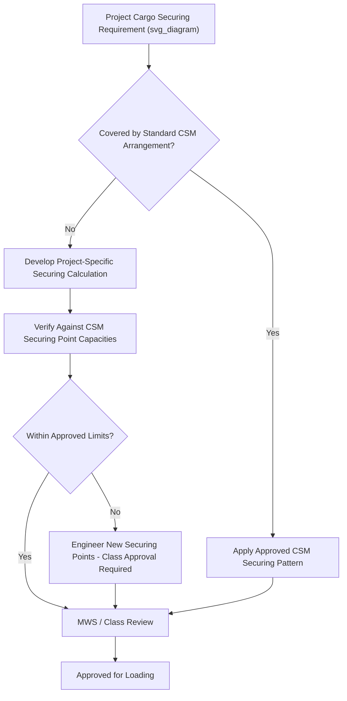

## Cargo Securing Manual Compliance

### Definition and Scope

A Cargo Securing Manual (CSM) is a vessel-specific, classification-society-approved document required under SOLAS (Safety of Life at Sea) Chapter VI/VII regulations, detailing the approved methods, equipment, and calculations for securing cargo aboard that particular ship. Compliance with the CSM is mandatory for any cargo carried on a SOLAS-regulated vessel, and for heavy-lift and project cargo, CSM compliance is a critical interface point between the vessel's fixed securing infrastructure and the project-specific sea-fastening designed for a given shipment.

### Regulatory Basis

**Key Points**

- The requirement for a CSM derives from SOLAS Chapter VI, Regulation 5, and is elaborated through the IMO's Code of Safe Practice for Cargo Stowage and Securing (CSS Code).
- Every vessel carrying cargo other than solid or liquid bulk cargo in a manner requiring securing must have an approved CSM on board, reviewed and stamped by the vessel's classification society or flag administration.
- The CSM is vessel-specific — it reflects the actual securing points, lashing equipment, and structural capacities of that individual ship, not a generic template.
- Non-compliance can result in port state control detention, cargo insurance complications, and in serious cases, cargo loss or vessel stability incidents.

### Core Contents of a Cargo Securing Manual

| Section | Content |
| --- | --- |
| General vessel particulars | Ship dimensions, cargo spaces, deck layout |
| Securing points and fittings | Location, type, and maximum working load of pad eyes, lashing points, container fittings |
| Securing equipment inventory | Lashing chains, turnbuckles, wires, twist locks, and their certified working load limits |
| Standard cargo securing arrangements | Pre-approved lashing patterns for common cargo types |
| Calculation methodology | Formulas and safety factors used to determine required securing arrangements based on vessel motion |
| Force and acceleration data | Vessel-specific design accelerations for various sea states, used as input to securing calculations |

### CSM Compliance for Project and Heavy-Lift Cargo

**Key Points**

- Standard CSM securing arrangements typically cover conventional cargo types (containers, vehicles, general breakbulk); project cargo often falls outside these pre-approved arrangements.
- For non-standard cargo, a supplementary or project-specific securing calculation must be prepared, referencing the CSM's approved securing point capacities and the vessel's design acceleration data.
- This project-specific calculation must still comply with the underlying CSM framework — securing points used must not exceed their CSM-rated working load, and calculation methodology must align with the CSM's approved approach or an equivalent recognized standard.
- Where project cargo requires securing points not covered by the existing CSM (e.g., specially welded padeyes for a one-off shipment), classification society approval of the additional fittings is typically required before use.

### Sea-Fastening Design Within CSM Constraints

The design process for project cargo sea-fastening operating within CSM compliance typically follows this logic:

1. **Obtain vessel design acceleration data** — from the CSM or vessel-specific stability/motion data, covering pitch, roll, heave, and combined accelerations for the intended voyage and sea state.
2. **Calculate cargo securing forces** — using cargo weight, center of gravity, and design accelerations to determine required restraint forces in longitudinal, transverse, and vertical directions.
3. **Select securing method and points** — choosing between existing CSM-approved securing points (where capacity allows) or engineering new points requiring class approval.
4. **Verify against CSM working load limits** — confirming that no securing point or piece of equipment is loaded beyond its CSM-stated maximum working load.
5. **Documentation and MWS/class review** — securing calculations submitted for review by the Marine Warranty Surveyor and/or classification society as applicable.

### Example: Securing Calculation Force Check

**Example**

For a cargo item of mass $m = 50\ t$ subject to a transverse design acceleration of $a_t = 0.5g$ (a typical order-of-magnitude figure for moderate sea states, though actual values are vessel- and route-specific per the CSM), the required transverse securing force is:

$$F_t = m \times a_t = 50{,}000\ kg \times (0.5 \times 9.81\ m/s^2) \approx 245{,}250\ N \approx 25\ t$$

This force must then be distributed across the securing arrangement (chains, lashings, or structural sea-fastening welds) with an appropriate safety factor, and each securing point's contribution must remain within its CSM-rated working load limit.

[Inference] The 0.5g figure used above is illustrative; actual design acceleration values are vessel-specific, derived from the CSM or a dedicated motion analysis, and vary significantly with vessel size, loading condition, route, and season.

### Diagram: CSM Compliance Verification Flow

### Interaction with Marine Warranty Surveying

CSM compliance and MWS review are closely linked but distinct: the CSM establishes the vessel's inherent securing capability and regulatory framework, while the MWS (see: Role and Scope of the Marine Warranty Surveyor) independently verifies that the project-specific securing design is technically adequate and properly executed, often using the CSM as a key reference document during their review.

### Common Risks and Mitigation

| Risk | Mitigation |
| --- | --- |
| Securing points exceeding CSM working load limits | Engineering verification against CSM data before finalizing lashing arrangement |
| New securing points installed without class approval | Early engagement with classification society for any non-standard padeye or fitting |
| Generic securing calculations not reflecting vessel-specific accelerations | Use of actual CSM/vessel motion data rather than generic industry assumptions |
| Port state control detention for CSM non-compliance | Pre-voyage documentation check, ensuring CSM is current, approved, and matches actual cargo configuration |
| Cargo shift during voyage due to inadequate securing | Rigorous force calculation, safety factor application, and MWS/class review before departure |

### Conclusion

Cargo Securing Manual compliance is a mandatory regulatory foundation for any cargo secured aboard a SOLAS-regulated vessel, and for project cargo it functions as the technical baseline against which custom sea-fastening designs must be verified. Effective compliance requires integrating vessel-specific CSM data into project-specific securing calculations and coordinating closely with classification societies and marine warranty surveyors before cargo is loaded.

**Related Topics**

- Role and Scope of the Marine Warranty Surveyor
- Sea-Fastening Design Principles and Load Calculations
- Vessel Motion Analysis and Design Acceleration Criteria
- SOLAS Chapter VI/VII and the CSS Code
- Classification Society Approval Processes for Cargo Securing
- Lashing Equipment Types and Working Load Limits