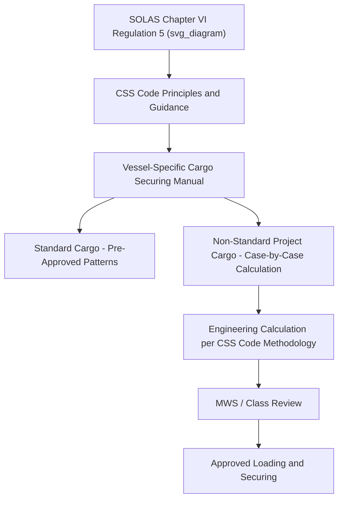

## IMO Code of Safe Practice for Cargo Stowage and Securing

### Definition and Scope

The IMO Code of Safe Practice for Cargo Stowage and Securing (commonly known as the CSS Code) is an internationally recognized set of guidelines developed by the International Maritime Organization to provide guidance on the safe stowage and securing of cargo, particularly for cargo types not covered by more specific mandatory codes (such as the IMDG Code for dangerous goods or the IMSBC Code for solid bulk cargo). The CSS Code is the foundational reference document underpinning individual vessels' Cargo Securing Manuals and is central to how heavy-lift and project cargo securing calculations are justified and reviewed.

### Regulatory Status and Relationship to SOLAS

**Key Points**

- The CSS Code is referenced by SOLAS Chapter VI, Regulation 5, which mandates that cargo (other than solid/liquid bulk) be loaded, stowed, and secured in accordance with a Cargo Securing Manual, itself developed with reference to CSS Code principles.
- While originally a recommendatory (non-mandatory) code when first adopted, key elements of the CSS Code have become effectively mandatory through their incorporation into SOLAS requirements for the Cargo Securing Manual.
- The CSS Code is periodically amended by the IMO to reflect updated understanding of cargo securing engineering, vessel motion behavior, and lessons learned from cargo loss incidents.
- [Unverified] Specific amendment histories and current in-force revision status should be verified against the latest IMO circular or resolution, as code updates occur periodically and this response reflects generally established structure rather than a real-time regulatory database.

### Core Structure and Content Areas

| Content Area | Coverage |

 

| General principles | Overarching safety philosophy for cargo stowage and securing |

| Cargo Securing Manual requirements | Framework and content requirements for vessel-specific CSMs |

| Stowage and securing of containers | Specific guidance for containerized cargo arrangements |

| Stowage and securing of vehicles | Guidance for ro-ro and vehicle cargo |

| Semi-standardized and non-standardized cargo | Guidance most directly relevant to project and heavy-lift cargo, covering irregular or one-off cargo types |

| Portable tanks and other specialized units | Guidance for tank containers and similar specialized cargo units |

| Actions to be taken in heavy weather | Operational guidance for vessel crews when securing arrangements are stressed by severe conditions |

### Relevance to Project and Heavy-Lift Cargo

**Key Points**

- Project cargo frequently falls into the CSS Code's "non-standardized cargo" category, since it does not conform to containerized or vehicle stowage patterns the code addresses in greatest detail.
- For non-standardized cargo, the CSS Code provides general principles and calculation methodology (covering forces from vessel motion, friction, and securing device capacity) rather than prescriptive lashing patterns.
- This general, principles-based approach means project cargo securing designs typically require case-by-case engineering calculation, referencing CSS Code methodology, rather than simply selecting a pre-approved pattern from a table.
- Marine Warranty Surveyors and classification societies use CSS Code principles as a key technical reference when reviewing project-specific sea-fastening designs (see: Role and Scope of the Marine Warranty Surveyor).

### CSS Code Force Calculation Principles

The CSS Code's methodology for securing force calculation generally accounts for:

- **Gravitational force** acting on the cargo mass
- **Dynamic forces** from vessel motion (roll, pitch, heave) at given sea states, often expressed as multiples of gravitational acceleration ($g$)
- **Friction** between cargo and the deck or stowage surface, which can reduce (but should not be relied upon to eliminate) the need for active securing devices
- **Wind forces**, particularly relevant for cargo with large exposed surface area carried on deck

A generalized transverse force balance concept (consistent with CSS Code methodology, simplified for illustration) can be expressed as:

$$F_{required} = (m \times a_t) - (\mu \times m \times g \times \cos\theta)$$

where $F_{required}$ is the net securing force needed, $m$ is cargo mass, $a_t$ is the transverse design acceleration, $\mu$ is the coefficient of friction between cargo and deck, $g$ is gravitational acceleration, and $\theta$ is any relevant heel/list angle. This reflects that friction offsets part of the dynamic force, with securing devices required to resist the remainder.

[Inference] This is a simplified conceptual representation of CSS Code force-balance logic rather than a verbatim formula reproduced from the code text; actual CSS Code and CSM calculations involve more detailed treatment of combined motions, safety factors, and direction-specific force components that should be applied via the vessel's approved CSM methodology or a qualified naval architect's calculation.

### Example: Applying CSS Code Principles to a Non-Standard Cargo Item

**Example**

A generator module too large for standard container securing fittings is being loaded as breakbulk deck cargo. Following CSS Code non-standardized cargo principles:

1. The vessel's design accelerations (from the CSM, reflecting the specific vessel and intended route/season) are obtained for the applicable sea state.
2. Friction coefficient between the module's base and the deck (or interposed dunnage) is conservatively estimated, generally erring toward a lower assumed friction value to avoid over-reliance on an unverifiable surface condition.
3. Required securing force is calculated per axis (longitudinal, transverse, vertical) using the CSS Code's general methodology.
4. Securing arrangement (lashings, chocks, welded sea-fastening) is designed and checked against the CSM's approved securing point capacities.
5. Documentation is submitted for MWS and/or classification society review prior to loading.

### Diagram: CSS Code's Role in the Securing Compliance Chain

### Heavy Weather Guidance

**Key Points**

- The CSS Code includes guidance for actions to be taken if securing arrangements are found to be inadequate or compromised during a voyage encountering heavy weather.
- This includes crew inspection protocols, re-tensioning of lashings, and route/speed adjustment considerations to reduce vessel motion and associated cargo forces.
- For project cargo voyages, pre-voyage weather routing planning (selecting routes and timing to avoid known severe weather patterns) is a common complementary risk mitigation alongside CSS Code-compliant securing design.

### Common Risks and Mitigation

| Risk | Mitigation |
| --- | --- |
| Misapplying standardized cargo guidance to non-standard project cargo | Case-specific engineering calculation per CSS Code non-standardized cargo principles |
| Over-reliance on friction in securing calculations | Conservative friction coefficient assumptions, primary reliance on active securing devices |
| Outdated CSS Code reference used in calculations | Verification of current in-force CSS Code revision via IMO documentation |
| Securing design not reviewed against vessel-specific CSM data | Coordination between cargo engineer, ship's officers, and MWS using actual CSM data |
| Inadequate response protocol during heavy weather | Pre-voyage briefing of crew on CSS Code heavy weather guidance and cargo-specific contingency plans |

### Conclusion

The IMO Code of Safe Practice for Cargo Stowage and Securing provides the internationally recognized technical and philosophical foundation underlying vessel-specific Cargo Securing Manuals and, by extension, all project cargo sea-fastening engineering. Its principles-based treatment of non-standardized cargo makes it particularly relevant to heavy-lift logistics, where case-specific calculation rather than prescriptive pattern selection is the norm.

**Related Topics**

- Role and Scope of the Marine Warranty Surveyor
- Cargo Securing Manual Compliance
- Sea-Fastening Design Principles and Load Calculations
- Vessel Motion Analysis and Design Acceleration Criteria
- SOLAS Chapter VI/VII Regulatory Framework
- Weather Routing and Voyage Planning for Heavy-Lift Cargo