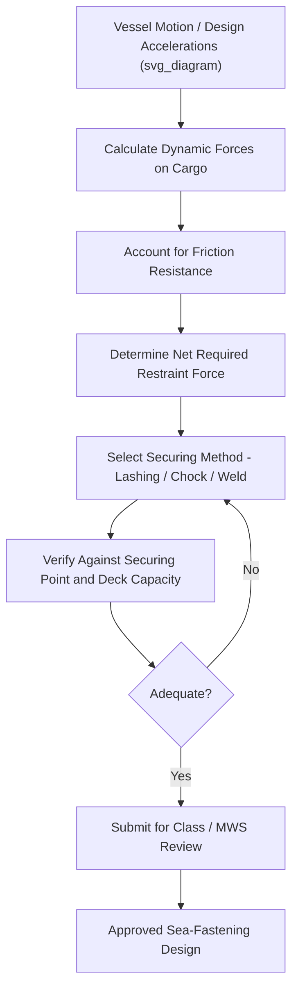

## Sea-Fastening Design and Lashing Calculations

### Definition and Scope

Sea-fastening design is the engineering process of determining how project cargo will be physically restrained aboard a vessel to withstand the forces generated by vessel motion during sea transit. Lashing calculations are the quantitative core of this process, converting vessel motion data and cargo properties into specific required restraint forces, which then dictate the sizing, quantity, and arrangement of lashings, chocks, and structural sea-fastening welds. This discipline sits at the intersection of naval architecture, structural engineering, and rigging practice, and is subject to review by classification societies and Marine Warranty Surveyors.

### Design Inputs

**Key Points**

- **Cargo properties**: weight, center of gravity, dimensions, and the location/capacity of any lifting or securing points built into the cargo itself.
- **Vessel motion data**: design accelerations for roll, pitch, heave, and combined motions, typically derived from the vessel's Cargo Securing Manual, a dedicated motion analysis, or standard reference values for the vessel type and route.
- **Voyage parameters**: route, season, and expected sea states, which directly influence the magnitude of design accelerations used.
- **Deck/stowage surface properties**: friction coefficient between cargo base and deck (or interposed dunnage), and the structural capacity of the deck itself to receive point loads from chocks or welded fastenings.

### Types of Sea-Fastening Systems

| System Type | Description | Typical Use Case |
| --- | --- | --- |
| Lashing (chain/wire) | Flexible tension members connecting cargo to deck fittings | Moderate loads, cargo with suitable lashing points |
| Chocking/shoring | Timber or steel blocks preventing sliding movement | Combined with lashings to resist sliding forces |
| Welded sea-fastening | Steel structures welded directly to cargo and/or deck | High loads, irregular cargo shapes, one-off heavy items |
| Bolted/clamped fastening | Mechanical fixing without welding | Cargo where welding is impractical or prohibited (e.g., coated/painted surfaces) |
| Combination systems | Mixed use of lashing, chocking, and welding | Most heavy-lift project cargo, addressing multiple force directions |

### Lashing Calculation Methodology

1. **Determine design accelerations** — obtain longitudinal, transverse, and vertical acceleration values for the vessel, route, and sea state (from CSM data or dedicated analysis).
2. **Calculate dynamic forces on cargo** — multiply cargo mass by each design acceleration component to obtain the force the securing system must resist in each direction.
3. **Account for friction** — subtract the frictional resistance (conservatively estimated) from the transverse and longitudinal dynamic forces, since friction offsets part of the required active restraint.
4. **Determine required restraint force per direction** — the net force that lashings, chocks, or welds must resist after friction is accounted for.
5. **Select and size securing elements** — choose lashing type/size, chock dimensions, or weld specification to resist the calculated forces with an appropriate safety factor.
6. **Verify against securing point and deck capacity** — confirm chosen securing points and deck areas can structurally accept the applied loads without exceeding their rated capacity.
7. **Documentation and review** — submit calculations for classification society and/or MWS review prior to loading.

### Core Force Calculation

For a cargo item of mass $m$, the dynamic force in a given direction under design acceleration $a$ is:

$$F = m \times a$$

Accounting for friction resistance in the transverse or longitudinal direction:

$$F_{net} = (m \times a) - (\mu \times m \times g)$$

where $\mu$ is the friction coefficient and $g$ is gravitational acceleration. The net force $F_{net}$ is then distributed across the number and geometry of lashings or chocks provided, with each individual lashing's tension calculated according to its angle relative to the direction of restraint.

**Example**

A 60 t cargo item is subject to a transverse design acceleration of 0.4g. Estimated friction coefficient between the cargo base and steel deck (via timber dunnage) is conservatively taken as 0.3.

$$F = 60{,}000\ kg \times (0.4 \times 9.81) \approx 235{,}440\ N \approx 24\ t$$

$$F_{friction} = 0.3 \times 60{,}000\ kg \times 9.81 \approx 176{,}580\ N \approx 18\ t$$

$$F_{net} = 24 - 18 = 6\ t$$

This net 6 t transverse force must then be resisted by lashings or chocks, distributed with a safety factor (commonly 1.5–2.0 times the calculated load applied to the securing device's rated capacity, per typical class society and CSS Code-aligned practice) across the securing arrangement.

[Inference] The specific safety factor range cited is representative of common industry and class society practice; the exact factor required depends on the applicable classification society rules, MWS firm standards, and cargo/voyage risk classification, and should be confirmed against the governing technical standard for the specific operation.

### Lashing Angle Effects on Required Capacity

Similar to rigging sling mechanics, a lashing's effective restraint capacity in the direction of load decreases as its angle from that direction increases. For a lashing at angle $\phi$ from the horizontal restraint direction, the effective restraining component is:

$$F_{effective} = T \times \cos\phi$$

where $T$ is the lashing's tension. Lashings angled steeply away from the primary restraint direction contribute proportionally less to resisting that specific force component, which is why sea-fastening designs typically use multiple lashings or chocks oriented to address each force direction (longitudinal, transverse, vertical) rather than relying on a single lashing angle to resist all directions simultaneously.

### Diagram: Sea-Fastening Design Process

### Welded Sea-Fastening Considerations

For heavy or irregularly shaped cargo, welded steel sea-fastening (brackets, stools, or full cradles) is often preferred over flexible lashings:

- Weld sizing must be calculated against the full range of design forces (longitudinal, transverse, vertical, and combined)
- Base material compatibility (cargo steel grade vs sea-fastening steel grade) must be verified for weldability
- Deck reinforcement may be required beneath welded sea-fastening feet to distribute point loads into the vessel's structure
- Removal of welded sea-fastening at destination must be planned for, including any temporary coating repair required after weld removal

### Common Risks and Mitigation

| Risk | Mitigation |
| --- | --- |
| Underestimating design accelerations for the route/season | Use vessel-specific CSM data or dedicated motion analysis rather than generic assumptions |
| Over-reliance on friction in calculations | Conservative friction coefficients, primary reliance on active securing devices |
| Lashing angle inefficiency reducing effective capacity | Multi-directional lashing/chock arrangement addressing each force axis |
| Deck point load exceeding structural capacity under chocks/welds | Load-spreading pads, deck reinforcement verification with ship's structural drawings |
| Inadequate documentation for class/MWS review | Complete calculation package including all assumptions, safety factors, and reference standards used |

### Conclusion

Sea-fastening design and lashing calculations translate vessel motion physics into concrete, verifiable restraint systems for project cargo at sea, forming a critical link between naval architecture and heavy-lift logistics. Rigorous force calculation, appropriate safety factors, and multi-directional securing arrangements are essential to prevent cargo shift or loss, and the resulting designs are subject to mandatory verification by classification societies and Marine Warranty Surveyors before voyage approval.

**Related Topics**

- Cargo Securing Manual Compliance
- IMO Code of Safe Practice for Cargo Stowage and Securing
- Role and Scope of the Marine Warranty Surveyor
- Vessel Motion Analysis and Design Acceleration Criteria
- Welded Sea-Fastening vs Flexible Lashing Selection
- Rigging Engineering: Slings, Shackles, and Spreader Bars