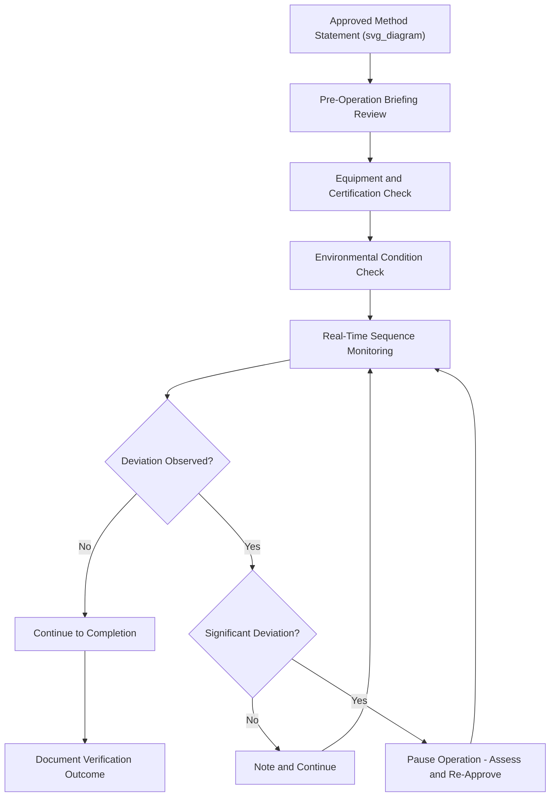

## Method Statement Compliance Verification

### Definition and Scope

Method statement compliance verification is the process of confirming that a heavy-lift or marine operation is executed in accordance with its approved method statement — the detailed, step-by-step procedural document describing how a specific operation will be performed safely. In the context of marine warranty surveying, this verification is a core function of the on-site attendance role, bridging the gap between paper-based engineering approval and actual field execution, where deviations can introduce risk not captured in the original desk review.

### Why Verification Is Distinct from Approval

**Key Points**

- Approving a method statement confirms the plan is technically sound on paper; verification confirms the plan is actually being followed in practice.
- Field conditions, personnel changes, equipment substitutions, or time pressure can all cause deviations from an approved method statement that are not automatically flagged unless someone is actively checking.
- Many serious incidents in heavy-lift operations trace back not to inadequate planning, but to unverified departure from an adequate plan during execution.
- Verification is typically performed by a combination of the operation's own supervision (stevedoring superintendent, lift supervisor) and independent third parties (Marine Warranty Surveyor, classification society attendee, client's own representative).

### Components of a Method Statement Subject to Verification

| Component | Verification Focus |
| --- | --- |
| Personnel and roles | Correct qualified personnel present in each defined role |
| Equipment specification | Actual equipment used matches approved specification (capacity, type, certification) |
| Sequence of operations | Steps performed in the approved order, without unauthorized shortcuts |
| Environmental limits | Operation proceeds only within approved weather/sea state thresholds |
| Rigging and securing configuration | Physical rigging/securing matches approved drawings and calculations |
| Communication protocols | Designated communication channels and signal procedures are followed |
| Emergency procedures | Contingency plans and equipment are in place and understood by personnel |

### Verification Process

1. **Pre-operation briefing review** — confirm toolbox talk or pre-job briefing covers the approved method statement content and that attending personnel understand their roles.
2. **Equipment and certification check** — verify cranes, rigging, and lifting equipment on site match the approved specification and carry current test/inspection certificates.
3. **Environmental condition check** — confirm current and forecast weather/sea state conditions remain within the method statement's approved operating envelope before work commences.
4. **Real-time sequence monitoring** — observe the operation as it proceeds, checking each major step against the approved sequence.
5. **Deviation identification and response** — if a deviation is observed, determine whether it is minor and correctable in real time, or significant enough to require pausing the operation for re-assessment.
6. **Documentation** — record verification findings, any deviations noted, and corrective actions taken, forming part of the operation's permanent record.

### Handling Deviations During Execution

**Key Points**

- Not all deviations are equally serious — a minor sequencing adjustment may be acceptable if within the general intent of the method statement, while a rigging configuration change is typically not.
- Verifying parties (particularly MWS or classification society attendees) generally hold explicit stop-work authority defined in their engagement scope, to be used when a deviation poses unacceptable risk.
- Significant deviations typically require the operation to pause while the change is assessed, potentially requiring re-engineering, re-approval, or a formal method statement amendment before work resumes.
- A clear escalation path (who can approve an in-field change, and under what authority) should be established before the operation begins, not improvised during execution.

### Example: Deviation Identified During a Heavy-Lift Loadout

**Example**

During a module loadout using SPMTs, the on-site verification team observes that the actual SPMT axle configuration differs from the approved method statement — one additional axle line has been added compared to the approved drawing, apparently to address an availability issue with the originally specified trailer configuration.

1. The verifying MWS surveyor halts the loadout pending assessment, exercising stop-work authority.
2. The lift engineer is contacted to confirm whether the additional axle line changes the load distribution calculation in a way that affects quay point load compliance (see: Quay Load-Bearing Capacity and Point Load Limits).
3. A revised load distribution calculation is produced, showing the change is acceptable (in this case, more favorable, since load is spread across an additional axle line) but must be formally documented as a method statement amendment.
4. The amendment is reviewed and approved, and the operation resumes with the documentation updated to reflect the actual configuration used.

This example illustrates that the verification process is not solely about identifying non-compliance to reject, but about ensuring any deviation — even a seemingly beneficial one — is properly assessed rather than assumed safe.

### Diagram: Method Statement Verification Flow

### Roles in Verification

- **Lift/operation supervisor**: primary responsibility for ensuring the crew follows the method statement in real time.
- **Marine Warranty Surveyor**: independent verification specifically tied to insurance warranty conditions, with defined stop-work authority.
- **Classification society surveyor**: verification tied to class rules compliance, particularly for vessel-related aspects of the operation.
- **Client/owner's representative**: verification on behalf of the cargo owner's commercial and technical interests, which may extend beyond the MWS's specific insurance-related scope.

### Common Risks and Mitigation

| Risk | Mitigation |
| --- | --- |
| Field substitutions made without formal approval | Clear escalation protocol requiring engineering sign-off for any equipment or configuration change |
| Verification treated as a formality rather than active oversight | Defined verification checklist tied explicitly to method statement content, not generic observation |
| Ambiguous stop-work authority during disputes | Pre-agreed, documented stop-work protocol established before operation begins |
| Deviations not documented for future reference | Mandatory deviation logging as part of standard operation documentation |
| Time pressure leading to rushed verification | Verification activities built into the operational schedule as non-negotiable steps, not optional buffer time |

### Conclusion

Method statement compliance verification closes the loop between engineering approval and field execution, ensuring that heavy-lift and marine operations are actually performed as planned rather than merely planned correctly on paper. Effective verification requires active, structured observation, a clear framework for handling deviations, and well-defined authority for pausing operations when field conditions diverge from the approved plan.

**Related Topics**

- Role and Scope of the Marine Warranty Surveyor
- Sea-Fastening Design and Lashing Calculations
- Stevedoring Operations for Breakbulk and Heavy Lift
- Tandem and Multi-Crane Lift Planning
- Quay Load-Bearing Capacity and Point Load Limits
- Toolbox Talks and Pre-Job Safety Briefings