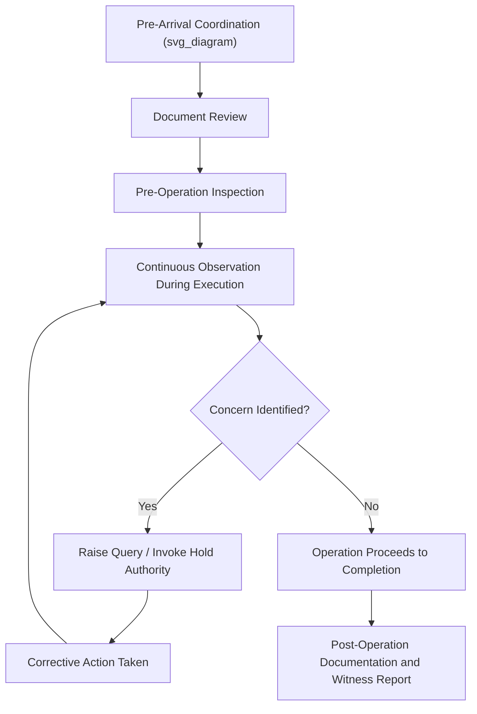

## Loading and Discharge Operation Witnessing

### Definition and Scope

Loading and discharge operation witnessing refers to the physical, on-site attendance of an independent or client-appointed representative — typically a Marine Warranty Surveyor, classification society surveyor, or cargo owner's technical representative — during the actual loading of cargo onto a vessel or its discharge at the destination port. Witnessing is distinct from document review or method statement approval: it is real-time observation of the physical execution of the operation, providing an independent record of what actually occurred, as distinguished from what was planned.

### Purpose of Witnessing

**Key Points**

- Provides independent, contemporaneous verification that the operation was conducted safely and in accordance with approved plans.
- Creates a documented record that can be referenced if a dispute, insurance claim, or incident investigation arises later.
- Allows real-time identification of hazards or deviations that were not apparent during desk-based planning.
- Supports insurance warranty conditions that specifically require MWS attendance at critical operational milestones, not merely document approval.

### Key Activities During Witnessing

**Pre-Operation Checks**

- Verification of crane, rigging, and lifting equipment certification and condition
- Confirmation of personnel competency and role assignments against the method statement
- Weather and sea state check against approved operational limits
- Visual inspection of cargo condition and lifting point integrity before the operation begins

**During-Operation Observation**

- Monitoring of the lift or SPMT movement sequence against the approved method statement
- Observation of load cell readings (where used) to confirm load distribution matches engineering assumptions
- Monitoring of vessel stability parameters (list, trim) throughout the operation, particularly for shipboard lifts affecting vessel loading condition
- Communication discipline observation — confirming the designated signal person/banksman protocol is followed

**Post-Operation Verification**

- Confirmation of final cargo position and initial securing/sea-fastening installation
- Visual inspection for any damage to cargo, vessel structure, or equipment
- Collection of photographic documentation supporting the witnessed record

### Witnessing Process Flow

1. **Pre-arrival coordination** — witnessing party confirms schedule, scope, and access arrangements with the operation's project team.
2. **Document review immediately prior to attendance** — final check of the approved method statement, lift plan, and any recent revisions.
3. **On-site pre-operation inspection** — equipment, personnel, and environmental condition checks as outlined above.
4. **Continuous observation during execution** — witnessing party remains present and attentive throughout the critical phases of the operation, not merely at the start.
5. **Real-time query and hold authority** — if a concern arises, the witnessing party raises it immediately, potentially invoking hold/stop-work authority if defined in their engagement scope.
6. **Post-operation documentation** — a witness report is prepared, recording observations, any deviations, and overall compliance assessment.

### Example: Witnessing a Module Loadout onto a Heavy-Lift Vessel

**Example**

An MWS surveyor is engaged to witness the loadout of a 500 t process module onto a heavy-lift vessel via SPMT and vessel-mounted ramp:

1. **Pre-operation**: surveyor confirms SPMT axle configuration matches the approved lift plan, checks recent test certificates for the SPMT's hydraulic system, and confirms current sea state is within the vessel's approved ramp operation limits.
2. **During operation**: surveyor observes the SPMT's approach and ascent onto the vessel ramp, monitoring communication between the SPMT operator and the vessel's loading officer, and checks that vessel ballast adjustments are being made in accordance with the stability plan as weight transfers onto the vessel.
3. **Deviation noted**: surveyor observes that the vessel's list during the transfer briefly exceeds the pre-agreed threshold specified in the method statement.
4. **Response**: surveyor raises the concern immediately; the vessel's ballast team adjusts trim, and the operation pauses briefly before resuming once list returns within limits.
5. **Post-operation**: witness report documents the module's final position, the brief list excursion and corrective action taken, and overall confirmation that the operation was completed safely, with the deviation logged for the record.

### Diagram: Witnessing Activity Timeline

### Witnessing vs Method Statement Compliance Verification

While closely related, loading and discharge witnessing is somewhat broader in scope than method statement compliance verification specifically: witnessing encompasses the full observational and documentation role during the operation, of which checking compliance against the method statement is one central component alongside equipment condition checks, stability monitoring, and independent record-keeping for insurance and legal purposes.

### Documentation Outputs

| Document | Purpose |
| --- | --- |
| Witness attendance report | Primary record of observations, timeline, and compliance assessment |
| Photographic/video record | Visual evidence supporting the written report |
| Deviation log | Specific record of any departures from approved plans and their resolution |
| Load cell/monitoring data | Quantitative record of actual loads experienced during the operation, where instrumented |
| Certificate of attendance/approval | Formal confirmation the operation was witnessed and found compliant (or noting exceptions) |

### Common Risks and Mitigation

| Risk | Mitigation |
| --- | --- |
| Witnessing party arrives without current method statement revision | Confirm latest approved revision immediately before attendance |
| Incomplete observation due to multiple simultaneous activity streams | Adequate witnessing personnel numbers for complex, multi-crane, or multi-location operations |
| Ambiguity in hold/stop-work authority during the operation | Pre-agreed protocol clearly defining witnessing party's authority, communicated to all parties beforehand |
| Inadequate documentation of a critical deviation | Standardized deviation logging template used consistently during witnessing |
| Photographic/video evidence gaps | Pre-planned documentation checklist covering all critical operational phases |

### Conclusion

Loading and discharge operation witnessing provides the real-time, independent verification layer that connects approved engineering and planning documents to actual field execution in heavy-lift marine operations. Thorough pre-operation checks, continuous attentive observation, and clear authority to intervene when concerns arise are essential to the witnessing function's value, both for immediate operational safety and for the documented record it creates for insurance and future reference.

**Related Topics**

- Role and Scope of the Marine Warranty Surveyor
- Method Statement Compliance Verification
- Sea-Fastening Design and Lashing Calculations
- Vessel Stability and Ballast Management During Cargo Operations
- Tandem and Multi-Crane Lift Planning
- Cargo Insurance and Warranty Clauses in Marine Transport