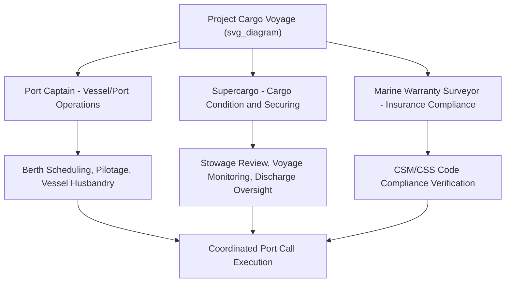

## Port Captain and Supercargo Responsibilities

### Definition and Scope

A Port Captain is a senior marine operations professional, typically representing the vessel owner, charterer, or project cargo owner, responsible for overseeing marine and port-related aspects of a voyage or project — including vessel selection, port operations coordination, and liaison with terminal, agency, and regulatory parties. A Supercargo is a specialist representative, usually appointed by the cargo owner or charterer, embedded aboard the vessel or present at loading/discharge operations specifically to protect the cargo's interests, oversee stowage and securing, and act as the on-site technical authority for cargo-related decisions distinct from the vessel's own command structure.

### Role Distinctions

**Key Points**

- The Port Captain's scope is broader and more voyage/port-operations focused, often spanning multiple port calls, vessel husbandry matters, and commercial/operational liaison.
- The Supercargo's scope is narrower and cargo-specific, typically embedded for the duration of loading, the sea voyage, and discharge for a particular shipment or project.
- Both roles exist to represent interests (vessel owner/charterer for Port Captain; cargo owner for Supercargo) that are distinct from the vessel master's primary responsibility for the safety of the vessel and crew.
- On smaller or simpler heavy-lift projects, a single individual may fulfill functions overlapping both roles; on larger projects, both roles may be filled by separate specialists working in coordination.

### Port Captain Responsibilities

**Pre-Voyage**

- Vessel vetting and suitability assessment for the specific cargo and route
- Coordination with port agents for berth scheduling, pilotage, and port formalities
- Review of voyage charter party terms and ensuring operational compliance

**During Port Calls**

- Liaison between vessel, terminal, stevedores, and port authority during loading/discharge operations
- Oversight of bunkering, provisioning, and other vessel husbandry matters during port stays
- Troubleshooting operational or commercial issues arising during the port call (delays, disputes, documentation issues)

**Voyage Oversight**

- Monitoring voyage progress and addressing any operational issues arising en route
- Coordination of any required port diversions or schedule adjustments
- Post-voyage reporting on vessel and port performance

### Supercargo Responsibilities

**Pre-Loading**

- Review of stowage plan and sea-fastening design from the cargo owner's perspective
- Verification that cargo condition and documentation are in order before loading commences
- Coordination with the Marine Warranty Surveyor and vessel's officers on securing arrangements

**During Loading and Voyage**

- On-site representation of cargo owner interests during loading operations, working alongside (but independently from) MWS witnessing functions
- Ongoing monitoring of cargo condition and securing integrity during the sea voyage, including periodic inspection rounds
- Direct liaison with the vessel's master and officers regarding any cargo-related concerns arising during transit
- Weather routing input and advisory role regarding voyage decisions affecting cargo safety

**During Discharge**

- Oversight of discharge sequence and cargo handling to protect cargo condition
- Documentation of cargo condition upon discharge, including any damage assessment
- Coordination of any required surveys or inspections at the discharge port

### Comparison of Port Captain and Supercargo Roles

| Attribute | Port Captain | Supercargo |
| --- | --- | --- |
| Primary allegiance | Vessel owner/charterer | Cargo owner |
| Scope | Voyage and port operations broadly | Specific cargo shipment |
| Typical duration of engagement | Multiple voyages or ongoing | Single voyage/shipment, embarked or attending key phases |
| Focus | Vessel operations, commercial/schedule matters | Cargo condition, stowage, securing integrity |
| Typical background | Master mariner, marine operations experience | Marine cargo surveyor, naval architect, or experienced marine superintendent |

### Interaction with Other Marine Warranty and Securing Functions

**Key Points**

- The Supercargo's cargo-condition monitoring role complements but is distinct from the Marine Warranty Surveyor's insurance-driven compliance verification function (see: Role and Scope of the Marine Warranty Surveyor).
- During loading and discharge witnessing (see: Loading and Discharge Operation Witnessing), the Supercargo and MWS may both be present, each focused on their respective interests — cargo owner protection versus insurer compliance — though their observations often overlap and can be mutually reinforcing.
- The Port Captain typically coordinates the overall port call logistics within which both MWS witnessing and Supercargo activities take place, ensuring schedule and access arrangements support all required verification functions.

### Example: Coordinated Roles During a Heavy-Lift Voyage

**Example**

For a project shipping a 400 t reactor vessel by heavy-lift ship:

1. The **Port Captain**, representing the charterer, coordinates berth availability at both load and discharge ports, arranges pilotage, and manages the overall voyage schedule against the project's delivery deadline.
2. The **Supercargo**, representing the cargo owner, reviews and approves the sea-fastening design from a cargo protection standpoint, is present during loading to verify the reactor is stowed and secured as expected, and conducts daily inspection rounds during the voyage to confirm lashings remain tensioned and no cargo movement has occurred.
3. The **Marine Warranty Surveyor** independently reviews the same sea-fastening design against insurance warranty requirements and attends loading to verify CSM and CSS Code compliance.
4. At discharge, both the Supercargo and Port Captain coordinate with the receiving terminal, with the Supercargo focused on cargo condition documentation and the Port Captain focused on vessel/berth logistics.

### Diagram: Role Coordination During a Heavy-Lift Voyage

### Common Risks and Mitigation

| Risk | Mitigation |
| --- | --- |
| Role overlap/confusion between Port Captain, Supercargo, and MWS | Clear pre-voyage definition of scope and reporting lines for each role |
| Cargo condition issues undetected during voyage | Scheduled Supercargo inspection rounds with standardized reporting |
| Port operations delays affecting cargo-sensitive schedule | Early Port Captain engagement in berth scheduling and contingency planning |
| Miscommunication between Supercargo and vessel's master | Pre-voyage agreement on communication protocol and escalation procedures |
| Cargo owner interests under-represented during loading | Dedicated Supercargo attendance independent of MWS witnessing, ensuring cargo-owner-specific concerns are captured |

### Conclusion

Port Captain and Supercargo roles provide complementary, interest-specific oversight during heavy-lift marine operations — the Port Captain managing the broader vessel and port operational picture, and the Supercargo focused specifically on cargo condition and securing integrity throughout loading, voyage, and discharge. Clear role definition and coordination with Marine Warranty Surveying functions ensures comprehensive oversight without gaps or redundant confusion during critical project cargo voyages.

**Related Topics**

- Role and Scope of the Marine Warranty Surveyor
- Loading and Discharge Operation Witnessing
- Sea-Fastening Design and Lashing Calculations
- Method Statement Compliance Verification
- Vessel Stability and Ballast Management During Cargo Operations
- Weather Routing and Voyage Planning for Heavy-Lift Cargo