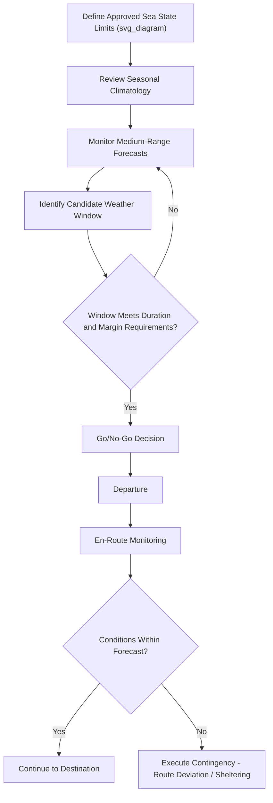

## Voyage Routing and Weather Window Analysis

### Definition and Scope

Voyage routing and weather window analysis is the process of planning a vessel's route and departure timing to minimize exposure to sea conditions that could exceed the design assumptions underlying a project cargo's sea-fastening, or otherwise threaten vessel and cargo safety. For heavy-lift and project cargo voyages, this analysis is closely tied to the sea-fastening design process (see: Sea-Fastening Design and Lashing Calculations), since the design accelerations used in securing calculations are only valid within the sea states the routing analysis is intended to keep the vessel within.

### Why Weather Window Analysis Is Critical for Project Cargo

**Key Points**

- Sea-fastening is designed against specific design accelerations tied to an assumed maximum sea state; encountering conditions beyond this assumption can invalidate the securing arrangement's safety margin.
- Unlike containerized cargo with standardized, conservative securing arrangements, project cargo sea-fastening is often optimized closely to the intended voyage's expected conditions, making weather routing accuracy more operationally significant.
- Marine Warranty Surveyors frequently impose weather-related conditions on their approval (e.g., maximum significant wave height for departure, seasonal routing restrictions), making weather window analysis a condition of insurance coverage, not merely good practice.
- Weather-related delays are a common and often underestimated schedule risk in project logistics, particularly for voyages through seasonally variable sea areas (monsoon regions, North Atlantic winter routes, cyclone-prone corridors).

### Core Concepts in Weather Window Analysis

**Weather Window**

A weather window is a forecast period during which sea conditions are expected to remain within the vessel/cargo's approved operating limits for a sufficient duration to complete the voyage or a critical phase of it (departure, a specific exposed leg, arrival).

**Design Sea State / Return Period**

Sea-fastening and vessel motion design accelerations are often based on a statistical "return period" sea state — for example, a sea condition with a defined probability of being exceeded during the voyage duration, commonly expressed as a percentage exceedance probability or a return period in years for the relevant season and route.

**Persistence**

Persistence refers to how long a favorable weather window is likely to last once identified, which is critical for voyages that cannot be interrupted or that require the full transit to be completed within the window (e.g., an unescorted tow through an exposed sea area).

### Weather Routing Data Sources and Methods

| Source/Method | Application |
| --- | --- |
| Historical climatology data | Long-term seasonal patterns used for initial route/timing planning |
| Numerical weather prediction (NWP) models | Short- to medium-range forecasts (typically 5–10 days) for specific departure decisions |
| Commercial weather routing services | Specialized voyage-specific routing advice, often integrated with vessel performance data |
| Hindcast/wave model data | Historical wave height and period data used to derive design sea states for engineering calculations |
| Real-time satellite and buoy data | En-route monitoring to confirm forecast accuracy and support routing adjustments |

### Weather Window Analysis Process

1. **Define voyage weather sensitivity** — determine the vessel/cargo's approved operating limits (maximum significant wave height, wind speed, or specific directional sea state limits) from the sea-fastening design and MWS conditions.
2. **Review seasonal climatology** — assess historical weather patterns for the intended route and season to establish baseline expectations and identify higher-risk periods.
3. **Monitor medium-range forecasts** — as the planned departure date approaches, track numerical weather prediction forecasts for the specific route and timing.
4. **Identify candidate weather windows** — evaluate forecast data for periods where conditions are expected to remain within approved limits for the required voyage duration plus a safety buffer.
5. **Go/no-go decision** — final departure decision made based on the most current forecast data, weighing forecast confidence against schedule pressure.
6. **En-route monitoring and contingency** — continued weather monitoring during the voyage, with pre-defined contingency actions (route deviation, speed adjustment, sheltering) if conditions deteriorate beyond forecast expectations.

### Example: Weather Window Analysis for a North Sea Heavy-Lift Tow

**Example**

A heavy-lift tow of a jack-up rig across the North Sea has an MWS-approved maximum significant wave height limit of 3.5 m for the tow operation, with sea-fastening designed against this design sea state.

1. Seasonal climatology indicates North Sea conditions in the planned autumn transit window have historically exceeded 3.5 m significant wave height on a substantial proportion of days, making window identification more critical than in a calmer season.
2. Seven days before planned departure, medium-range forecasts identify a potential 4-day window with forecast significant wave height remaining below 3.0 m (providing a margin below the 3.5 m limit) across the transit route.
3. As departure approaches, updated forecasts confirm the window remains viable, with only a minor route adjustment recommended by the weather routing service to avoid a developing low-pressure system's outer swell field.
4. The MWS reviews the routing plan and forecast confidence, and confirms departure approval is maintained subject to a final forecast check 24 hours before sailing.
5. The tow departs and completes the transit within the identified window, with continued monitoring confirming no unexpected deterioration in conditions.

### Diagram: Weather Window Decision Process

### Relationship to Sea-Fastening Design Margins

**Key Points**

- Weather routing does not replace the safety margin built into sea-fastening design; it is a complementary risk-reduction measure that reduces the likelihood of design limits being approached or exceeded.
- Conservative practice typically involves selecting a weather window with meaningful margin below the design sea state limit, rather than routing precisely to the boundary of the approved envelope, to accommodate forecast uncertainty.
- For longer voyages where a single continuous favorable window may not be achievable, route selection may prioritize legs with sheltering options (coastal routing, port of refuge availability) over the shortest great-circle route.

### Common Risks and Mitigation

| Risk | Mitigation |
| --- | --- |
| Forecast inaccuracy leading to unexpected severe conditions | Conservative margin below design limits, continuous en-route monitoring |
| Schedule pressure driving departure despite marginal forecast | Pre-agreed go/no-go criteria removing subjective pressure from the decision, MWS independent sign-off |
| Seasonal climatology not reflecting a specific year's anomalous conditions | Reliance on current forecast data as the primary decision input, not historical averages alone |

 
| Insufficient weather window persistence for voyage duration | Route/speed planning to minimize exposure time, identification of intermediate shelter options |
| Miscommunication of weather-related conditions to vessel's master | Clear documentation of approved limits and contingency triggers provided directly to vessel command |

### Conclusion

Voyage routing and weather window analysis provides the operational discipline that keeps a project cargo voyage within the environmental assumptions underlying its sea-fastening design, functioning as both an insurance warranty condition and a genuine safety risk mitigation measure. Effective analysis combines seasonal climatology, real-time forecasting, and conservative margin practices, with continuous en-route monitoring to detect and respond to any deviation from forecast expectations.

**Related Topics**

- Sea-Fastening Design and Lashing Calculations
- Role and Scope of the Marine Warranty Surveyor
- Vessel Motion Analysis and Design Acceleration Criteria
- Port Captain and Supercargo Responsibilities
- Towage Operations and Bollard Pull Requirements
- Vessel Stability and Ballast Management During Cargo Operations